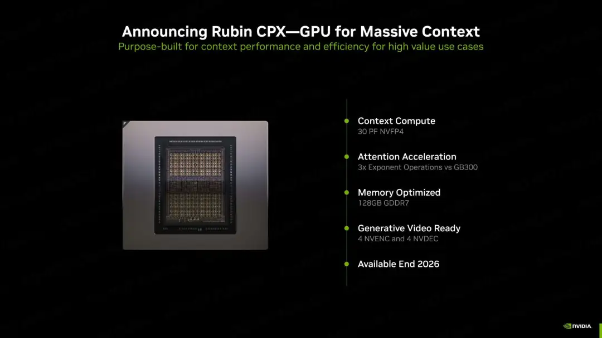
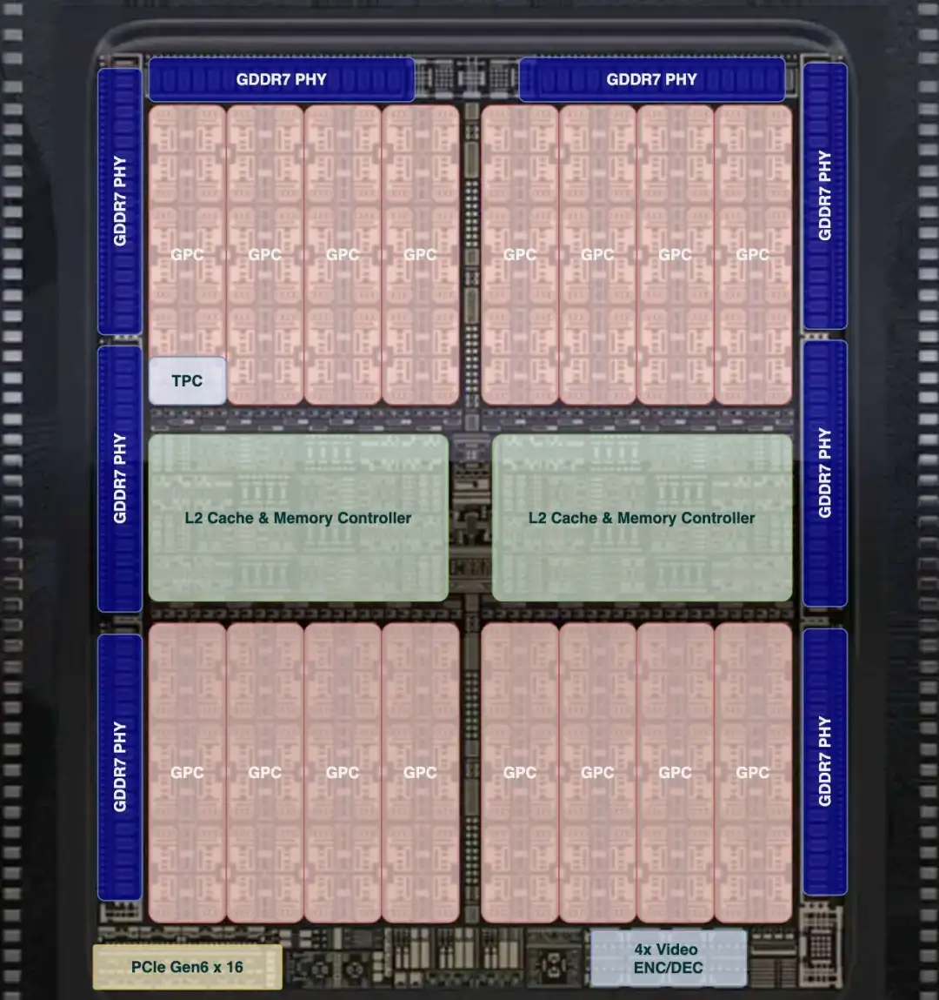
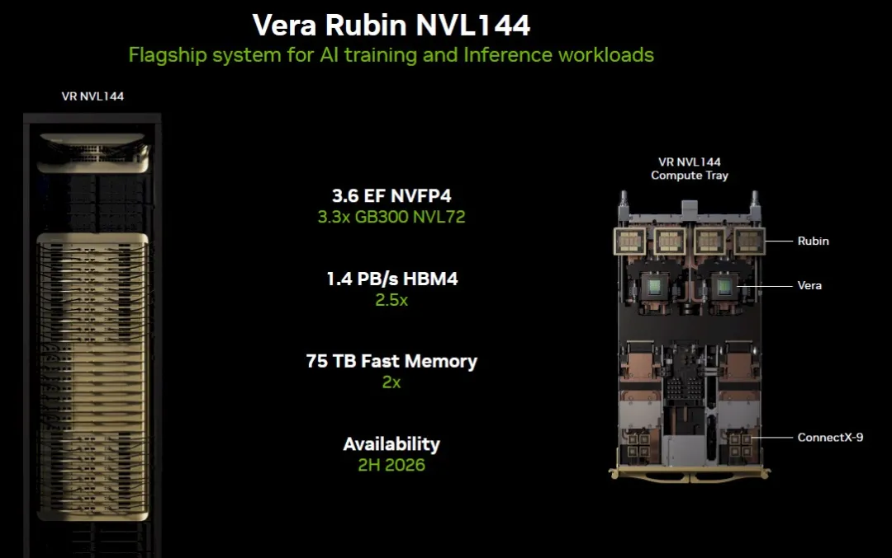
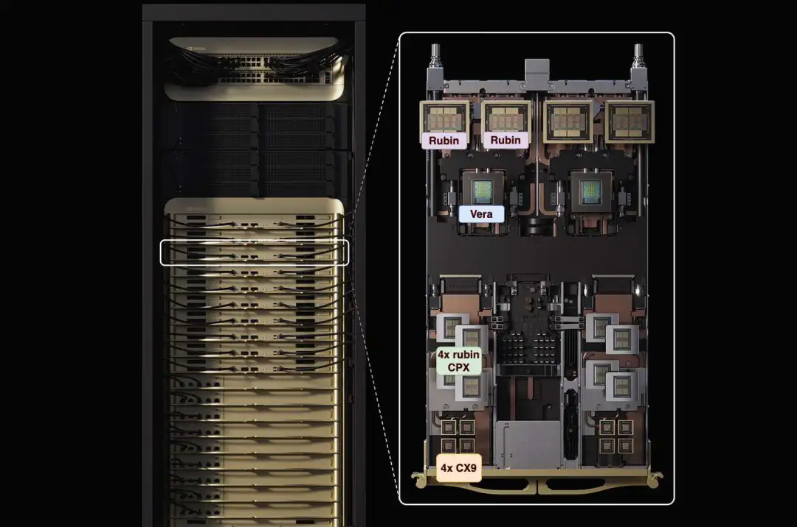
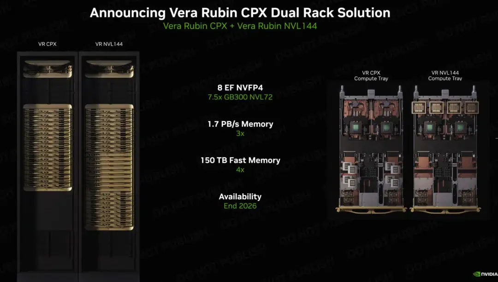
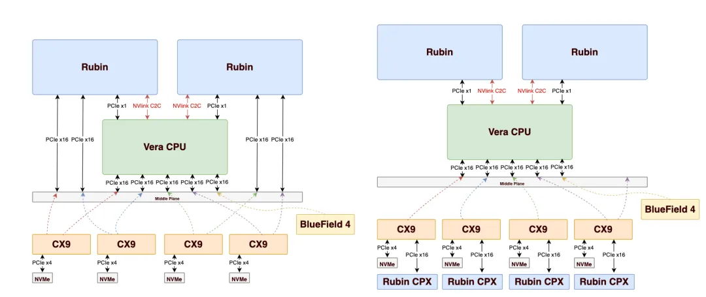
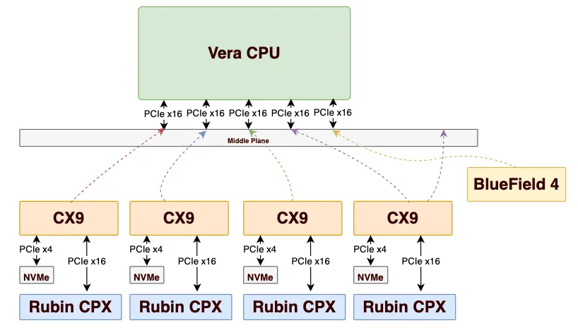
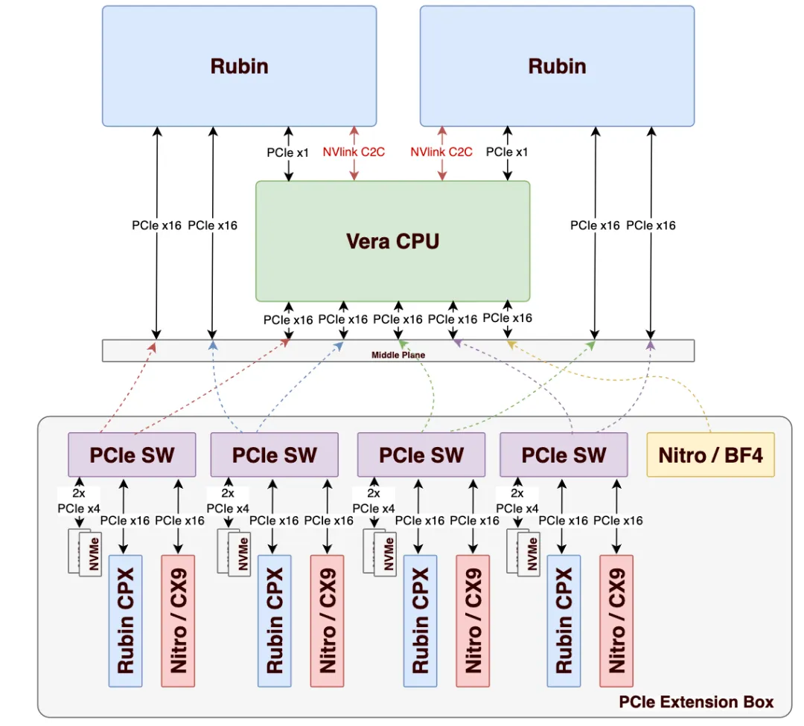
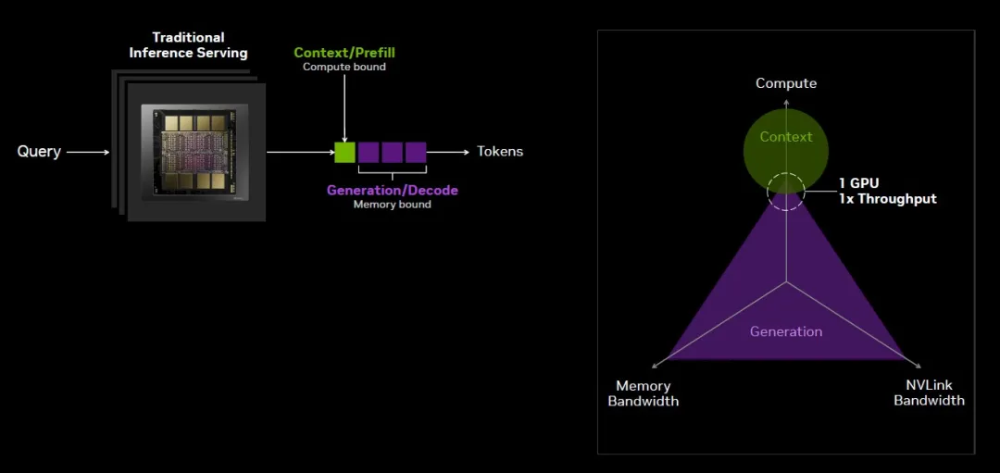
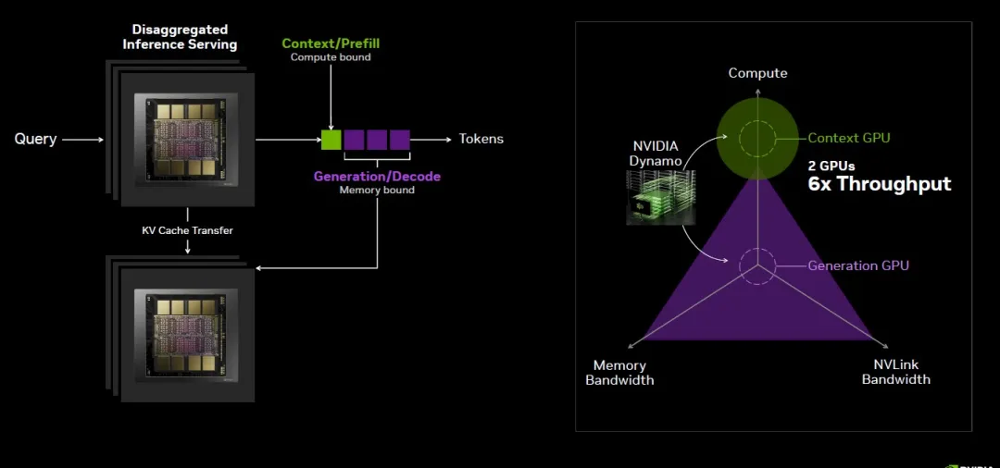

# Rubin CPX

> [原文地址](https://mp.weixin.qq.com/s/5oyNhocptR0PD4IB3p5wXA)

总体来看, Rubin CPX 只是原来 Hopper 那一代 L40 和 Blackwell 这一代的 RTX6000 pro 这条产品线的延续, 然后重新包装成了一个 Context GPU 的概念并且集成到 Rubin NVL 144 中搭售。也就是说 Rubin CPX 并不是专门为 Long Context 设计的, 而是恰好适合来做这件事情. 另一方面我们也看到了 RTX 6000 pro 的销售似乎并不好, 而 GB200 NVL72 相对于 B200 的 ROI 也并不是那么的好, 贵了 1.5 倍? 然后性能只有少数一些 case 下才有 40%以上的收益. 实际上 B200 更划算? NVL 的故事如何讲呢?

官方的两种方案, VR CPX NVL144 采用固定配比, 并且丧失了 ScaleOut GDR 的能力, 而 Dual-Rack 方案虽然天然的支持 xPyD, 但又会导致在 ScaleOut 上同时进行 KVCache 传输和 EP 并行的流量产生干扰的问题, 同时多了很多 Vera CPU 和 CX9 网卡. 老黄那句“Buy More, save More”是否成立?

如果专门 For Long Context 那么为啥不做一个带两个 PCIe Gen6x16 的 Rubin CPX 呢? 进一步扩大 ScaleOut 带宽?

当然另外一方面, 模型本身也在尝试 MoR 和 Universal Transformer 以及一些 Linear Attn 的事情. 前面两个对于 Attn 计算的算力要求会更高, 而后面 Linear Attn 对算力要求会低不少. 这些 Trade-off 如何处理呢? 等后面有时间从数学上详细分析一下 Linear Attn 再说吧.

总体来看, Rubin CPX 可能还是蛮有收益的一个尝试, 但并不是 SA 所说的那样 Another Giant Leap.

## **Rubin CPX 芯片分析**

Rubin CPX 是一颗基于 Rubin 架构但使用 GDDR7 的芯片。相对于基于 HBM 的平台，其不受 CoWoS 封装产能的限制，出货量可以很高。 芯片的基本规格如下：

- N3P 工艺, 1 x Reticle Size
- NVFP4 浮点算力 30PFLOPS
- 128GB GDDR7 内存, 内存带宽 2TB/s
- 互连仅支持 PCIe Gen6x16, 支持单卡 800Gbps 带宽
- 内置了视频编解码, 但是是否带有光线追踪的 RTCore 未知
- 针对 Attention 计算中 Softmax 相关的指数计算 SFU 性能比 B300 提升了 3 倍

从芯片规格来看, 整体芯片还是对 RTX 5090/6000 pro(GB202)的延续, 估计有192 个 SM, 内存位宽为 8 x 64bit-GDDR7, 如下图所示:

值得关注的是累计算力达到了 30PFLOPS, 相对于 Blackwell 这一代的 GB202(RTX 5090/6000pro), TensorCore 的算力提升了 10 倍。 而 30PFLOPS 甚至超过了 1x Reticle Size 的 Rubin Die(单颗 Rubin 在 GTC25 上宣布为 50PFLOPS)。对于单个 SM 来看, TensorCore 和 SFU 都将占用更大的芯片面积, 是否进一步砍掉一些高精度算力?

## **Rubin CPX NVL144**

### 标准 VR NVL144

新一代的 Vera Rubin 架构还是延续 GB300 这样的 Oberon 机框结构, 单柜版本为 18 个 ComputeTray 和 9 个 SwitchTray，单个 ComputeTray 包含了 4 颗 Rubin GPU (每颗由 2 个 Die 封装)和 2 颗 Vera CPU 以及 8 颗 CX9：

- Vera CPU 包含 88 个 Arm Core。
- Rubin GPU 包含 288GB HBM4 显存，带宽为 13TB/s，50 PF FP4 算力，2 个 Die。
- Rubin GPU 的  FP4 算力是 FP8 的 3x>，与 B300 一致。
- Vera Fast Memory 为 (75TB - 288GB\*72) / 36 = 1.5TB。
- NVLink6 带宽为 260/72 = 3.6 TB/s。
- ConnectX-9 网卡带宽为 28.8TB/s / 144 = 200 GB/s = 1600 Gbps(宣传值，实际值为 800)。
- HBM4 总带宽为 13\*72=936TB/s
- 上图中 1.4PB/s 实际是 HBM4 带宽 936 TB/s + Vera Fast Memory 带宽，因此后续统一称作 Memory 带宽，这种情况下 Vera CPU 的 Fast Memory 的带宽为 (1.4 PB/s - 936 TB/s)/36 = 0.46 TB/s / 36 = 13TB/s。
- 后续会像 AMD MI400 Series 一样，采用 432GB 的 HBM4，显存带宽为 432/288\*13 = 19.6 TB/s。

### CPX 变体

ComputeTray 发布了变体：

1. 在标准 ComputeTray 上增加了 8 颗 Rubin CPX 构建的 Vera Rubin CPX NVL144, 如下图所示。这种做法的优点是 Rubin CPX 直接 PCIe 总线连接到 Vera 上, KVCache 传输的功耗较小，缺点是 Prefill 和 Decode 形成了固定的配比，并不灵活.

   

2. 另一种做法是采用两个机框的部署, 在 VR CPX 机柜中, 只有 Vera CPU 和 Rubin CPX, 而没有 Rubin 芯片, 因此机柜只有 18 个 ComputeTray, 没有 NVLink SwitchTray. 而另一个机柜则是标准版的 Vera Rubin NVL144 机柜：

这种做法相当于是分离式部署, 优点是可以根据自己的需求灵活的实现 xPyD 的配比, 但是缺点是 Vera CPU 和 CX9 网卡的数量翻倍了, 而 KVCache 传输需要通过 RDMA 网络传输, 功耗和成本都更高。

## 内部拓扑

标准的 Vera Rubin NVL144 机内 PCIe 拓扑如下左图所示, 而 Vera Rubin CPX NVL144 机内 PCIe 拓扑如下右图所示:

CX9 继续维持在 800Gbps, 主要是在 CX8 的基础上修正了一些 bug 和增加了某几个公司的一些功能需求. 因此CX9 内置的 PCIe Switch 依旧约束在 48 Lane。

对于标准版的 VR NVL144, 可以通过 16x 连接 CPU, 16x 连接 Rubin, 并剩余 16x 可以连接 NVMe 盘, 但是考虑到前面板的空间约束, 单个 CX9 应该只能放置 1 块最多 2 块盘. 这个机型的好处是对于 ScaleOut 网络依旧可以通过 GPU-Direct-RDMA 进行通信。

而对于 VR CPX NVL144 的版本, 需要留一根 PCIe Gen6x16 给 Rubin CPX, 因此判断在 CX9+Rubin CPX 的子卡上, 断开了 PCIe 的连接. CX9 可以 GDR 到 Rubin CPX, 利用 ScaleOut 网络执行 Prefill 的计算. 而CX9 无法通过 ScaleOut GDR 连接到 Rubin.

而对于 Vera Rubin CPX only 的计算板拓扑如下所示:

其实对于其它的 CSP 更有可能选择 Dual-Rack 的方案, 但是并不需要官方的 CPX Only Rack 集成 Vera CPU, 而是可以直接通过一个 PCIe Switch Box 旁至, 并使用 PCIe AEC 互连, 如下图所示:

这样的好处是既可以定制自己的网卡, 例如 AWS Nitro, 又可以挂载更多的盘,并且还能维持 Rubin GPU 的 GDR 能力, 综合成本和功耗也应该小于官方的 VR NVL144 + VR CPX only 的 Dual-Rack 方案. 甚至还可以定制在 PCIe Switch 下挂载多个 Rubin CPX 芯片.

另一方面还可以像 Meta 那样, 对于 VR NVL144 依旧构建 Dual-Rack 的方案, 采用 Vera CPU 和 Rubin 1:1 配比. 然后左右两边并柜放置 Prefill 的 PCIe Box.

## PD 分离

Nvidia 官方有这样一个描述, Prefill 阶段是一个 Compute Bound 的计算. 对于 Coding/Agent 一类的 LLM 场景和视频生成(例如 Veo3)/图片编辑(Nano Banana)场景来看, Prefill 的长度通常会很长， 通用的 GPU(例如 Rubin)来看虽然算力/内存/NVLink 互连带宽都兼顾了, 但是整体 ROI 来看并不好.

因此构建一个 Rubin CTX, 放弃对高内存带宽的需求, 使用 GDDR7 降低成本, 另一方面也放弃对高 NVLink 互连带宽的需求, 专注于 Prefill 的场景：

我们来探讨几种情况下的 Rubin CPX 的 P-D 分离策略

### **Rubin CPX ScaleOut Prefill**

首先是针对所有的 Rubin CPX, 通过 ScaleOut RDMA 网络构成集群进行 Prefill 处理, 再通过 PCIe 将 KVCache 传输给 Vera 或者 Rubin 进行 Decode Generation. 可以等效的看作每个 ComputeTray 8 张卡,每张卡 800Gbps 带宽构建的一个 144 卡的 Prefill 集群, 对于长 Context 而言, Attention 计算应该没有太大的问题, 而 ScaleOut 带宽是否足够支撑后续的 MoE 的 EP 并行?

其实在 Dual-Rack 的方案中就是这样的, Rubin CPX Only 的机柜只能通过 RDMA ScaleOut 网络通信. 同时又有大量的 KVCache 也要通过 RDMA 网络传输到 VR NVL144 机柜. KVCache 传输和 EP 的干扰也是一个麻烦事, 毕竟和单机柜的 VR CPX NVL144 相比, RDMA 传输 KVCache 比起机内直接 D2H copy 带来了一些不确定性

### **Rubin CPX with NVLink**

是否可以借助 NVLink 的大带宽优势呢? 也就是说 Attention 计算完了以后, 传递一份 Token 给 Vera, 然后通过 NVLink dispatch 多份到其它 ComputeTray, 然后还可以借助 DeepSeek-V3 这样的 Group 方案来做 2 级的分发, 即按照一个 ComputeTray 一个 Group 的方式分配 Experts, 然后在 Nvlink 上减少 Dispatch 的份数, 避免 NVLink 上对其它 Decoding 的任务产生影响(例如 Rubin 的 L2Cache 污染/HBM 带宽占用等). 这是一个可以探索的方向.

这个方案可以降低一些通信量, 并且把 NVLink 的一些带宽用起来, 但是 Vera CPU 并不一定能在 PCIe 上扛住这么大的带宽, 毕竟 8x800Gbps 已经达到 800GB/s 了, 这么大的流量穿越 Vera 还是有一些潜在的问题的. 那么前面提到的基于 PCIe Switch, 让 Rubin CPX 直接 PCIe P2P 拷贝到 Rubin 可能是比官方的 VR CPX NVL144 更好的方案?

### Rubin CPX Attention with Rubin FFN

是否能够借助 Rubin 来做一些 Expert 的计算? 但是需要考虑整个 Timeline 如何去做 Overlap，并且不影响 Decode. 当然 Decode 阶段 NVLink 带宽和 GEMM 本身的效率来看也需要攒够更大的 Batch 提升 MFU.

可能这种方案有收益, 但额外的极长的 Context 在 Rubin 上计算可能对 Decode 也带来了负收益, 这些取决于 SLA 标准如何定义, 然后平台如何取舍.

### 混合调度方案

是否还是在 NVL144 中配置 xPyD 的方案, 仅对 SeqLen 很长的任务 Offload 到 Rubin CPX 处理? 这也是一个潜在的可以尝试的调度策略. 因为我们还需要考虑 KVcache 对显存的占用. Rubin CPX 毕竟只有 128GB 的显存. 例如对于一个 256K Seqlen 的 Prefill 最高能到多少并发也需要根据模型计算的.

NVL576
