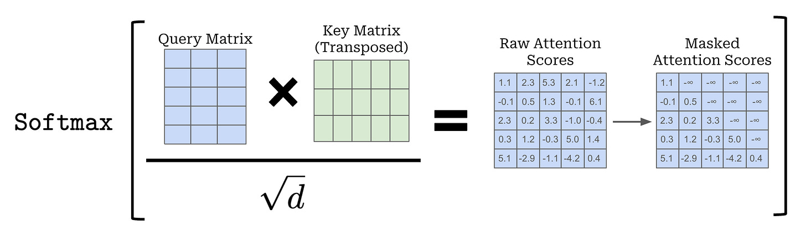
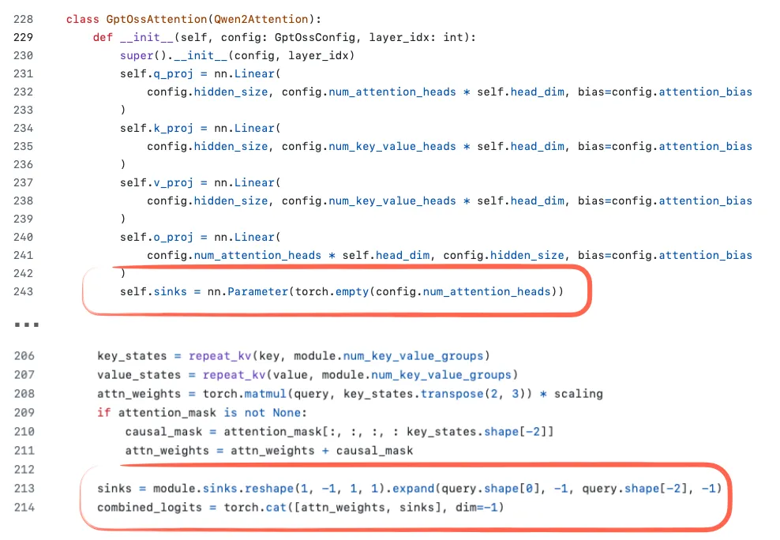
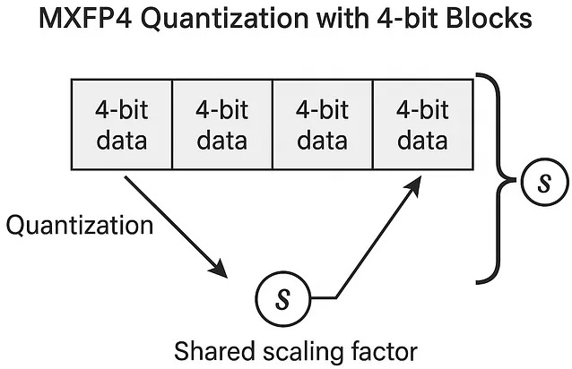

# GTP-OSS

2025 年 8 月，OpenAI 发布了新款开源权重 LLM：gpt-oss-120b 和 gpt-oss-20b，这是自 2019 年 GPT-2 以来他们首次发布的开源权重模型。早期的 GPT 模型展示了 transformer 架构的可扩展性。2022 年 ChatGPT 的发布则通过展示模型在写作和知识（编程）任务中的实际用途，使其成为主流。

两个 GPT-oss 模型均<span style="color:magenta">针对代理工作流进行了优化</span>，具有合理的长上下文窗口（131k 令牌），以及强大的工具使用、推理和指令遵循能力。为了更顺畅地处理代理工作流中的模式（例如函数调用、工具使用、推理、结构化输出等），OpenAI 推出了新的 **Harmony 提示格式**——一种灵活且分层的聊天模板，能够捕捉多样化的 LLM 交互模式，用于 GPT-oss 的训练和交互。GPT-oss 模型还支持通过在其系统消息中明确指定努力级别（低、中或高），来调整自身的推理强度。

OpenAI 发布的评估结果显示，GPT-oss-120b 的表现与 o4-mini 相当，而 GPT-oss-20b 的表现则与 o3-mini 类似。此外，在发布时，OpenAI 重点强调了这些模型在健康相关任务上的强大能力——基于其新发布的 [HealthBench](https://openai.com/index/healthbench/) 评估结果。然而，GPT-oss 模型在此基准测试上的表现仍不及完整的 o3 模型。

# 1. 模型结构

在深入讨论架构细节之前，我们先来看一下图 1 中所示的两个模型：gpt-oss-20b 和 gpt-oss-120b。


| **模型**     | **层数** | **总参数** | **每个令牌的活跃参数** | **总专家数** | **每个令牌的活跃专家数** | **上下文长度** |
| ------------ | -------- | ---------- | ---------------------- | ------------ | ------------------------ | -------------- |
| gpt-oss-120b | 36       | 117b       | 5.1b                   | 128          | 4                        | 128k           |
| gpt-oss-20b  | 24       | 21b        | 3.6b                   | 32           | 4                        | 128k           |


```json
{
  "architectures": ["GptOssForCausalLM"],
  "attention_bias": true,
  "attention_dropout": 0.0,
  "eos_token_id": 200002,
  "experts_per_token": 4,
  "head_dim": 64,
  "hidden_act": "silu",
  "hidden_size": 2880,
  "initial_context_length": 4096,
  "initializer_range": 0.02,
  "intermediate_size": 2880,
  "layer_types": [
    "sliding_attention",
    "full_attention",
    "sliding_attention",
    "full_attention",
    "sliding_attention",
    "full_attention",
    "sliding_attention",
    "full_attention",
    "sliding_attention",
    "full_attention",
    "sliding_attention",
    "full_attention",
    "sliding_attention",
    "full_attention",
    "sliding_attention",
    "full_attention",
    "sliding_attention",
    "full_attention",
    "sliding_attention",
    "full_attention",
    "sliding_attention",
    "full_attention",
    "sliding_attention",
    "full_attention"
  ],
  "max_position_embeddings": 131072,
  "model_type": "gpt_oss",
  "num_attention_heads": 64,
  "num_experts_per_tok": 4,
  "num_hidden_layers": 24,
  "num_key_value_heads": 8,
  "num_local_experts": 32,
  "output_router_logits": false,
  "pad_token_id": 199999,
  "quantization_config": {
    "modules_to_not_convert": [
      "model.layers.*.self_attn",
      "model.layers.*.mlp.router",
      "model.embed_tokens",
      "lm_head"
    ],
    "quant_method": "mxfp4"
  },
  "rms_norm_eps": 1e-5,
  "rope_scaling": {
    "beta_fast": 32.0,
    "beta_slow": 1.0,
    "factor": 32.0,
    "original_max_position_embeddings": 4096,
    "rope_type": "yarn",
    "truncate": false
  },
  "rope_theta": 150000,
  "router_aux_loss_coef": 0.9,
  "sliding_window": 128,
  "swiglu_limit": 7.0,
  "tie_word_embeddings": false,
  "transformers_version": "4.55.0.dev0",
  "use_cache": true,
  "vocab_size": 201088
}
```

```json
{
  "architectures": ["GptOssForCausalLM"],
  "attention_bias": true,
  "attention_dropout": 0.0,
  "eos_token_id": 200002,
  "experts_per_token": 4,
  "head_dim": 64,
  "hidden_act": "silu",
  "hidden_size": 2880,
  "initial_context_length": 4096,
  "initializer_range": 0.02,
  "intermediate_size": 2880,
  "layer_types": [
    "sliding_attention",
    "full_attention",
    "sliding_attention",
    "full_attention",
    "sliding_attention",
    "full_attention",
    "sliding_attention",
    "full_attention",
    "sliding_attention",
    "full_attention",
    "sliding_attention",
    "full_attention",
    "sliding_attention",
    "full_attention",
    "sliding_attention",
    "full_attention",
    "sliding_attention",
    "full_attention",
    "sliding_attention",
    "full_attention",
    "sliding_attention",
    "full_attention",
    "sliding_attention",
    "full_attention",
    "sliding_attention",
    "full_attention",
    "sliding_attention",
    "full_attention",
    "sliding_attention",
    "full_attention",
    "sliding_attention",
    "full_attention",
    "sliding_attention",
    "full_attention",
    "sliding_attention",
    "full_attention"
  ],
  "max_position_embeddings": 131072,
  "model_type": "gpt_oss",
  "num_attention_heads": 64,
  "num_experts_per_tok": 4,
  "num_hidden_layers": 36,
  "num_key_value_heads": 8,
  "num_local_experts": 128,
  "output_router_logits": false,
  "pad_token_id": 199999,
  "quantization_config": {
    "modules_to_not_convert": [
      "model.layers.*.self_attn",
      "model.layers.*.mlp.router",
      "model.embed_tokens",
      "lm_head"
    ],
    "quant_method": "mxfp4"
  },
  "rms_norm_eps": 1e-5,
  "rope_scaling": {
    "beta_fast": 32.0,
    "beta_slow": 1.0,
    "factor": 32.0,
    "original_max_position_embeddings": 4096,
    "rope_type": "yarn",
    "truncate": false
  },
  "rope_theta": 150000,
  "router_aux_loss_coef": 0.9,
  "sliding_window": 128,
  "swiglu_limit": 7.0,
  "tie_word_embeddings": false,
  "transformers_version": "4.55.0.dev0",
  "use_cache": true,
  "vocab_size": 201088
}
```


# 2. 对比 GPT-2

gpt-oss 和 GPT-2 都是仅解码器模型，基于 2017 年论文《Attention Is All You Need》中提出的 transformer 架构构建。多年来，许多细节已经演变。


## 2.1. 移除 Dropout

[Dropout](https://arxiv.org/abs/1207.0580)（2012）是一种传统技术，通过在训练过程中随机“丢弃”（即设为零）一部分层激活值或注意力分数（见图 3）来防止过拟合。然而，Dropout 很少被用于现代 LLMs 中，大多数在 GPT-2 之后的模型都已摒弃了这一方法。


dropout 最初在 GPT-2 中被使用，可能是因为它继承自原始的 transformer 架构。研究人员后来注意到 Dropout 并不能提升 LLM 性能，这可能是因为 LLM 通常只在大规模数据集上训练一个 epoch，而 dropout 最初是为数百个 epoch 的训练场景设计的。因此，由于 **LLM 在训练过程中每个 token 仅出现一次，过拟合的风险很小**。

有趣的是，尽管在很长一段时间里，Dropout 在 LLM 架构设计中被忽视了，但一篇 [2025 年的研究论文](https://arxiv.org/abs/2505.24788)对小型 LLM（Pythia 1.4B）进行了实验，证实了在单轮训练的场景下，使用 Dropout 会导致下游任务性能变差。

## 2.2. RoPE 替代绝对位置编码

在基于 Transformer 的 LLMs 中，位置编码是必要的。默认情况下，注意力机制会将输入标记视为没有顺序关系。在最初的 GPT 架构中，通过为序列中的每个位置添加一个可学习的位置嵌入向量（图 4），解决了这一问题，该向量随后与标记嵌入相加。


RoPE（旋转位置编码）引入了一种不同的方法：通过旋转 Q 和 K 向量来编码位置，而不是将位置信息作为独立的嵌入添加，旋转方式取决于每个标记的位置。虽然 RoPE 最初于 2021 年提出，但随着 2023 年原始 LLaMA 模型的发布而被广泛采用，并自此成为现代 LLMs 中的标配。

相对位置编码使 Transformer 更容易处理长序列。与需要 LLM 在特定长度的序列上进行训练的绝对位置不同，<span style="color:magenta">相对位置具有可泛化性，并且与序列的总长度无关</span>。


RoPE 是一种混合位置编码方案，它同时考虑了绝对和相对信息。与绝对位置嵌入不同，<span style="color:magenta">RoPE 作用于每个 Transformer 层</span>，而不仅仅是输入层。在自注意力中，键和查询向量通过将输入标记向量分别传入独立的线性层来生成。这一操作对于键和查询向量来说是相同的（除了使用各自权重的独立线性层），下图为单个标记嵌入的情况。假设标记向量维度为 `d` 。


为了将位置信息融入自注意力机制，RoPE 通过将权重矩阵 `W_k` 乘以一个基于标记在序列中绝对位置计算出的独特旋转矩阵来修改上述操作。换句话说，旋转键和查询向量的程度取决于它们在序列中的位置。修改后的操作如下所示，此处仅展示键向量的创建过程，但查询向量的过程相同。


<span style="color:magenta">$\theta$ 是一个大小为 `d / 2` 的向量，称为旋转（或频率）基向量</span>。旋转基向量的值按以下方程生成，该向量的条目由基础频率决定，一个必须在 RoPE 中设定的超参数。原始 RoPE 论文使用了 10K 的基础频率，但这个设置并不总是最优的！


我们有一个函数 $\mathbf{R}$ ，它以旋转基向量 $\theta$ 和绝对标记位置 `i` 作为输入，并产生如下所示的旋转矩阵。该矩阵是[**分块对角矩阵**](https://mathworld.wolfram.com/BlockDiagonalMatrix.html)，矩阵中的每个块都是一个 `2 × 2` 旋转矩阵，用于旋转键（或查询）嵌入中的一对二维空间。正如下面表达式所示，正是由于该矩阵由 `2 × 2` 的块组成，频率基向量才具有 `d / 2` 维的维度。


在每个 Transformer 层，生成自注意力的键和查询向量时应用此旋转矩阵，从而得到如下所示的操作：所有向量都根据其在序列中的绝对位置进行旋转。


当我们相乘旋转后的键和查询时，会发生一些有趣的事情。键和查询的旋转矩阵组合成一个单一的旋转矩阵： `R(θ, n - m)` 。换句话说，<span style="color:magenta">在自注意力中同时旋转键和查询向量能够捕捉到序列中标记对之间的**相对距离**</span>。这就是 RoPE 的核心思想：旋转矩阵直接将每对标记的相对位置注入到自注意力机制中！

## 2.3. Swish/SwiGLU 替代 GELU

早期的 GPT 架构使用的是 GELU。现在为什么要用 Swish 而不是 GELU 呢？Swish（也称为 sigmoid 线性单元或 SiLU）在计算上稍微便宜一些，根据参考论文的不同，两者在建模性能上各有优劣。在我看来，这些微小的差异可能都在标准误差范围内，具体效果会因超参数敏感度的不同而有所不同。

激活函数曾经是深度学习领域争论的热点话题，直到十多年前深度学习社区基本确定使用 ReLU。此后，研究人员提出了许多类似 ReLU 但曲线更平滑的变体，其中 GELU 和 Swish（图 5）得以保留下来。

> 参考：[FFN](https://aliyuque.antfin.com/vivi.xl/gdp85f/rou8pmwuozxa3gau#wg4Of)


早期的 GPT 架构使用了 GELU，其定义为 `0.5x * [1 + erf(x / sqrt(2))]` 。其中， `erf` （即误差函数的缩写 Error Function）是高斯函数的积分，通过高斯积分的多项式近似来计算，这使其比 Swish 中使用的 sigmoid 函数等更简单的函数计算成本更高，而 Swish 只是 `x * sigmoid(x)` 。

实际上，Swish 在计算上比 GELU 稍微便宜一些，这可能是它在大多数新模型中取代 GELU 的主要原因。根据我们参考的论文不同，两者在建模性能上可能各有优劣。但我认为这些提升通常都在标准误差范围内，最终谁更优很大程度上取决于超参数调优。<span style="color:magenta">Swish 在当今大多数架构中都被使用</span>>。然而，GELU 并未被完全遗忘；例如，<span style="color:coral"> **Google 的 Gemma 模型仍然使用 GELU**</span>。

更值得注意的是，前馈模块（一个小型多层感知机）被一个门控的“GLU”模块替代，其中 GLU 指门控线性单元（gated linear unit），是在一篇[ 2020 年的论文](https://arxiv.org/pdf/2002.05202)中提出的。具体来说，原来的两个全连接层被三个全连接层取代，如下面图 6 所示。


乍一看，GEGLU/SwiGLU 变体似乎比普通的前馈层更好，因为额外的层导致参数更多。但这具有欺骗性，因为在实际应用中，SwiGLU/GEGLU 中的 `W` 和 `V` 权重层通常被设置为传统前馈层中 `W_1` 层大小的一半。为了更清楚地说明这一点，考虑一下常规版本和 GLU 变体的具体代码实现：


因此，假设嵌入维度是 1024。在常规前馈的情况下：

- fc1: 1024 × 4096 = 4,194,304
- fc2: 1024 × 4096 = 4,194,304

即 fc1 + fc2 = 8,388,608 个参数。对于 GLU 变体，我们有

- fc1: 1024 × 1024 = 1,048,576
- fc2: 1024 × 1024 = 1,048,576
- fc3: 1024 × 1024 = 1,048,576

即，3 × 1,048,576 = 3,145,728 个权重参数。

因此，使用 GLU 变体会在减少参数量的同时获得更好的性能。性能更好的原因在于，GLU 变体提供了额外的乘法交互，从而提升了表达能力（与深度且瘦长的神经网络相比浅层且宽广的神经网络表现更好是同样的原因，前提是它们得到了良好的训练）。

## 2.4. MoE 取代单一前馈模块

除了之前讨论的将前馈模块升级为 SwiGLU 外，gpt-oss 还将单一的前馈模块替换为多个前馈模块，每次生成 token 时仅使用其中的一部分。这种方法被称为专家混合（Mixture-of-Experts，MoE），如下面图 8 所示。


用多个前馈模块替换单个前馈模块会显著增加模型的总参数数量。关键在于，并不是对每个标记都使用（“激活”）所有专家。相反，路由器会为每个标记仅选择一小部分专家。由于同一时间只有少数专家处于活跃状态，MoE 模块通常被称为稀疏的，与始终使用全部参数集的密集模块形成对比。然而， MoE 增加了 LLM 的容量，这意味着它在训练过程中可以容纳更多知识，而且稀疏性保持了推理的高效，因为我们并不会同时使用所有参数。

> 有趣的事实：在大多数 MoE 模型中，$\textcolor{magenta}{专家权重占总模型参数的比例超过 90%}$。

## 2.5. GQA 替代 MHA

分组查询注意力（GQA）近年来已成为一种比多头注意力（MHA）更具计算效率和参数效率的替代方案。在多头注意力（MHA）中，每个注意力头都有自己的一组键和值。分组查询注意力（GQA）通过将多个注意力头分组，共享相同的键和值投影来减少内存使用量。如图 9 所示，如果有 2 组键值对和 4 个注意力头，那么头 1 和头 2 可能共享一组键和值，而头 3 和头 4 则共享另一组。这种分组方式减少了总的键和值计算数量，根据消融研究结果，这降低了内存使用量并提高了效率，同时不会明显影响模型性能。


因此，GQA 的核心思想是通过将多个查询头共享键和值头来减少键和值头的数量。这：

- 降低了模型的参数量
- 减少了推理过程中键和值的内存带宽使用，因为需要存储和从 KV 缓存中检索的键和值更少了。

## 2.6. 滑动窗口注意力

滑动窗口注意力（见下图 10）最早由 [LongFormer 论文](https://arxiv.org/abs/2004.05150)（2020 年）提出，后被 Mistral 广泛采用。有趣的是，gpt-oss 在每 2 层中应用了这一机制。你可以将其视为多头注意力（本例中是 GQA）的一种变体，其中注意力上下文被限制在一个较小的窗口内，从而降低内存使用量和计算成本。

> 参考：在 [KV 缓存](https://aliyuque.antfin.com/vivi.xl/gdp85f/oihrra461h407n8p)中为了降低缓存也提到过该方法


具体来说，gpt-oss 在全注意力（full attention）层和滑动窗口限制为 128 个标记（sliding_window=128）的 GQA 层之间交替（即 1:1）。

其实，[Gemma 2](https://arxiv.org/abs/2408.00118)（2024 年）采用了类似的 1:1 比例。今年早些时候发布的[ Gemma 3 ](https://arxiv.org/abs/2503.19786)则走得更远，转向了 5:1 的比例，这意味着每五个滑动窗口（局部）注意力层中仅有一个全注意力层。根据 Gemma 的消融研究，滑动窗口注意力对建模性能的影响微乎其微，如下图所示。请注意，<span style="color:magenta;">Gemma 2 中的窗口大小为 4096 个标记，而 Gemma 3 将其减少到 1024。在 gpt-oss 中，窗口仅为 128 个标记，这非常小</span>。而且有趣的是，[官方公告文章](https://openai.com/zh-Hans-CN/index/introducing-gpt-oss/)指出，滑动窗口注意力机制实际上已经在 GPT-3 中使用了：

> 这些模型采用交替的密集和局部带状稀疏注意力模式，与 GPT‑3 类似。

在 GPT-3 [论文中](https://arxiv.org/abs/2005.14165)，果然提到了：

> 我们使用的模型和架构与 GPT-2 相同，包括其中描述的修改后的初始化、预归一化和可逆标记化，唯一的区别是我们在 Transformer 的各层中<span style="color:tomato;">**使用交替的密集和局部带状稀疏注意力模式**</span>，类似于稀疏 Transformer 。

## 2.7. RMSNorm 替代 LayerNorm

最后，来自 GPT-2 的一个小调整是用 [RMSNorm](https://arxiv.org/abs/1910.07467)（2019 年提出）替代 [LayerNorm](https://arxiv.org/abs/1607.06450)（2016 年提出），这在近年来已成为一种普遍趋势。

与用 Swish 和 SwiGLU 替换 GELU 类似，RMSNorm 也是这类虽小但合理的效率改进之一。RMSNorm 的目的与 LayerNorm 相同，都是对层激活进行归一化，如下面图 11 所示。不久之前，BatchNorm 还是这项任务的首选。但后来它逐渐不再流行，主要原因在于它难以高效并行化（由于均值和方差的批量统计信息），且在小批量尺寸下表现较差。

> 注：在 [归一化](../Transformers/modules/归一化.md) 中讨论过集中归一化的方法及其对比


如上图 11 所示，LayerNorm 和 RMSNorm 都将层输出缩放到一个合理的范围内。LayerNorm 通过减去均值并除以标准差，使得层输出具有零均值和单位方差（方差为 1，标准差为 1）。RMSNorm 将输入除以均方根。这种方式将激活值缩放到相近的幅度，而无需强制要求零均值或单位方差。在图 11 所示的这个特定例子中，均值为 0.77，方差为 0.41。

LayerNorm 和 RMSNorm 都能稳定激活值的尺度并改善优化过程，但在大规模 LLM 中通常<span style="color:magenta">更偏好使用 **RMSNorm，因为它的计算成本更低**</span>。与 LayerNorm 不同，RMSNorm 没有偏置（移位）项，并将昂贵的均值和方差计算简化为单个均方根运算。这使得<span style="color:tomato">跨特征的归约次数从两个减少到一个，从而降低了 GPU 上的通信开销，提升了训练效率</span>。


# 3. 对比 Qwen3

现在我们已经完成了从 GPT-2 到 GPT OSS 的演进过程，可以再进一步将 GPT OSS 与更近的 Qwen3 进行比较，Qwen3 于 2025 年 5 月提前三个月发布。选择 Qwen3 的原因是，截至撰写本文时，它属于顶尖的开源权重模型之一。此外，其中一个 Qwen3 MoE 模型由于其可训练参数总量与 GPT OSS 相近，因此在某种程度上可以直接对比。下图将 gpt-oss-20b 与一个大小相当的 Qwen3 模型进行了比较。


如上所见，gpt-oss 20B 和 Qwen3 30B-A3B 在架构组件上非常相似。除了尺寸差异外，<span style="color:magenta">主要区别在于 gpt-oss 采用了**滑动窗口注意力机制**</span>，而 Qwen3 则没有。

| **模型**      | **层数** | **嵌入维度** | **专家投影维度** | **总参数** | **每个令牌的活跃参数** | **专家数** | **每个令牌的活跃专家数** | **注意力头** |
| ------------- | -------- | ------------ | ---------------- | ---------- | ---------------------- | ---------- | ------------------------ | ------------ |
| Qwen3 30B-A3B | 48       | 2048         | 768              | 30b        | 3.3b                   | **128**    | 8                        | 64           |
| gpt-oss-20b   | 24       | 2880         | 2880             | 21b        | 3.6b                   | **32**     | 4                        | 32           |

## 3.1. 宽度与深度

如果我们仔细观察这两个模型，会发现 <span style="color:magenta">Qwen3 的架构更深</span>，拥有 48 个 Transformer 模块，而不是 24 个（图 14）。


另一方面，gpt-oss 相比 Qwen3 是一个更宽的架构：嵌入维度从 2048 提升至 2880，中间专家（前馈）投影维度也是 2880，而不是 768。需要指出的是，gpt-oss 使用的注意力头数量是 Qwen3 的两倍，但这并不会直接增加模型的宽度。<span style="color:magenta">**模型的宽度由嵌入维度决定**</span>。

在参数数量固定的情况下，一种方法是否比另一种方法具有优势？通常来说，<span style="color:tomato">**更深的模型更具灵活性**</span>，但由于不稳定问题（如梯度爆炸和梯度消失），训练起来可能更困难（RMSNorm 和快捷连接旨在缓解这些问题）。<span style="color:magenta">**更宽的架构在推理过程中具有优势**</span>，由于更高的并行化程度，能够以更高的每秒令牌吞吐量运行，但需要更多的内存。

在模型性能方面，<span style="color:red">目前没有发现任何可靠的直接比较（即保持参数量和数据集不变）的案例</span>，除了 [Gemma 2 论文](https://arxiv.org/abs/2408.00118)中的消融研究（表 9），该研究发现对于一个 90 亿参数的架构，较宽的设置略优于较深的设置。在四个基准测试中，较宽的模型平均得分为 52.0，而较深的模型平均得分为 50.8。

## 3.2. 少量大专家 vs 大量小专家

值得注意的是，gpt-oss 的专家数量出人意料地少（32 vs 128 ），且每个 token 仅使用 4 个激活专家而非 8 个。然而，每个专家的规模远大于 Qwen3 中的专家。这很有趣，因为近期的趋势和发展表明，更多更小的模型是有益的。在总参数规模不变的情况下，这种变化在下面来自 DeepSeekMoE 论文的图 15 中得到了很好的说明。


值得注意的是，与 DeepSeek 的模型不同，<span style="color:magenta">gpt-oss 和 Qwen3 都没有使用共享专家</span>。公平地说，gpt-oss 中专家数量较少可能是 20B 规模带来的副作用。 gpt-oss-120B 模型，确实增加了专家数量（以及 Transformer 模块的数量），同时保持其他所有因素不变，如下面图 16 所示。


20B 模型和 120B 模型如此相似的解释可能是：<span style="color:tomato">**120B 模型才是主要关注点**</span>。而创建较小模型最简单的方法就是让它稍微短一些（减少 transformer 模块的数量），并减少专家数量，因为那里占据了大部分参数。推测他们一开始训练了 120B 模型，然后切掉了一些 transformer 模块和专家，继续进行预训练（而不是从随机权重开始）。

无论如何，这是因为仅扩展这两个方面（Transformer 模块和专家数量）相当不寻常。例如，查看多个尺寸的 Qwen3 MoE 模型（如下图 17 所示），它们在更多方面上被更成比例地扩展。


## 3.3. 注意力偏置和汇点



自注意力中的注意力矩阵如上所示计算得出。我们将查询矩阵与（转置后的）键矩阵相乘。此操作产生一个 `S x S` 矩阵，其中 `S` 是计算自注意力的序列长度。在掩码处理并将该矩阵的值除以嵌入维度的平方根后，会**对<span style="color:magenta">每一行</span>>应用 softmax 函**数，从而为序列中的每个标记（或矩阵中的每行）形成一个关于序列中所有其他标记的概率分布。通过将注意力矩阵与值矩阵相乘来完成自注意力操作。实际上，这会对每个标记的值向量进行加权求和，权重由注意力分数决定。


尽管自注意力机制在其自然形式下表现极为出色，但由于自注意力内部使用的 softmax 函数，会出现一个有趣的问题。即，注意力得分必须形成一个有效的概率分布，这意味着注意力得分必须全部为正数，并且总和为 1。因此，<span style="color:magenta">序列中至少有一个标记必须获得一定的权重</span>，模型不可能完全不关注任何标记。自注意力的这一特性在实践中可能导致 LLMs 出现一些有趣的行为。例如，[先前的研究](https://arxiv.org/abs/2309.17453) 发现，LLMs 倾向于为序列中语义无意义的标记分配较高的注意力分数。通常是序列中的第一个标记被错误地赋予高权重，被称为“注意力陷阱”。这一经验观察源于 LLM 无法对序列中的任何标记都不关注。此外，LLMs 对注意力陷阱分配极高分数可能会引发实际问题：这种异常的注意力值会使量化变得更加困难。

> 我们发现自回归 LLMs 中存在一种有趣的现象：无论初始标记与语言建模任务的相关性如何，都会分配出相当大的注意力分数……我们将这些标记称为注意力“陷阱”。尽管它们缺乏语义意义，却会收集显著的注意力分数。我们认为<span style="color:red">原因在于 Softmax 操作，它要求所有上下文标记的注意力分数之和必须为 1</span>。因此，即使当前查询在许多先前标记中没有强匹配，模型仍需将这些不需要的注意力值分配到某处，以保证总和为 1。初始标记成为吸积体的原因很直观：由于自回归语言建模的特性，<span style="color:red">初始标记几乎对所有后续标记都是可见的，这使得它们更容易被训练成注意力汇聚点</span>。

为了解决 GPT-oss 模型中的这个问题，作者采用了一种与 Evan Miller [博客](https://www.evanmiller.org/attention-is-off-by-one.html)中描述的技术非常相似（尽管并非完全相同）的方法。 <span style="color:magenta">对于每个注意力头，创建了一个额外的**可学习偏置项**</span>，该偏置项的学习方式与其他模型参数类似。这个偏置项仅出现在自注意力机制内部 softmax 运算的分母中。通过在某些注意力头中设置较高的偏置值，LLM 可以选择在序列中不关注任何标记，从而解决已知的注意力汇聚问题。这种方法在 GPT-oss 模型卡片中的以下引文中有所解释。

> 每个注意力头在 softmax 的分母中都有一个学习到的偏置，类似于*off-by-one attention*和*attention sinks*，这使得注意力机制可以完全忽略任何标记。

gpt-oss 和 Qwen3 都使用分组查询注意力机制。主要区别在于，gpt-oss 通过滑动窗口注意力机制<span style="color:magenta">**在每二层**</span>限制上下文大小。然而， <span style="color:tomato">gpt-oss 在注意力权重中使用了**偏置单元**</span>，如下图所示。[代码](https://github.com/huggingface/transformers/blob/369c99d0cea403b77bd0aef818527106453fd9fc/src/transformers/models/gpt_oss/modular_gpt_oss.py#L228-L243)链接。


自从 GPT-2 时代以来，我还没见过这些偏置单元被使用，它们通常被认为是没有必要的。实际上，一篇[最近的论文](https://arxiv.org/abs/2302.08626)，从数学上证明了这一点至少对 K 变换（k_proj）是成立的。此外，实证结果表明，是否使用偏置单元几乎没有差异（见下图 19）。


你可能还注意到图 18 中代码截图里 `sinks` 的定义。在一般模型中，注意力汇点（attention sinks）是放置在序列开头的特殊“始终被关注”的标记，用于稳定注意力机制，这在长上下文场景中尤其有用。也就是说，如果上下文变得非常长，这个开头的特殊关注标记仍然会被关注，它能够学习存储关于整个序列的一些通用有用信息。

> 参考论文：https://arxiv.org/abs/2309.17453
>
> 在[KV 缓存](https://aliyuque.antfin.com/vivi.xl/gdp85f/oihrra461h407n8p)也讨论过注意力汇点

在 gpt-oss 实现中，注意力汇聚点并不是输入序列中的实际标记。相反，它们是每个头学习到的偏置 logits，被附加到注意力分数上（图 20）。目标与前述的注意力汇聚点相同，但无需修改分词后的输入。[代码](https://github.com/huggingface/transformers/blob/bbd8085b0b774ad4f7a7c3dc6663b9b5009427f1/src/transformers/models/gpt_oss/modular_gpt_oss.py#L251)：



# 4. 其他

## 4.1. 训练概述

在 GPT-OSS 的[模型卡片](https://cdn.openai.com/pdf/419b6906-9da6-406c-a19d-1bb078ac7637/oai_gpt-oss_model_card.pdf)和[官方声明](https://openai.com/index/introducing-gpt-oss/)中有一些内容：

> gpt-oss 模型是使用我们最先进的预训练和后训练技术进行训练的
>
> 完成训练需要 210 万小时的 H100 算力，而 gpt-oss-20b 所需的算力几乎减少了 10 倍。（1）
>
> 包括一个监督微调阶段和一个高算力强化学习阶段，我们使用了一个以英文为主、仅包含文本的数据集来训练模型，重点关注 STEM 领域、编程和通用知识。（2）

因此，我们知道 gpt-oss 模型是<span style="color:magenta">**推理模型**</span>。其训练算力为 210 万小时的 H100 GPU，大致相当于约 5.6 倍大的 DeepSeek V3 模型所使用的 278.8 万小时的 H800 GPU 算力。

有趣的是，GPT-oss 的训练时长估算<span style="color:magenta">**包含了指令遵循的监督学习和推理的强化学习**</span>，而 DeepSeek V3 只是一个预训练的基础模型，DeepSeek R1 是在此基础上单独训练的。

## 4.2. 推理投入

gpt-oss 模型是推理模型。有趣的是，它们的训练方式使得用户可以通过推理时 Scaling 轻松控制推理程度。具体而言，gpt-oss 模型可以接收`Reasoning effort: low/medium/high`作为系统提示的一部分，这直接影响响应长度和准确性，如图 21 所示。


这种可调节性很有用，因为它让我们能够在成本、计算资源和准确性之间取得平衡。例如，如果任务比较简单，比如回答一个直接的知识问题或修正一个小小的拼写错误，我们就可以跳过复杂的推理过程。这样可以节省时间和资源，同时避免不必要的长篇回答和冗长的推理过程。

令人遗憾的是，OpenAI 在基于强化学习的推理训练之前并未发布基础模型，而 Qwen3 或 OLMo 则做到了这一点。对于从事推理方法研究的科研人员来说，基础模型尤其重要（这也是我目前更喜欢使用 Qwen3 Base 的原因之一）。我认为 OpenAI 的决定更多是出于产业和生产场景的考虑，而非研究因素。

请注意，原始的 Qwen3 模型也提供了一个开关来启用或禁用思考（推理）模式（通过 Tokenizer 中的一个 `enable_thinking=True/False` 设置）。然而，Qwen3 团队在最近几周更新了他们的模型，从混合模型转向了专用的`Instruct/Thinking/Coder`变体。原因是混合模式的性能低于各个单独的模型：

在与社区讨论并反思后，我们决定放弃混合思维模式。我们将分别训练指令模型和思维模型，以达到最佳质量。

## 4.3. MXFP4

一个惊喜是，OpenAI 在发布 gpt-oss 模型时，<span style="color:magenta">采用了 MXFP4 量化方案来处理 MoE 专家模块</span>。量化曾是一个小众话题，主要与移动或嵌入式人工智能相关，但随着大模型的发展，这一情况已发生变化。在这种情况下，MXFP4 优化使模型能够在单个 GPU 上运行。

实际情况如下：

- 大模型（120B）可以放进单张 80GB H100 或更新的 GPU 中。这并非消费级硬件，但租用一台 H100 的机器比租多台 H100 的机器便宜得多。此外，我们无需担心将模型分布到多个 GPU 上并增加通信开销。AMD MI300X 显卡从第一天起就受到支持，这也非常方便！
- 较小的 20B 模型甚至可以放入 16 GB 显存中；需要注意的是，必须使用 RTX 50 系列或更新的 GPU 才能支持 MXFP4。（注：最近通过[补丁](https://github.com/huggingface/transformers/pull/39940)添加了对较旧显卡（如 RTX 4090）的支持。）

请注意，模型也可以在较旧的硬件上运行，但不支持 MXFP4，因此会消耗更多内存。没有 MXFP4 优化的情况下，bfloat16 格式的模型将消耗大约 48 GB（gpt-oss-20b）和 240 GB（gpt-oss-120b）的内存。顺便说一下，我可以在 Mac Mini 上使用 ollama 顺利运行 gpt-oss-20b 模型。它占用约 13.5GB 内存，这非常合理。

> 参考：[From GPT-2 to gpt-oss: Analyzing the Architectural Advances](https://magazine.sebastianraschka.com/p/from-gpt-2-to-gpt-oss-analyzing-the?mark_id=999_reallog_mark_ad%3A999|WeiboADNatural)

# 5. 面向 Agent 的上下文管理

> 参考：https://cameronrwolfe.substack.com/p/gpt-oss

现在我们已经了解了 GPT-oss 的架构，接下来将重点探讨模型最强调的部分——**代理和推理**。具体来说，我们将深入研究用于模型的分词器和提示格式。OpenAI 为 GPT-oss 模型采用了一种高度复杂的输入格式，其核心目标是处理层级指令、工具调用、推理、结构化输出以及统一结构下的多轮对话。在介绍完 Harmony 格式后，我们还将阐述一种上下文扩展方法，从而使得 GPT-oss 模型达到 131K 标记的上下文窗口。

## 5.1 Tokenizer

与 LLM 交互时，我们提供文本提示作为输入，但这并不是 LLM 实际看到的内容。LLM 使用分词器，通常是字节对编码（BPE）分词器，将文本提示拆分为一系列离散的词或子词，我们称之为标记（tokens）。


分词器内部拥有一个词表，即一组固定的已知标记集合。每个标记都关联一个唯一的整数索引，该索引可以映射到 LLM 嵌入层中的向量嵌入。因此，我们可以将每个标记映射到对应的标记嵌入，从而将标记序列转换为向量序列。标记向量的序列会组成一个矩阵（若输入为一批数据，则为张量），随后作为输入传递给 Transformer。


### 5.1.1. 聊天模版

除了上述基本分词功能外，我们还可以在分词器中创建<span style="color:magenta">特殊标记</span>。例如，LLM 通常有一个专用的“停止”标记，如 `<eos>` 或 `<|end_of_text|>` ，用来表示序列结束。这些是词汇表中的独特标记，可以训练 LLM 在生成一段文本序列后输出这样的标记。


除了停止标记之外，还可以使用特殊标记用更易理解的方式格式化输入。例如，可以使用特殊标记创建一个聊天模板，用于格式化多轮对话。如下所示，使用 Qwen-3 的聊天模板将多轮对话转换为实际传入模型的文本提示。提示中的所有特殊标记均已高亮以便清晰识别。


如我们所见，该聊天模板使用特殊标记 `1` 和 `</1>` 分别表示每轮对话的开始和结束。每轮对话的来源（用户、助手或系统消息），通过另一个放置在每轮对话开头的特殊标记来标识。使用聊天模板使我们能够将复杂的对话编码为扁平化的提示。

### 5.1.2. 工具使用

LLM 可以通过输出类似于以下示例的序列来发起工具调用。在此情况下，LLM 通过输出特殊标记 <span style="color:green">`<START TOOL>` </span>启动工具调用。当生成工具调用标记时，会执行以下操作：

1. 停止 LLM 继续生成文本；
2. 从模型输出中解析工具调用的参数；
3. 调用指定工具；
4. 将工具的输出重新加入 LLM 的文本序列中；
5. 继续生成剩余序列。


这样，LLM 便具备了在生成输出时发起工具调用并获取额外上下文的能力。这种方法有助于显著减少幻觉，或向 LLM 注入最新信息。

推理模型也会使用特殊标记将推理过程与最终模型输出区分开来。具体而言，推理模型通常以特殊标记<think>开始输出。紧随此“开始思考”标记之后，模型会输出一段较长的解释，对提示进行推理并决定如何回应。一旦推理结束，模型会输出标记 `</think>` 以表示推理过程的结束。此后，模型输出其最终响应，并以标准的停止标记如 `</1>`结束。


这里的中心思想始终一致：<span style="color:magenta">使用特殊的标记符和聊天模板，将多种不同的输入和输出类型格式化为 LLM 可理解、开发者易于解析/处理的形式</span>。随着我们向更广泛且更强大的智能体迈进，这种模板化过程的复杂性也在增加。接下来，我们将深入探讨 GPT-oss 使用的提示模板，称为 Harmony 提示格式。

## 5.2. Harmony 提示

> 参考：[OpenAI Harmony Response Format](https://cookbook.openai.com/articles/openai-harmony)

LLM 的分词器和聊天模板决定了输入到模型中的格式，并控制模型如何管理多种类型的输入和输出。OpenAI 模型使用的 (BPE) 分词器可在 [tiktoken](https://github.com/openai/tiktoken) 包中公开获取。早期模型如 GPT-4o 和 GPT-4o-mini 使用的是<span style="color:tomato"> `o200k`</span> 分词器，词汇量为 20 万 token；而 GPT-oss 模型使用的是改进版的<span style="color:tomato"> `o200k_harmony`</span> 分词器，其扩展词汇量达 201,088 个 token，以支持其全新的 Harmony 提示格式。

> 模型可以交错插入思维链（CoT）、函数调用、函数响应、对用户可见的中间消息以及最终答案。

Harmony 提示格式被 GPT-oss 模型采用，是现代<span style="color:magenta">代理型 LLM 系统</span>所需复杂聊天模板的一个绝佳例证。GPT-oss 模型特别强调工具使用，并经过专门训练以便在代理场景中有用；例如，后训练过程教会模型如何使用各种工具（如浏览工具、Python 运行时及任意函数），并且模型可以根据开发者提供的指令选择是否启用工具。Harmony 提示格式通过标准化格式，在实现这些能力方面起到了关键作用。

Harmony 提示格式的角色如下所示。这些角色包括标准角色如 user 和 assistant。然而，新增了一个专门用于支持工具调用的角色，同时系统消息也被拆分为两个新角色——system 和 developer，分别捕捉传统 LLM 系统消息的不同方面。system 角色捕获顶层元数据，而 developer 消息则提供开发者给模型下达的指令。


Harmony 提示格式中的角色构成了下图所示的<span style="color:magenta">指令层级结构</span>。该层级定义了提供给 LLM 的指令优先级顺序。如果多个指令存在冲突，则应遵循角色层级中最高优先级的指令；例如，developer 消息优先于 user 消息。GPT-oss 模型在后训练阶段特别对齐以遵守此指令层级结构。


对于 assistant 角色而言，Harmony 定义了三种不同通道，助理可以在其中提供输出。简单来说，<span style="color:magenta">不同的通道用于区分模型提供的最终输出与其他类型输出（如工具调用或推理轨迹）</span>。


通过将模型输出划分为多个通道，我们可以区分面向用户的输出与内部使用的输出——在大多数 LLM 用户界面中，只有最终消息会实际展示给用户。此外，使用多个输出通道使更复杂的输出场景更容易处理。举个例子，假设 LLM 依次生成以下输出：工具调用 → 推理 → 最终输出。这些输出各自落入不同的 assistant 通道，从而让我们能够轻松解析每个输出组件并决定下一步行动。

### 5.2.1. 示例

Harmony 提示格式在配套的[开发者文档](https://cookbook.openai.com/articles/openai-harmony)中有详细说明，OpenAI 甚至发布了 [Python 包](https://pypi.org/project/openai-harmony/)，用于正确构建和渲染 Harmony 格式的消息。借助该包，可以构造了针对 GPT-oss 的消息序列的具体示例，使用 Harmony 提示格式呈现。


在这里，我们看到了 Harmony 提示格式所有组成部分的实际应用。具体而言，示例展示了 `developer` 和 `system` 消息之间的区别，并使用了 `assistant` 可用的所有输出通道，提供了思考和工具调用的示例，然后综合所有信息向用户提供最终输出。以下列出了 Harmony 提示格式中可使用的全部特殊标记符供参考。


## 5.3. 长上下文


能够摄入并理解长上下文对所有 LLM 都很重要，但对于推理模型尤其重要，因为它们在提供最终输出前会输出很长的 CoT（思维链）——可能长达数千甚至数万个 token。幸运的是，GPT-oss 模型均经过训练，能够在密集层中支持 131K token 的上下文窗口。这种长上下文能力得益于一系列常用技术的组合。

理想情况下，我们希望 LLM 能够在训练期间未见过的更长上下文中进行泛化，但[研究表明](https://arxiv.org/abs/2305.19466)，大多数位置编码方案——包括 RoPE——在较长上下文中泛化效果不佳。为了创建能处理长上下文的 LLM，通常需要添加一个额外的训练阶段：

1. 使用较短的上下文长度进行标准预训练；
2. 在长上下文数据集上进一步训练（即上下文扩展）

这种两阶段方法是为了节省训练成本。长上下文训练消耗大量内存，因此如果在整个 LLM 预训练过程中采用该方法将非常昂贵。有许多上下文扩展技术，但 GPT-oss 模型特别关注 [YaRN](https://arxiv.org/abs/2309.00071)，该技术用于将密集注意力层的上下文扩展至 131K 个标记。让我们先了解一些上下文扩展的背景知识，以便理解 YaRN 的工作原理。


### 5.3.1. 位置插值

使用 RoPE 进行上下文扩展的最简单形式之一是[位置插值](https://arxiv.org/abs/2306.15595)（position interpolation, PI）。PI 定义了一个缩放因子 `s = L / L’` ，其中 `L` 是第一阶段训练中使用的上下文窗口， `L’` 是模型期望的上下文窗口（经过上下文扩展后）。假设 `L’ > L` ，在此基础上，修改旋转矩阵的创建方式。


这种方法对 RoPE 中使用的索引位置进行插值，使得更大的位置落入 LLM 的原始上下文窗口内。应用此缩放后，通过在长上下文数据集上进一步微调模型来完成上下文扩展过程。PI 仅更新位置索引，完全不考虑旋转基向量 $\theta$ 的值——这被称为“盲”插值方法。

### 5.3.2. NTK 感知插值

除了 PI 之外，许多近期的 LLM 为了实现上下文扩展而修改了 RoPE 的基础频率。RoPE 论文中原始使用的频率基础是 10K。然而，Gemma-3 将 RoPE 的频率基础提升至 1M ，而 Llama-3 则使用 500K 的频率基础 。

PI 的一个关键问题是它对 RoPE 的每个维度进行等比例缩放。因此，在 YaRN 论文中我们看到，PI 可能导致短上下文性能下降，以换取让 LLM 学习处理更长上下文的能力。为了解决该问题，需要一种非均匀的方法来缩放或插值 RoPE 维度。即高频特征（即具有较高 `θ_i` 值的特征）和低频特征使用不同的缩放方式，来分散插值的“压力”。具体而言，可以通过缩放 RoPE 中的频率基础而非位置索引来实现。这种方法被称为 [NTK 感知插值](https://www.reddit.com/r/LocalLLaMA/comments/14lz7j5/ntkaware_scaled_rope_allows_llama_models_to_have/)。

### 5.3.3. YaRN

NTK 感知插值并未考虑波长，而是对基础频率进行了均匀缩放。可以为 RoPE 中频率基础向量的每个维度定义一个波长 `λ` 。具体来说，对于频率基础向量的第 `j` 维，波长是<span style="color:magenta"> $λ_j = 2π / θ_j$ </span>（即这只是标准的波长公式）。如上所述，“高频”维度指的是频率基础向量中波长较短的隐藏维度。

我们可以根据给定维度的波长切换插值。具体而言，可以定义 LLM 上下文长度与给定 RoPE 维度波长之间的比值：<span style="color:magenta"> $r(j) = L / λ_j$ </span>。基于该值，可以定义一个函数动态确定某个 RoPE 维度所使用的基频。该表达式引入了两个额外的超参数 `α` 和 `β` ，它们必须按具体情况调整，但在[YARN 的论文](https://arxiv.org/abs/2306.15595)中分别设为 1 和 32。


这种方法称为<span style="color:magenta"> **NTK 分段插值**</span>。直观上，这种插值方法利用比值 `r(j)` 来决定如何执行插值：

1. 如果波长 `λ_j` 远小于模型的上下文长度 `L` ，则不进行插值。
2. 如果波长 `λ_j` 大于 `L` ，则对 RoPE 的基础频率进行插值。
3. 否则，我们混合这两种方法，各执行一部分。

这样，我们可以根据每个 RoPE 维度的频率动态控制插值方式。YaRN 与 NTK 分段插值非常相似，它使用了上述完全相同的插值技术，但在自注意力的 softmax 中添加了一个温度缩放参数，如下所示。与其他技术类似，<span style="color:magenta">必须在通过 YaRN 插值后，进一步在长上下文数据上微调模型</span>，以实现上下文扩展。


## 5.4 训练过程


如上所示，现代 LLM 的训练过程可以分为几个标准化阶段：

1. **预训练**是一种大规模训练程序，使用互联网规模的文本数据，通过下一个 token 预测目标从头开始训练 LLM。预训练的目的是在 LLM 中植入广泛且高质量的知识库；
2. 监督微调（SFT）或指令微调（IFT）也使用（监督的）下一个 token 预测训练目标，在较小的高质量样本集上训练 LLM，使其学会模仿这些样本。SFT 的主要目的是教会 LLM 基本的**格式化能力和指令遵循能力**；
3. 人类反馈强化学习（RLHF）或偏好微调（PreFT）使用强化学习（RL）在人类偏好数据上训练 LLM。RLHF 的关键目的是使 LLM 与人类偏好对齐；即教会 LLM 生成人类评分较高的输出；
4. 可验证奖励强化学习（RLVR）或强化微调（RFT）使用 RL 在可验证任务上训练 LLM，其中奖励可以从规则或启发式中确定性地推导出来。这一最终训练阶段有助于**提升推理性能**，或更一般地提升任何可验证任务上的表现。

预训练之后的阶段统称为“后训练”过程。尽管 OpenAI 发布了 GPT-oss 的权重，但关于这些模型预训练或后训练过程的细节极少披露。不过，我们将用本节回顾 OpenAI 分享的有关 GPT-oss 的训练细节——主要聚焦于安全性和推理能力。

### 5.4.1. 通用训练信息

GPT-oss 模型的知识截止日期为 2024 年 6 月，训练数据集主要是英文文本，说明模型既不是多模态也不是多语言的。有趣的是，这些模型仍在多语言基准测试中表现良好（相对而言）。

<span style="color:blueviolet">**预训练**</span>数据集包含“数万亿 token”，重点涵盖 STEM、编程和通用知识领域。大多数开源 LLM 都使用 15-20T token 进行训练，因此说模型训练用了“数万亿 token”并没有告诉我们太多。

<span style="color:blueviolet">**安全过滤**</span>。作者提及 GPT-oss 预训练数据时，唯一值得注意的细节是他们进行了安全过滤。更具体地说，<span style="color:magenta">GPT-oss 复用了 GPT-4o 模型的安全过滤器</span>，从预训练数据集中移除有害内容，尤其关注化学、生物、放射性和核（CBRN）领域。用于 GPT-4o 的安全过滤器基于 OpenAI 的 Moderation API。在最近的一篇[博客](https://openai.com/index/upgrading-the-moderation-api-with-our-new-multimodal-moderation-model/)中，OpenAI 透露 Moderation API 基于 LLM，它使用了一个专门用于根据预定义分类法检测有害文本和图像的 GPT-4o 版本。换句话说，先前的 GPT 模型被用来为 GPT-oss 筛选训练数据。

<span style="color:blueviolet">**量化感知训练**</span>。为了使 LLM 的计算和内存更加高效，可以对模型权重进行量化，即转换为更低精度的格式。然而，量化 LLM 可能会损害模型性能。为了避免这种性能下降，可以进行[量化感知训练](https://pytorch.org/blog/quantization-aware-training/)，即在较低精度下训练模型，使模型在推理时更能抵抗量化带来的影响。

GPT-oss 模型对其 MoE 层的权重进行了量化，这些权重占模型总参数数的 90%以上。使用 Microscaling FP4（[MXFP4](https://arxiv.org/abs/2310.10537)）格式，<span style="color:magenta">每模型参数仅需 4.25 位</span>。这种量化方案也应用于后训练过程（即 GPT-oss 模型进行了量化感知训练），从而使模型更能抵抗量化影响。以这种方式量化 MoE 权重，使得 GPT-oss 模型极为内存高效，即使是更大的 120B 模型也能运行在单个 80GB GPU 上。



参数如何使用 4.25 位？正如 [huggingface 博客](https://huggingface.co/blog/RakshitAralimatti/learn-ai-with-me)所解释的那样，MXFP4 通过四位表示每个模型参数：一位符号位、两位指数位和一位尾数位。然后，模型的参数被分成多个块，<span style="color:magenta">每块 32 个参数，每个块共享一个八位的指数缩放因子（即每个参数额外 0.25 位）</span>，这就是为什么 MXFP4 格式被称为“微缩放”。详见上方的格式示意图。此前，以四位精度训练模型非常困难，但 MXFP4 利用多种技巧（如随机舍入、分块量化以及随机哈达玛变换来处理异常值）使得原生训练 LLM（如 GPT-oss）在如此低的精度下成为可能。

除了上述内容外，OpenAI 在各种技术报告中零散地提供了一些关于 GPT-oss 训练过程的细节。例如，对齐过程仍然基于 OpenAI 的模型规范，尽管新的模型规范草案正在频繁发布。训练过程还鼓励模型在给出最终答案之前使用思维链（CoT）推理和工具。在训练期间正确激励工具使用很困难，但 OpenAI 在这方面表现卓越，如 o3 令人印象深刻的搜索能力所示。

### 5.4.2. 推理训练

GPT-oss 模型都是推理模型，这在当前人工智能研究中是一个非常热门的话题。最近发布的多个开源推理模型（例如 DeepSeek-R1 和 Qwen-3 ），很可能促使 OpenAI 决定发布自己的开源推理模型。GPT-oss 模型及相关报告就训练推理模型的正确方式发表了一些非常有趣的评论，为我们提供了关于 OpenAI 安全策略的独特视角。

推理模型与标准 LLM 的主要区别在于其能在回答问题前“思考”。具体而言，LLM 通过输出思维链（CoT），在最终答案之前进行思考。这种推理轨迹的生成方式与其他任何文本序列并无不同。不过，通常会用特殊标记符（例如 `<think>` 标记）将其包围起来，以区别于 LLM 的标准输出。


然而，与传统思维链不同的是，这种长思维链可以长达数千个标记。此外，许多推理模型还提供了控制<span style="color:magenta">模型推理努力程度</span>的能力，其中“高”推理努力水平会使模型增加其推理轨迹的长度，进而增加模型在推理时使用的计算量。

许多封闭的 LLM 不会让用户看到模型的<span style="color:blueviolet">**推理轨迹**</span>，仅显示最终输出，而长思维链则被隐藏。然而，如果我们观察 OpenAI o 系列模型或开源推理模型的一些推理轨迹示例，会注意到这些模型在长思维链中表现出复杂的推理行为：

1. 逐部分思考复杂问题；
2. 将复杂问题分解为更小、可解决的部分；
3. 批判思考解决方案并找出错误；
4. 探索多种备选方案。

模型在长思维链中执行的是一种复杂的、基于文本的搜索过程，从而找到提示的有效解决方案。这种行为超越了以往观察到的任何标准 LLM 和思维链提示的行为。考虑到这一点，我们可能会开始好奇：模型是如何学会做到这一点的？传统上，LLM 的训练分为三个关键阶段，首先进行预训练，然后结合 SFT 和多轮 RLHF 进行对齐。


与传统 LLM 不同，推理模型扩展了这一训练过程，增加了“高算力强化学习训练”（high-compute RL training）。具体来说，<span style="color:magenta">模型使用带有可验证奖励的强化学习（RLVR）进行训练</span>。


在该训练阶段，我们<span style="color:magenta">专注于**可验证**的问题</span>，如数学和编程。在这些领域中，我们可以轻松判断 LLM 提供的输出是否正确。例如，我们可以提取 LLM 对数学题的答案，并通过精确匹配或宽松启发式方法与真实答案比较来判断其正确性；对于编程题，只需运行测试用例即可。


这种二元验证信号可被用作使用 RL 训练 LLM 的奖励信号。这种可验证的方法与 RLHF 等技术形成鲜明对比，后者使用了学习得到的奖励模型。由于<span style="color:magenta"> RLVR 中的奖励是确定性的</span>，因此更加可靠。我们可以进行大规模的 RL 训练，而不会因<span style="color:red">奖励作弊</span>导致训练过程偏离轨道。推理模型的关键突破之一是发现 RL 训练遵循某种缩放定律，我们可以通过继续扩大 RL 训练规模来提升 LLM 性能。


推理模型的另一个关键突破是<span style="color:blueviolet"> **推理时缩放**（inference-time scaling）</span>。当使用大规模 RLVR 训练 LLM 时，模型被允许探索，Deepseek-r1 的作者观察到 LLM 在训练过程中自然学会了逐步生成越来越长的推理轨迹。换句话说，模型自己学会了生成更长的推理轨迹有助于解决复杂的推理问题。如上图所示，我们还观察到，推理轨迹的长度与模型性能之间存在平滑的缩放关系。实际上，我们可以通过在推理时使用更多计算资源（表现为更长的 CoT）来提升性能。


这种缩放定律与传统 LLM 观测到的缩放定律截然不同。以前的缩放定律研究的是性能与投入训练 LLM 的计算量之间的关系，而推理模型的缩放定律则是针对推理时使用的计算量。这也是推理模型具有不同推理努力等级的原因。我们可以通过影响模型推理轨迹的长度来改变模型的表现。GPT-oss 模型被训练成具备多种推理努力级别（即低、中、高）。为了让模型遵守这些推理努力级别，只需使用 RLVR——这是一种容易验证的奖励。我们可以检查模型推理轨迹的长度，并在该长度落在特定推理努力级别的期望范围内时给予正向奖励。

GPT-oss 模型的训练分为两个阶段。<span style="color:magenta">第一阶段是“冷启动”阶段</span>，使用 SFT 在思维链推理示例上训练模型。此阶段通过偏向模型探索思维链推理，为大规模 RL 训练提供更好的初始条件。SFT 之后，<span style="color:magenta">模型进入“高算力强化学习阶段”</span>。虽然具体的训练细节未明确说明，但 RL 训练过程无疑是一种大规模 RLVR 的变体。有趣的是，GPT-oss 的作者甚至提到，该训练过程借鉴了专有模型（如 o4-mini）的做法。

最后，OpenAI 对其 RL 训练方法提供了一个有趣的视角。具体而言，GPT-oss 的作者明确指出，他们<span style="color:red">不对模型的推理轨迹进行直接监督</span>。这种做法在 RLVR 中是标准的，<span style="color:red">唯一的监督基于结果</span>（即模型在长思维链后是否产生正确答案）。然而，OpenAI 特别强调其选择避免对长思维链进行额外监督，并甚至与来自其他主要 LLM 实验室的作者共同发表了一篇[立场论文](https://arxiv.org/abs/2507.11473)讨论这一主题。这种选择背后的直觉如下：

- 推理轨迹反映了 LLM 的思考过程。
- 可以利用这种推理轨迹来监控 LLM 的行为是否异常。
- 如果对推理轨迹施加直接监督，LLM 可能学会“隐藏”其真实的思考过程，不让它体现在推理轨迹中。例如，对推理轨迹进行安全训练会促使模型在思维链（CoT）中避免说出任何有害的内容。因此，对推理轨迹施加直接监督会失去将其用于监控的能力。

这一推理逻辑澄清了 OpenAI 选择不对用户展示 o 系列模型推理轨迹的原因。这些<span style="color:red">推理轨迹并未接受任何直接的安全训练</span>，可能包含有害输出。然而，这一选择允许 OpenAI 的研究人员探索推理轨迹在监控方面的实用性。

### 5.4.3. 安全后对齐

GPT-oss 的模型卡片提到，他们的后训练过程利用了[深思熟虑对齐](https://arxiv.org/abs/2412.16339)——一种由 OpenAI 先前发表的安全训练技术，并被用于所有 o 系列模型的对齐。安全训练的目标是教会模型如何拒绝不安全的提示，并抵御针对 LLM 的提示注入或其他攻击。深思熟虑对齐通过结合 AI 安全研究与推理模型的最新进展来实现该目标。


如上图所示，传统 LLM 的安全训练方法基于人类（或 AI）标注的数据。具体而言，我们收集大量偏好示例，展示正确的安全行为；例如，拒绝某些请求或避免恶意提示注入攻击。然后，我们使用这些偏好数据，通过人类（或 AI）反馈的强化学习来对 LLM 进行后训练。这样，LLM 通过具体示例学会如何遵守安全标准。

<span style="color:red">传统 LLM 的安全训练过程存在显著局限</span>：

- LLM 从未接受过实际安全标准的训练。相反，它需要从数据中“逆向工程”出这些标准。
- 如果使用的是非推理模型，LLM 必须在推理时立即响应提示——模型没有机会在生成最终输出前对复杂的安全场景进行推理。

> 我们引入深思熟虑对齐，这是一种<span style="color:blueviolet">**训练范式**</span>，教会推理型 LLM 人类编写的、可解释的安全规范，并训练它们在作答前明确地推理这些规范。

深思熟虑对齐通过<span style="color:magenta">直接训练 LLM 遵循期望的安全规范</span>来解决这些问题。这是一种以推理为核心的安全部署方法，使模型能够在推理过程中系统性地考虑安全指南。模型被教导在向用户提供最终响应之前花时间“思考”复杂的安全部分。


深思熟虑对齐的<span style="color:blueviolet">**训练过程**</span>从一个已进行了 [helpful](https://arxiv.org/abs/2204.05862) 对齐的推理模型开始——该模型尚未接受安全训练。接着，我们<span style="color:magenta">合成一个聚焦于安全的**提示-补全对**数据集</span>，生成此合成数据所用的提示如上图所示。在生成该数据时，我们将模型的安全规范插入到系统消息中，并鼓励模型输出一个引用安全规范的思维链（CoT）。由此产生的数据集包含多样化的模型补全结果，它们具备两个特点：i) 展示正确的安全行为；ii) 在推理过程中频繁引用安全指南。


如上图所示，<span style="color:magenta">随后在该合成数据上执行 SFT（监督微调）训练</span>。在此过程中，我们从模型的系统消息中移除安全规范。这种方法使模型真正学会这些安全规范，因为模型是在带有显式引用安全指南的安全导向推理轨迹上进行训练的。SFT 训练完成后，<span style="color:magenta">模型进一步接受类似推理风格的强化学习（RL）训练</span>，如下图所示。


在 RL 训练期间，模型被教导如何利用其思维链来正确遵守安全标准。这样一来，当处理复杂提示时，模型可以在推理时使用更多计算资源；见下图。这解决了普通 LLM 的一个关键局限：必须立即响应给定提示，无法根据问题复杂度调整推理时使用的计算量。


与 SFT 训练阶段类似，模型在 RL 训练期间不会获得对安全规范的显式访问权限。然而，该训练阶段的奖励来源于一个能访问安全信息的奖励模型。该奖励模型的提示如下所示，供参考。由于奖励模型可以访问安全标准，它可以准确判断模型是否正确遵守安全规范，从而提供可靠的奖励信号。


尽管无需人工编写思维链（CoT）数据或响应，<span style="color:magenta">**深思熟虑对齐是一种极其有效的安全训练工具**</span>。在各项广泛的安全基准测试中，采用深思熟虑对齐训练的 o 系列模型表现达到甚至超越其他顶级 LLM。有趣的是，o 系列模型同时更擅长避免过度拒绝和不足拒绝——它们在不增加对非有害提示的拒绝次数的前提下避免产生有害输出。此外，由于深思熟虑对齐专注于对安全标准的推理，因此对训练数据中未出现的安全场景也表现出良好的泛化能力。

### 5.4.4. 开放权重模型的安全风险

开放权重模型引入了新的攻击途径，这在此前的封闭模型中并未被考虑。具体而言，攻击者可以对开放模型进行<span style="color:red">恶意微调（malicious finetuning，MFT）</span>，以移除之前设置的所有安全措施。为了评估这种新增的风险维度，OpenAI 在[论文](https://arxiv.org/abs/2508.03153)中进行了广泛的实证研究。

> 一旦[GPT-oss 模型]发布，有决心的攻击者可以对其进行微调，绕过安全拒绝机制，或直接优化以造成危害，而 OpenAI 将无法实施额外缓解措施或撤销访问权限。

GPT-oss 在三个关键风险领域进行了微调：

1. 反拒绝：通过强化学习训练，奖励符合不安全提示的回答，使模型去除拒绝能力。
2. 生物风险：在强化学习环境中，使用与生物风险相关的定制任务对模型进行微调，并允许其访问浏览器。
3. 网络安全：给模型提供一个代理式编程环境，并训练其解决夺旗挑战。

完成 MFT 后，将生成的模型与多种其他封闭和开放 LLMs 在多个风险评估基准上进行比较。此实验的目标是衡量通过直接微调 GPT-oss 模型能造成的最大危害。在此测试中，假设对手具备：i）技术专长，ii）收集其感兴趣领域的数据的能力，iii）七位数规模的计算预算。换句话说，对手无法从头训练 GPT-oss，但具备充分条件进行大规模后训练。

> 为了创建一个反拒绝版本的 GPT-oss，我们执行了一个逐步的强化学习阶段，奖励符合不安全提示的回答……这种方法可以在保持 GPQA 等基准测试能力的同时，使对不安全提示的拒绝率接近 0%

OpenAI 论文的作者发现，<span style="color:red">反拒绝训练可用于移除 GPT-oss 的拒绝机制</span>。具体来说，他们创建了一个拒绝率为 0%的 GPT-oss 版本，在关键基准测试中性能与原模型相当。然而，当该反拒绝模型应用于特定领域（如生物或网络安全），以最大化风险时，我们发现这些模型与其他 LLMs 相比并无独特风险。


在多数情况下，MFT 后的 GPT-oss 模型能力低于 o3，后者仍未达到 OpenAI [准备框架](https://openai.com/index/updating-our-preparedness-framework/)中的高风险类别。MFT 模型的表现优于其他开放 LLMs。然而，所有模型在任一领域都无法达到专家级对抗攻击者的水平。在网络安全领域，模型表现较差，且所有模型都难以解决最难的一组任务。

> 这些恶意微调后的模型未能达到高水平能力……这一恶意微调方法经由三个独立专家小组审查，并提出了改进训练过程和评估的建议，其中许多我们已采纳。

GPT-oss 模型的生物能力在 MFT 后明显提升。为全面评估该领域的风险，OpenAI 对其生物 MFT 模型进行了外部第三方评估。这些评估证实，发布 GPT-oss 模型权重并不会引入显著的新威胁。换句话说，论文中发现，<span style="color:magenta">开放微调 GPT-oss 模型并未带来超出现有可用 LLMs 的额外风险</span>。
