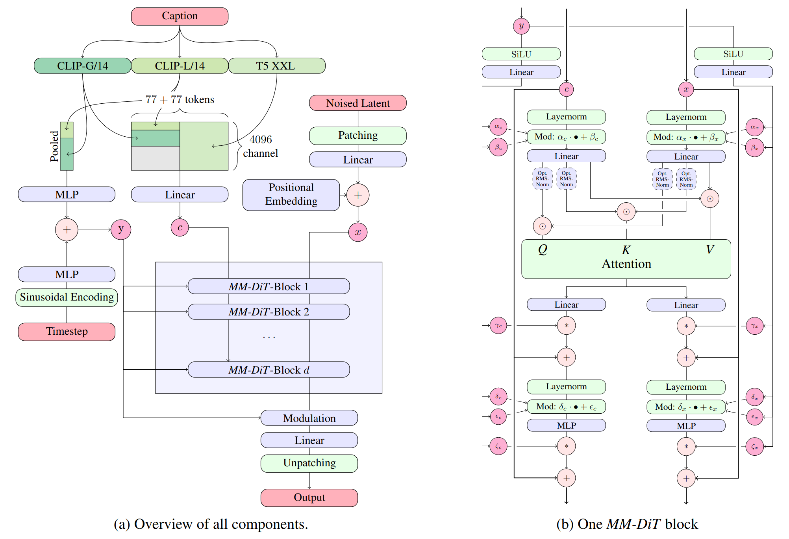
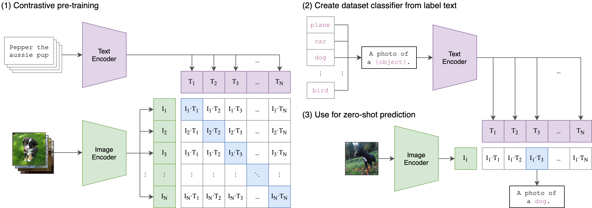
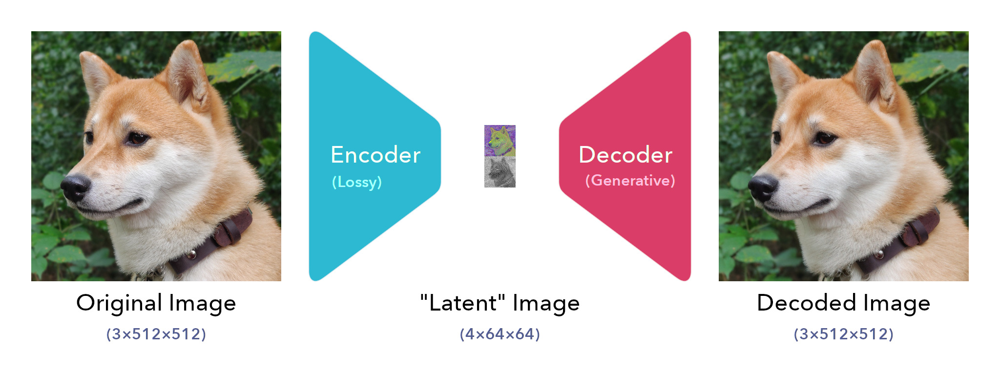
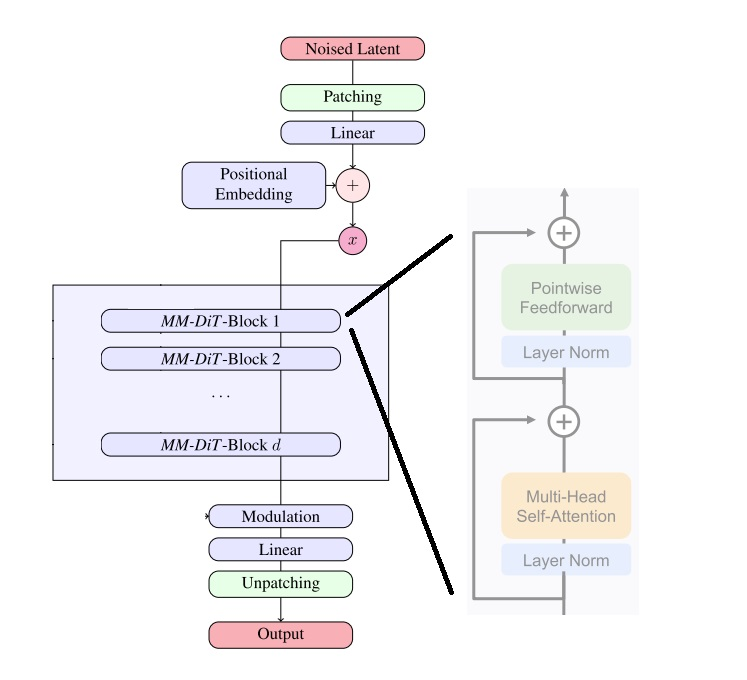
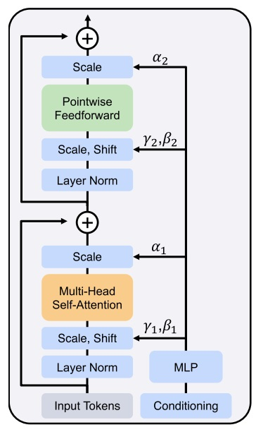

如果要使用 diffusers 框架，需要下载 diffusers 兼容的权重：[stable-diffusion-3-medium-diffusers](https://www.modelscope.cn/models/AI-ModelScope/stable-diffusion-3-medium-diffusers/summary)

官方发布原始权重：[stable-diffusion-3-medium](https://www.modelscope.cn/models/AI-ModelScope/stable-diffusion-3-medium/summary)

# **1. 架构**

在文本到图像生成中，模型需要同时考虑文本和图像两种信息。这种新架构称为 MMDiT，意味着它可以处理多种不同的信息。与之前的稳定扩散版本一样，SD 3 团队使用预训练模型来获取适当的文本和图像表示。具体来说，他们使用了三种不同的文本嵌入器 - 两个 CLIP 模型和 一个 T5 模型 - 来编码文本信息，并使用了改进的自编码模型来编码图像信息。



SD3 以序列 Embedding 的形式处理文本输入和视觉隐空间特征。位置编码 (Positional Encoding) 是施加在隐空间特征的 2x2 patch 上的，随后被展开成 patch 的 Embedding 序列。这一序列和文本的特征序列一起，被送入 MMDiT 的各个模块中去。两种特征序列被转化成相同特征维度，拼接在一起，然后送入一系列注意力机制模块和多层感知机 (MLP) 里。

为应对两种模态间的差异，MMDiT 模块使用<span style="color:magenta">两组不同的权重去转换文本和图像序列的特征维度</span>。两个序列会在注意力操作之前被合并在一起。这种设计使得两种表征能在自己的特征空间里工作，同时也使得它们之间通过注意力机制从对方的特征中提取有用的信息。这种文本和图像间双向信息流动有别于以前的文生图模型，后者的文本信息是通过 cross-attention 送入模型的，且不同层输入的文本特征均是文本编码器的输出，不随深度的变化而改变。

此外，SD3 还在时间步 (timestep) 这一条件信息上加入了汇合过的文本特征，这些文本特征来自使用的两个 CLIP 模型。这些汇合过的文本特征被拼接在一起，然后加到时间步的 Embedding 上，再送入每个 MMDiT 模块。

SD3 是一款多模态扩散变换器（Multimodal Diffusion Transformer, MMDiT）文本到图像模型

```shell
root@paper:/workspace/vivi/project/poc/sd/model# tree
.
├── comfy_example_workflows # 包含示例 comfy 工作流程。
│   ├── sd3_medium_example_workflow_basic.json
│   ├── sd3_medium_example_workflow_multi_prompt.json
│   └── sd3_medium_example_workflow_upscaling.json
├── configuration.json
├── demo_images
│   ├── demo (10).png
├── LICENSE.md
├── mmdit.png
├── README.md
├── sd3demo.jpg
├── sd3demo_prompts.txt
├── sd3_medium_incl_clips.safetensors # 含除 T5XXL 文本编码器之外的所有必需权重。它要求的资源最少，但没有 T5XXL 文本编码器会影响模型性能。
├── sd3_medium_incl_clips_t5xxlfp16.safetensors # 含有所有必需的权重，包括 T5XXL 文本编码器的 fp16 版本。
├── sd3_medium_incl_clips_t5xxlfp8.safetensors # 含有所有必需的权重，包括 T5XXL 文本编码器的 fp8 版本，实现了质量与资源需求之间的平衡。
├── sd3_medium.safetensors # 包含 MMDiT 和 VAE 权重，但不包括任何文本编码器
└── text_encoders # 包含三个文本编码器及其原始模型卡片链接，以便用户方便使用。text_encoders 文件夹内的所有组件（以及在其他打包中嵌入的等效组件）均遵循其各自的原始许可。
    ├── clip_g.safetensors
    ├── clip_l.safetensors
    ├── README.md
    ├── t5xxl_fp16.safetensors
    └── t5xxl_fp8_e4m3fn.safetensors

3 directories, 28 files
```

SD3 使用了三个固定的预训练文本编码器：

- CLIP-ViT/L：[clip-vit-large-patch14](https://huggingface.co/openai/clip-vit-large-patch14/blob/main/README.md)

- OpenCLIP-ViT/G：[CLIP-ViT-bigG-14-laion2B-39B-b160k](https://huggingface.co/laion/CLIP-ViT-bigG-14-laion2B-39B-b160k/blob/main/README.md)

- T5 Version 1.1：[google/t5-v1_1-xxl](https://huggingface.co/google/t5-v1_1-xxl/blob/main/README.md)

## 1.1. CLIP

### 1.1.1. OpenAI CLIP

在 OpenAI 的[博客](https://openai.com/index/clip/)中，CLIP 模型能高效地从自然语言监督中学习视觉概念。通过提供要识别的视觉类别名称，CLIP 可以应用于任何<span style="color:magenta">**视觉分类**</span>基准测试。通过在各种不同的图像上进行训练，并使用互联网上广泛存在的自然语言监督信息，在不直接优化基准性能的前提下，在 ImageNet 上的零样本性能与原始 ResNet-50 相当。

CLIP（对比语言-图像预训练）建立在大量关于零样本迁移、自然语言监督和多模态学习的研究基础上。使用<span style="color:magenta">**互联网上与图像配对的文本**</span>执行以下训练：<span style="color:tomato">给定一张图像，预测在 32,768 个随机采样的文本片段中，哪一个实际上与该图像在我们的数据集中配对过。</span>为了完成训练，我们的直觉是，CLIP 模型需要学会识别图像中各种各样的<span style="color:blueviolet">**视觉概念**</span>，并将它们与<span style="color:blueviolet">**名称关联**</span>起来。这样一来，CLIP 模型就可以应用于几乎任意的视觉分类任务。例如，如果某个数据集的任务是区分狗和猫的照片，我们会检查每张图像，看 CLIP 模型预测“一张狗的照片”还是“一张猫的照片”更可能与该图像配对。

CLIP 通过预训练<span style="color:magenta">**图像编码器**</span>和<span style="color:magenta">**文本编码器**</span>来预测数据集中哪些图像与哪些文本配对，然后我们利用这种行为<span style="color:magenta">将 CLIP 转换为**零样本分类器**</span>。我们将数据集的所有类别(class)转换为描述(caption)，如“一张狗的照片”，并预测 CLIP 认为最可能与给定图像描述(caption)匹配的类别(class)。



CLIP 旨在缓解标准深度学习方法在计算机视觉领域面临的多个<span style="color:red">问题</span>：

- 昂贵的数据集：深度学习需要大量数据，而视觉模型传统上是在人工标注的数据集上训练的，这些数据集构建成本高，且仅能为有限数量的预定义视觉概念提供监督。ImageNet 数据集是这一领域的最大努力之一，它耗费了超过 25,000 名工作人员标注 1400 万张图片，覆盖 22,000 个物体类别。相比之下，<span style="color:magenta">CLIP 从互联网上已公开可用的图文对中学习</span>。
- 窄：ImageNet 模型擅长预测 1000 个 ImageNet 类别，但仅此而已。“开箱即用”时它无法完成其他任务。如果执行其他任务，从业者需要构建一个新的数据集，添加一个输出头，并微调该模型。相比之下，<span style="color:magenta">CLIP 可以在不需要额外训练样本的情况下适应各种视觉分类任务</span>。要将 CLIP 应用于新任务，只需“告诉”CLIP 的**文本编码器**该任务中<span style="color:blueviolet">**视觉概念**的**名称**</span>，它就会输出 CLIP 视觉表示的<span style="color:magenta">线性分类器</span>。这个分类器的准确率通常可以与完全监督的模型相媲美。
- 现实世界表现不佳：深度学习系统通常在视觉基准测试中达到人类甚至超人类的性能 ，但在部署到真实环境中时，其表现可能远低于基准测试所设定的预期。换句话说，“基准性能”和“实际性能”之间存在差距。这种差距出现的原因在于模型通过仅优化基准测试上的表现来“作弊”，就像一名学生只复习往年试题就通过考试一样。相比之下，CLIP 模型可以在不训练其数据的情况下评估基准测试，因此它无法以这种方式“作弊”。这使得它的基准测试性能更真实地反映其在现实环境中的表现。为了验证“作弊假设”，我们还测量了当 CLIP 能够“备考”ImageNet 时其性能的变化。当在 CLIP 特征上拟合一个线性分类器时，它使 CLIP 在 ImageNet 测试集上的准确率提高了近 10%。然而，该分类器在衡量“鲁棒性”的 7 个其他数据集组成的评估套件中平均表现并无提升。

<span style="color:magenta">CLIP 从未经筛选、高度多样化且噪声极大的数据中学习</span>，并旨在以零样本（zero-shot）方式使用。为了减少所需的计算量，我们专注于<span style="color:magenta">通过算法手段提高训练效率</span>。我们报告了两个算法选择，它们带来了显著的计算资源节省。第一个选择是采用**对比目标**来连接文本与图像。在小规模到中等规模的实验中，我们发现 CLIP 使用的对比目标在零样本 ImageNet 分类任务上比其他方法高效 4 到 10 倍。第二个选择是采用视觉 Transformer，相较于标准的 ResNet，这使我们在计算效率上又提升了 3 倍。最终，我们表现最佳的 CLIP 模型在 256 个 GPU 上训练两周，这与现有的大型图像模型相当。

虽然 CLIP 在识别常见物体方面表现良好，但在<span style="color:red">更**抽象**或**系统性**的任务上表现不佳</span>，例如统计图像中物体的数量，以及更复杂的任务，比如预测照片中最近车辆的距离。在这两个数据集上，零样本 CLIP 的表现仅略优于随机猜测。与特定任务模型相比，零样本 CLIP <span style="color:red">在非常细粒度的分类任务上也表现不佳</span>，例如区分不同车型、飞机型号或花卉种类。

### 1.1.2. OpenClip

[mlfoundations/open_clip](https://github.com/mlfoundations/open_clip) 是 OpenAI 原始 [CLIP](https://arxiv.org/abs/2103.00020) 模型的开源复现与扩展，提供一系列基于 ViT（Vision Transformer）和 CNN 的图文对齐预训练模型。Stable Diffusion 3 (SD3) 的 `text_encoders` 目录下包含两个文本编码器模型：

- CLIP-ViT/L：[clip-vit-large-patch14](https://www.modelscope.cn/models/AI-ModelScope/clip-vit-large-patch14/file/view/master/config.json?status=1)。这是 OpenAI 发布的原始 CLIP 模型之一，使用 ViT-Large 架构，patch size 为 14。参数量约为 427M，用于提供基础的文本理解能力。

- OpenCLIP-ViT/G：[CLIP-ViT-bigG-14-laion2B-39B-b160k](https://www.modelscope.cn/models/AI-ModelScope/CLIP-ViT-bigG-14-laion2B-39B-b160k/file/view/master/config.json?status=1)。由 LAION 组织训练的更大规模的 CLIP 模型，使用 ViT-bigG 架构。参数量约为 1.8B。

这两个文件分别对应两个不同的 CLIP 变体，用于增强 SD3 的文本理解和生成能力。在 SD3 中，两个文件**都只包含各自模型的文本编码器部分**，视觉编码器权重已被完全剥离。

| 名称                  | 视觉骨架              | 参数量  | 特点/场景                          |
| --------------------- | --------------------- | ------- | ---------------------------------- |
| ViT-B-32              | ViT-Base/32           | 151 M   | 速度最快，适合原型开发             |
| ViT-B-16              | ViT-Base/16           | 150 M   | 精度-速度平衡                      |
| ViT-L-14              | ViT-Large/14          | 427 M   | 通用精度首选                       |
| ViT-H-14              | ViT-Huge/14           | 954 M   | 高精度推理                         |
| ViT-g-14              | ViT-giant/14          | 1.8 B   | 目前最大开源 CLIP，Top-1 85 % 左右 |
| MobileCLIP-S0/S1/S2/B | EfficientNet+ViT 混合 | 24–59 M | 端侧实时推理，支持 iOS/Android     |

> 注：同一骨架下还会根据“训练步数/数据集”细分，如 `laion2b_s34b_b79k` 表示在 LAION-2B 数据集上训了 34B 样本、GBS 为 79k。
>
> **`vit-b-32 laion2b-s34b-b79k`** 代表图像编码器使用了 ViT（Vision Transformer），B 是视觉 Transformer 模型的 Base 大小，32 代表 ViT 使用的 patch 大小为 32\*32 像素。

## 1.2. T5

[google/t5-v1_1-xxl](google/t5-v1_1-xxl) 是 Google 在原始 T5（Text-to-Text Transfer Transformer）基础上发布的“1.1 版本”里最大容量的预训练 checkpoint。由于完全自监督，**必须微调**才能直接用于下游任务。 如需开箱即用地生成文本，可先用 AutoModelForSeq2SeqLM 加载，再在小数据上微调几轮；若仅要文本特征，可加载 encoder-only 的社区转换版本（bf16 / GGUF），显存占用从数十 GB 降至数 GB。

模型规模：

- 参数量 ≈ 11 B（官方简称“xxl”）
- 结构：标准的 <span style="color:magenta">**Encoder-Decoder Transformer**</span>，Encoder 24 层、Decoder 24 层
- 预训练语料：C4（Colossal Clean Crawled Corpus，约 750 GB 英文文本）
- 训练目标：Span-corruption（类似 BERT 的 MLM），通过“哨兵 token”方式统一所有 NLP 任务为文本生成格式

相比第一版 T5，它在保持“纯文本到文本”框架的同时，做了 5 项关键改动：

1. 仅使用 C4（Colossal Clean Crawled Corpus，约 750 GB 英文文本）语料做自监督预训练，不再混入下游监督任务，避免数据泄漏。
2. 前馈层激活函数由 ReLU 换成 GEGLU，提升非线性表达能力。
3. 预训练阶段关闭 Dropout，微调时再手动打开，以获得更高质量的预训练权重。
4. 词嵌入层与输出分类层不再共享参数，减少训练-推理耦合。
5. 尺寸命名改为“xl / xxl”，并重新调整宽度与头数：xxl 拥有更大的 d_model、更少的注意力头数和相对较小的 d_ff，使计算与通信效率更均衡。

典型应用

- 文本摘要、问答、翻译、分类等传统 NLP 任务
- 作为扩散模型（Stable Diffusion 3、FLUX.1）的文本编码器，提供强语义特征
- 低比特量化实验与推理加速研究的基准模型

## 1.3. VAE

> 关于 VAE 的详细介绍可以参考[苏剑林的文章](https://spaces.ac.cn/archives/5253)

SD 的 VAE 模块是一个神经网络，由编码器-解码器组成，其中编码器会将原始图片编码为压缩后的潜码，降低计算量；解码器则用于把去噪后的潜码还原成像素图。推理阶段只用解码器。



VAE 模型的推导过程用到了 KL 散度及其性质，因此称为“变分”自编码器。在 SD 模型的生成过程中，VAE 解码器部分的使用方式如下。需要注意的是，<span style="color:magenta">SD3 中已经将去噪网络从 U-Net 改成了 Diffusion Transformer (DiT) 神经网络</span>。


SD3 中的 VAE 是一个 16 通道的 AutoEncoder 模型，

## 1.4 多模态 DiT(MM-DiT)

SD3 的去噪模型是一个 Diffusion Transformer (DiT)。如果去噪模型只有带噪图像这一种输入的话，DiT 则会是一个结构非常简单的模型，和标准 ViT 一样：图像过<span style="color:magenta">图块化层 (Patching) </span>并与位置编码相加，得到序列化的数据。这些数据会像标准 Transformer 一样，经过若干个子模块，再过<span style="color:magenta">反图块层</span>得到模型输出。DiT 的每个子模块 DiT-Block 和标准 Transformer 块一样，由 LayerNorm, Self-Attention, 一对一线性层 (Pointwise Feedforward, FF) 等模块构成。

> 图块化层会把 $2\times2$个像素打包成图块，反图块化层则会把图块还原回像素。



然而，扩散模型中的去噪网络一定得支持带约束生成。这是因为扩散模型约束于去噪时刻 。此外，作为文生图模型，SD3 还得支持文本约束。DiT 及本文的 MM-DiT 把模型设计的重点都放在了处理额外约束上。如下图所示，SD3 的模块保留了 DiT 的设计，用自适应 LayerNorm (Adaptive LayerNorm, AdaLN) 来引入额外约束。具体来说，过了 LayerNorm 后，数据的均值、方差会根据时刻约束做调整。另外，过完 Attention 层或 FF 层后，数据也会乘上一个和约束相关的系数。



文本约束以两种方式输入进模型：**与时刻编码拼接、在注意力层中融合**。具体数据关联细节可参见下图。为了提高 SD3 的文本理解能力，描述文本 (“Caption”) 经由三种编码器编码，得到两组数据。一组较短的数据会经由 MLP 与文本编码加到一起；另一组数据会经过线性层，输入进 Transformer 的主模块中。


SD3 的 DiT 的子模块结构图如上 b 所示，可以分几部分来看它。先看时刻编码 $y$ 的那些分支。和标准 DiT 子模块一样， 通过修改 LayerNorm 后数据的均值、方差及部分层后的数据大小来实现约束。再看输入的图像编码 $x$ 和文本编码 $c$。二者以相同的方式做了 DiT 里的 LayerNorm，FF 等操作。不过，相比此前多数基于 DiT 的模型，此模块用了一种特殊的融合注意力层。具体来说，在过注意力层之前，<span style="color:magenta">$x$ 和 $c$ 对应的 $Q,K,V$ 会分别拼接到一起</span>，而不是像之前的模型一样，$Q$ 来自图像，$K,V$ 来自文本。过完注意力层，输出的数据会再次拆开，回到原本的独立分支里。由于 Transformer 同时处理了文本、图像的多模态信息，所以作者将模型取名为 MM-DiT (Multimodal DiT)。

> 仅从数据来源来看，<span style="color:magenta">过了一个注意力层后，图像信息和文本信息就混在了一起</span>。很难测量之后的 $x$ 主要是图像信息，$c$ 主要是文本信息。只能说 $x,c$ 都蕴含了多模态的信息。之前 SD U-Net 里的 $x,c$ 可以认为是分别包含了图像信息和文本信息，因为之前的 $x$ 保留了二维图像结构，而 $c$ 仅由文本信息决定。

在训练过程中，SD3 创新的 MMDiT 架构在视觉保真度和文本对齐度方面表现优于已有的文本到图像的骨干架构，如 UViT（Hoogeboom 等，2023 年）和 DiT（Peebles＆Xie，2023 年）。

# 2. 训练

Stable Diffusion 3 采用<span style="color:magenta">**矫正流**（Rectified Flow，RF）</span>的思想（Liu 等，2022 年；Albergo & Vanden-Eijnden，2022 年；Lipman 等，2023 年），在训练过程中，数据和噪声按照线性轨迹相互关联。这种方法能够获得更加直接的推理路径，从而减少采样所需的步骤。同时，SD3 团队还引入了一种新颖的<span style="color:magenta">轨迹采样计划</span>。这个计划更注重轨迹中间部分的采样，因为他们认为这些部分对于预测任务更具挑战性。

通过与其他 60 种扩散轨迹（如 LDM、EDM 和 ADM）进行比较，使用了多个数据集、评估指标和采样设置。结果显示，虽然之前的矫正流方法在少量采样步骤时表现出改进的性能，但随着步骤增加，性能相对下降，而重新加权矫正流方法在各种步骤下都能持续提升性能。

[SD3 论文](https://arxiv.org/pdf/2403.03206)的核心贡献是用**整流 (rectified flow)** 生成模型、**Transformer** 神经网络做了模型**参数扩增**实验，以实现高质量文生图大模型。

除了结构上的创新，SD3 也使用了 [conditional flow-matching](https://arxiv.org/html/2403.03206v1#S2) 作为训练目标函数来训练模型。这一方法中，前向加噪过程被定义为一个 [rectified flow](https://arxiv.org/html/2403.03206v1#S3)，以一条直线连接数据分布和噪声分布。

采样过程也变得更简单了，当采样步数减少的时候，模型性能也很稳定。为此，SD3 引入了新的 scheduler ( `FlowMatchEulerDiscreteScheduler` )，集成了 rectified flow-matching 的运算公式以及欧拉方法 (Euler Method) 的采样步骤。同时还提出了一个与生成分辨率相关的 `shift` 参数。对于高分辨率，增大 `shift` 的值可以更好地处理 noise scaling。针对 2B 模型，建议设置 `shift=3.0` 。

## **2.1 调度器**

`FlowMatchEulerDiscreteScheduler` 是在 Hugging Face Diffusers 里用于 Flow Matching（流匹配）型采样 的一种 Euler 离散方法调度器，主要用于图像扩散模型（包括 Stable Diffusion 3 等）在训练或推理时的噪声时间步/σ 值调度。

`FlowMatchEulerDiscreteScheduler` 主要控制：

- 时间步数（num_train_timesteps）
- 噪声级别 σ 的分布（shift, base_shift, time_shift_type 等）
- 生成时间步序列的方法（linear / exponential / karras 等）
- 是否加入随机性（stochastic_sampling）
- 是否反转或动态调整 σ 曲线

这样可以让采样更适合流匹配训练的噪声分布，从而提升生成质量或速度。

## 2.2 DreamBooth

[DreamBooth](https://dreambooth.github.io/) 是 Google Research 在 2022 年提出的一种“小样本个性化”微调方法，面向文本-生成-图像扩散模型（如 Stable Diffusion 3）。它只用 3–10 张用户提供的图片，就能让基础模型学会“一个特定主体/风格”，并在任意提示词下把该主体自然融入新场景。

Diffusers 官方给出了基于 DreamBooth 进行训练的[示例](https://github.com/huggingface/diffusers/blob/main/examples/dreambooth/README_sd3.md)：

下载示例数据集，并进行后处理：

```shell
hf download --repo-type dataset  diffusers/dog-example --local-dir dog
```

# 参考

> [Stable Diffusion 3 论文及源码概览](https://zhouyifan.net/2024/07/14/20240703-SD3/)
