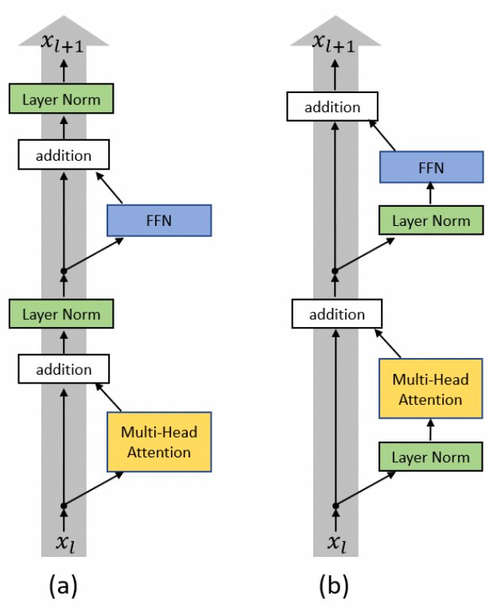
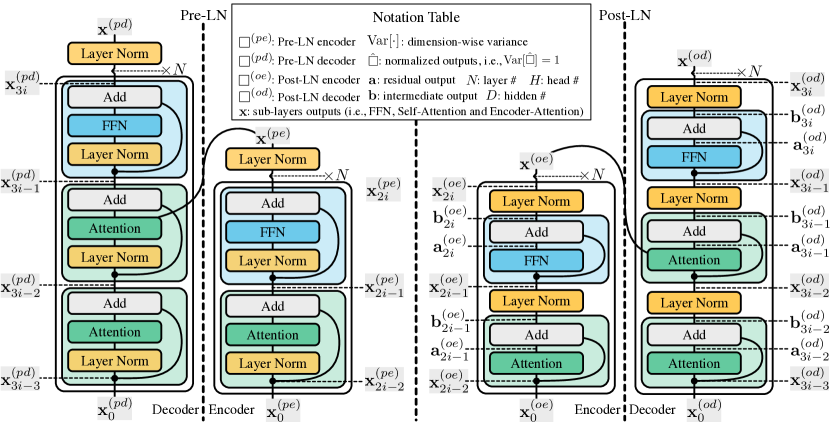

# 1. LayerNorm

在[Transformer](https://aliyuque.antfin.com/vivi.xl/gdp85f/yfl32wzh9k7bethb)中曾简要介绍过层归一化：层归一化是一种标准化技术，它在训练深度神经网络时被用来**稳定模型的学习过程，减少内部协变量偏移的影响**。在层归一化中，对于给定的样本，在模型的一个层内，会计算所有特征的均值和标准差，并使用这些统计信息来对该层的输出进行归一化处理。

这里引出了一个问题，为什么在 Transformer 中使用层归一化而不是批归一化呢？

## 1.1. LN vs BN

层归一化的特点是它是在网络的单个层上对特征进行归一化，即在**同一层内跨特征的统计归一化**，而不是像批归一化（Batch Normalization）那样在不同样本的同一特征上进行归一化。相比于批归一化，**层归一化**在处理变长序列、小批量数据或在线学习等任务时更加有效，因为它不依赖于批次的大小，其统计量是沿<span style="color:magenta">特征维度</span>而不是沿<span style="color:magenta">批次维度</span>计算的。

**Layer Normalization (LayerNorm)**:

- **归一化维度**：针对输入的各层特征（layer dimensions），即在每个时间步或者每个独立样本的所有隐藏层神经元上进行归一化。
- **计算方式**：`x_norm = (x - mean) / sqrt(variance + epsilon)`，其中 `mean` 和 `variance` 是沿着每个样本的特征维度计算的。
- **归一化对象**：不同于 BatchNorm，LayerNorm 是独立于 batch 大小的，适合任意 batch size，包括 batch size 为 1 的情况。

**Batch Normalization (BatchNorm)**:

- **归一化维度**：针对输入的 batch 维度进行归一化，即在特征维度上做归一化，使得每个特征在 mini-batch 上均值为 0，方差为 1。
- **计算方式**：`x_norm = (x - batch_mean) / sqrt(batch_variance + epsilon)`，其中 `batch_mean` 和 `batch_variance` 是沿着 batch 维度计算的。
- **归一化对象**：依赖于 batch 的大小，<span style="color:red">通常需要较大的 batch 才能取得更好的效果</span>。

自注意力机制中，特别是在 Transformer 模型中，Layer Normalization 被广泛使用而不是 Batch Normalization，有以下原因：

1. **依赖于序列位置**：自注意力机制主要用于处理<span style="color:magenta">**变长的输入序列**</span>，输入序列的长度（时间步数）可能会变化。Layer Normalization 针对每个时间步的特征进行归一化，因此对输入序列的长度不敏感。
2. **更加稳定**：在自注意力或 Transformer 模型中，每个时间步或层的特征因为动态权重的变化可能产生显著的波动，而 Layer Normalization 能更好地捕捉这些变化，<span style="color:magenta">不依赖于 batch 的分布</span>。
3. **适用的批量大小**：Layer Normalization 不依赖于 batch size 的大小，当 batch size 变化时，或在极端情况下（如 batch size = 1），Layer Normalization 依然能有效工作。这在处理序列数据或时间序列数据时尤其重要。
4. **批内依赖减小**：自注意力层的计算和序列中每个时间步间有复杂的依赖关系，而 Batch Normalization 由于需要跨样本计算均值和方差，会引入<span style="color:magenta">跨样本间的依赖</span>，可能影响收敛性和模型表现。

## 1.2. Pre-LN vs Post-LN

在 Transformer 原始论文《Attention is All You Need》中，Layer Normalization 被用于每个子层（Attn 和 FFN）之后。采用后置 **LayerNorm(Post-LN)**，作用类似于标准的`BatchNorm`，由于经过神经网络后数据的分布会发生改变，通过后置 LN 能够控制<span style="color:magenta">输出数据</span>的分布。

如果使用前置 LayerNorm(Pre-LN)，即在每个子层之前(例如 Attn/FFN 之前)应用`LayerNorm`，可以改善训练的稳定性避免梯度消失或者梯度爆炸，<span style="color:magenta">有助于训练更深的网络</span>。



LayerNorm 放置在哪里是一个值得探索的问题，例如 Llama 将 LN 放置在 Attention 和 FFN 之前，而标准的 Transformer 架构采用了 Post-FN。



[On Layer Normalization in the Transformer Architecture](https://arxiv.org/pdf/2002.04745) 指出，<span style="color:red">当使用 Pre-LN 时，如果模型参数是随机初始化的，则需要对学习率进行 warmup；对于 Post-LN，如果没有 warmup 会容易导致梯度爆炸</span>。


Pre-LN 通过对输入进行标准化，有助于解决梯度消失或爆炸的问题，同时可以让模型训练更深的网络，此外 <span style="color:magenta">**Pre-LN 收敛速度也比 Post-LN 快很多**</span>。

Post-LN 是标准的实现方式，类似于传统神经网络中的 Batch-Normalization，有助于控制每层的输出分布。

看上去 Pre-LN 既能节省算力又能快速收敛，Llama 也在用，因此国内基本上也开始抄作业。但是从数学角度来看，对于任意函数表示的 Attn 或者 FFN 的计算，整个 Pre-LN 的迭代过程如下：

$$
\begin{align}
x_{t+1} &=
x_t + F_t(Norm(x_t)) \\

&= x_{t-1} + F_{t-1}(Norm(x_{t-1}))+F_t(Norm(x_t)) \\
&=...
\end{align}
$$

实际上是得到了一个<span style="color:red">**更宽更浅**</span>的模型，这样配合一定的稀疏性（如 LoRA 微调），模型的质量反而会下降，总体来看为了一个算力上的优势把模型的效果降低，这样的取舍是否得当？我们需要辩证的来看，而不是抱着抄作业的心态。

## 1.3. 代码实现

此处以原始论文中的设计为例，进行阐释。

### 1.3.1. 前向传播

`Layer Normalization` 的前向传播公式：

1. **计算均值**：

   $\mu = \frac{1}{C} \sum_{i=1}^{C} x_i$

2. **计算标准差和反向标准差**：

   $\sigma = \sqrt{\frac{1}{C} \sum_{i=1}^{C} (x_i - \mu)^2}$

   $\begin{align}
   rstd &= \frac{1}{\sqrt{\sigma + \epsilon}} \\ 
   &= \frac{1}{\sqrt{\frac{1}{C} \sum_{i=1}^{C} (x_i - \mu)^2+\epsilon}}
   \end{align}$

3. **规范化**：

   $\hat{x}_i = (x_i - \mu) \cdot rstd$

4. **缩放和平移**：

   $y_i = \gamma \hat{x}_i + \beta$
   其中， $\gamma$ 和 $\beta$分别是缩放因子和偏移因子（trainable parameters)。

```python
import torch
eps = 1e-5

class LayerNorm:

    @staticmethod
    def forward(x, w, b):
        # x is the input activations, of shape B,T,C
        # w are the weights, of shape C
        # b are the biases, of shape C
        B, T, C = x.size()
        # calculate the mean
        # 计算输入张量 x 在特征维度上的均值。
        mean = x.sum(-1, keepdim=True) / C # B,T,1
        # calculate the variance
        xshift = x - mean # B,T,C
        # 计算输入张量 x 偏离其均值的平方之和，然后除以特征的个数 C 来求得方差。
        var = (xshift**2).sum(-1, keepdim=True) / C # B,T,1
        # calculate the inverse standard deviation: **0.5 is sqrt, **-0.5 is 1/sqrt
        # 使用方差计算标准差的倒数
        rstd = (var + eps) ** -0.5 # B,T,1
        # normalize the input activations
        # 规范化后的统计特性接近于零均值和单位方差
        norm = xshift * rstd # B,T,C
        # scale and shift the normalized activations at the end
        # out 是经过重缩放和平移（权重 w 和偏置 b）后的 norm，它的分布特性将不再是标准化后的数字
        out = norm * w + b # B,T,C

        # return the output and the cache, of variables needed later during the backward pass
        cache = (x, w, mean, rstd)
        return out, cache

    @staticmethod
    def backward(dout, cache):
        x, w, mean, rstd = cache
        # recompute the norm (save memory at the cost of compute)
        norm = (x - mean) * rstd
        # gradients for weights, bias

        db = dout.sum((0, 1))
        dw = (dout * norm).sum((0, 1))
        # gradients for input
        dnorm = dout * w
        dx = dnorm - dnorm.mean(-1, keepdim=True) - norm * (dnorm * norm).mean(-1, keepdim=True)
        dx *= rstd
        return dx, dw, db
```

### 1.3.2. 反向传播

反向传播的目标是计算损失函数对所有参数和输入的梯度。在 `Layer Normalization` 中，反向传播涉及梯度的计算，这里包括三个主要部分的梯度：偏置（bias）的梯度 ( db )，权重（weight）的梯度 ( dw )，以及输入 ( x ) 的梯度 ( dx )。

#### 偏置梯度

$\beta$ 是一个偏执参数。其影响的只是简单的加法：

$y_i = \gamma \hat{x}_i + \beta$

`dout` 是损失函数相对于输出  的梯度。由于  对每个  都有同样影响，因此：

$\frac{\partial L}{\partial \beta_j} = \sum_{i=1}^{N} \frac{\partial L}{\partial y_i} \frac{\partial y_i}{\partial \beta_j} = \sum_{i=1}^{N} dout_{i}$

在代码中实现为：

```python
db = dout.sum((0, 1))
```

#### 权重梯度

 是伸缩因素：

因此， 与  相关，求导数：


由于，我们重新计算了 ，并表示为 `norm`：

```python
norm = (x - mean) * rstd
dw = (dout * norm).sum((0, 1))
```

#### 输入梯度

首先，定义 `dnorm`：

```python
dnorm = dout * w
```

接下来，计算归一化输入对  的反向传播。对于归一化步骤，，梯度需要处理均值和标准化部分的影响。代码有效归纳为：


即代码中的公式：

```python
dx = dnorm - dnorm.mean(-1, keepdim=True) - norm * (dnorm * norm).mean(-1, keepdim=True)
dx *= rstd
```

## 1.4. 优化

LayerNorm 是一个访存密集型的算子，计算均值和方差然后进行修正需要读取和写入两次参数。关于 LayerNorm 在 GPU 上基于 Welford's 的优化可以参考[OneFlow 的一篇文章](https://zhuanlan.zhihu.com/p/443026261)

# 2. RMSNorm

RMSNorm（Root Mean Square Layer Normalization，均方根层归一化）是一种用于神经网络的正则化技术，旨在改善模型的训练稳定性和性能。它通常被视为 Layer Normalization 的一种变体，简化了一些计算并提供了一定的优势。

RMSNorm 的设计和 Layer Normalization 相似，但其主要区别在于如何计算标准化因子。它采用了<span style="color:magenta">**均方根**（RMS）</span>来替代均值和方差的计算，减小了计算复杂度，同时避免了均值计算中的不稳定性。

假设输入向量为 ，其维度大小为 ，RMSNorm 的数学公式如下：

1. **计算均方根（RMS）**：
   
2. **进行归一化**：
   
3. **缩放和平移**：RMSNorm 也可以引入可训练的缩放参数 ，但通常不涉及偏移参数 ：
   

因为不需要计算均值和标准差，而只需要计算平方和，这使得相比 Layer Normalization， RMSNorm 在**计算上更高效**。而且，由于消除了均值计算，RMSNorm 在一定程度上**提高了数值稳定性**，尤其是在小批量处理的情况下。

目前主流的模型都使用了 RMS Norm 来替代原始的 LayerNorm，比如[LLama](https://aliyuque.antfin.com/vivi.xl/gdp85f/rs9lz61s7y4trukz)、[Deepseek](https://aliyuque.antfin.com/vivi.xl/gdp85f/za2f5odgdoyal682#i05Ld)等。

# 3. 参考文档

https://ar5iv.labs.arxiv.org/html/2004.08249

https://arxiv.org/pdf/2002.04745

##

## here are the updates to merge:

## markdown:transformers/modules/归一化.md

layout: default
title: 归一化

---

# 1. LayerNorm

<!-- ... existing code ... -->
