---
---

# 嵌入模型

嵌入模型将数据序列（文本或图像）转换为高维向量的语义表示形式，能够捕捉不同维度上的含义。

$$
\text{Embedding model}(\text{"Robert Moses was an American urban planner"}) = \begin{align}
    \begin{bmatrix}
           0.12 \\
           -2.23 \\
           5.73 \\
           \vdots \\
          2.12
         \end{bmatrix}
  \end{align}
$$

这种语义表示之后可用于下游任务，例如“找到与用户提问语义最相似的文档”。相似度通过线性代数运算（如向量之间的点积或余弦相似度）计算得出。尽管这种单一向量表示存在一些局限性，但嵌入仍然是任何现代 RAG 系统的核心组成部分。

嵌入接口的特别之处在于其使用成本极其低廉。虽然 OpenAI 对其 O1 推理模型收取高达每百万输入 token 15 美元、每百万输出 token 60 美元的费用，但嵌入模型的价格却低得惊人——最受欢迎的`text-embedding-ada-002`模型仅需每百万输入 token 10 美分（见图 1）。

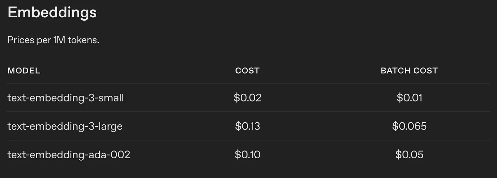

对整个英文维基百科语料库进行嵌入大约需要：


如果我们查看其他竞争对手的产品，价格大多与此相近，其中 Google 的 gemini-embedding-001 为每百万输入文本标记 0.15 美元，Cohere 的 Embed 4 为每百万输入文本标记 0.12 美元。

尽管从“计算浮点运算次数（FLOPS）”的角度来看，这些价格可能显得人为偏低，但显然它们反映了处理一个标记的底层成本结构。生成嵌入向量的成本极其低廉，而这些节省直接传递给了消费者。还有另一个因素促使价格下降：无论架构如何，嵌入模型正在趋同于相似的语义表示。如果所有模型都能以类似方式捕捉语义，差异化几乎变得不可能。这使得提供原始嵌入服务成为一个糟糕的生意，迫使那些曾专注于此的公司转向能获取更高利润率的端到端搜索服务。

## Qwen3 嵌入架构

> 参考：[Qwen3 Embedding: Advancing Text Embedding and Reranking Through Foundation Models](https://arxiv.org/pdf/2506.05176)

以 Qwen3-Embedding-8B 作为示例模型。截至 2025 年 9 月，该模型在嵌入任务排行榜上名列前茅（见图 2）。尽管将 MTEB 作为模型质量的代理存在局限性，因为模型可能对测试数据过拟合，但它仍被广泛采用。由于我们更关注生成嵌入表示所需的计算成本，而非模型的具体性能表现，因此这对我们分析来说不应构成问题。

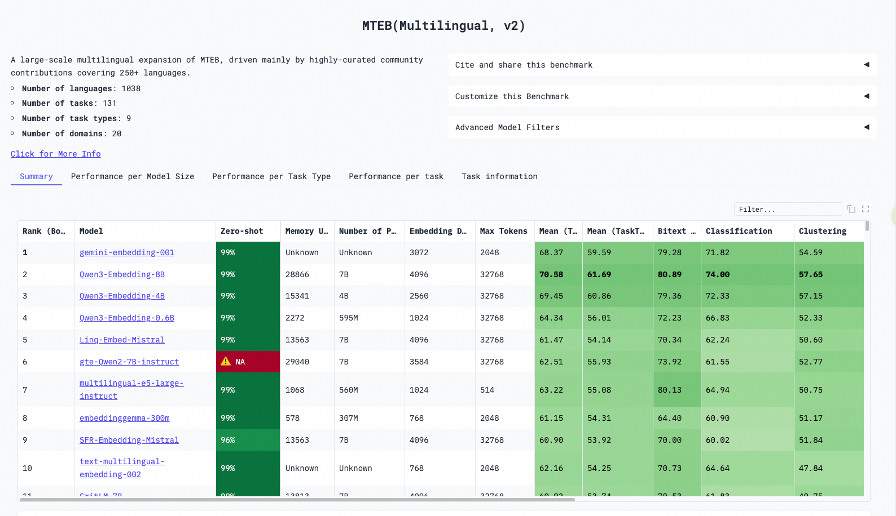

我们对商用嵌入模型做出几个关键假设。假设闭源模型如 text-embedding-ada-002 和 gemini-embedding-001 与 Qwen3 具有相似的架构设计，即假设它们是密集型 Transformer 模型，通过一次前向传播生成嵌入，并且参数量相对紧凑，低于 10B。

Qwen3 嵌入模型的架构非常简单，引用 Qwen 团队的话：

Qwen3 嵌入模型基于 Qwen3 基础模型的密集版本构建，提供三种尺寸：0.6B、4B 和 8B 参数。我们使用 Qwen3 基础模型来初始化这些模型，以利用其在文本建模和指令遵循方面的优势。

对于文本嵌入，我们使用具有因果注意力机制的 LLMs，并在输入序列末尾附加一个 [EOS] 标记。最终的嵌入向量来自对应于该 [EOS] 标记的最后层隐藏状态

这意味着生成一个嵌入只需通过模型进行一次前向传播，提取对应于最后一个[EOS]标记的隐藏状态（见图 3）。换句话说，使用 Qwen3 的自回归版本时，<font color="magenta">**嵌入的计算**量几乎与完成**预填充阶段**或生成第一个输出标记完全相同</font>。

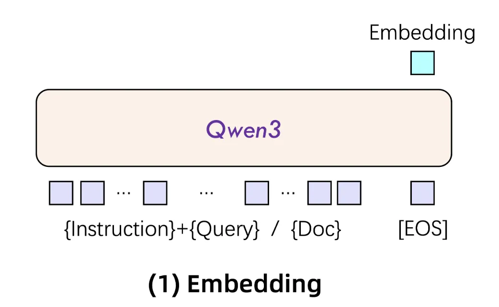

## FLOPs 计算

请注意，FLOPS 和 FLOPs 意思不同。FLOPS（小写 s）是指浮点运算的复数形式，完全不考虑时间因素；而 FLOPS（大写 S）则指每秒发生的浮点运算次数。

LLaMA 模型前向传播的总 FLOPs 为，参考

$$
\begin{align}
\text{Total FLOPs of Llama} = {} & \text{num\_hidden\_layers} \times \\
& (10S \times \text{hidden\_size} + 25.5S \times \text{hidden\_size}^2 \\
& + 4S^2 \times \text{hidden\_size} + 5S^2 \times \text{num\_attention\_heads}) \\
& + 2 \times \text{hidden\_size} \times \text{vocab\_size}
\end{align}
$$

其中 S 是处理序列的序列长度。

Qwen3 和 Llama3 具有非常相似的架构。两者都是密集因果 Transformer 模型；都使用分组查询注意力机制和 silu 激活函数用于 MLP。一个微小的区别在于，Qwen3 的隐藏层大小与中间层大小的比值为 3（12288/4096，见图 4），而 LLaMA 的比值为 3.5，由于这一差异如此微不足道，我们仍继续使用上述公式来估计 Qwen 前向传播的 FLOPs。

```json
{
  "architectures": ["Qwen3ForCausalLM"],
  "attention_bias": false,
  "attention_dropout": 0.0,
  "bos_token_id": 151643,
  "eos_token_id": 151645,
  "head_dim": 128,
  "hidden_act": "silu",
  "hidden_size": 4096,
  "initializer_range": 0.02,
  "intermediate_size": 12288,
  "max_position_embeddings": 40960,
  "max_window_layers": 36,
  "model_type": "qwen3",
  "num_attention_heads": 32,
  "num_hidden_layers": 36,
  "num_key_value_heads": 8,
  "rms_norm_eps": 1e-6,
  "rope_scaling": null,
  "rope_theta": 1000000,
  "sliding_window": null,
  "tie_word_embeddings": false,
  "torch_dtype": "bfloat16",
  "transformers_version": "4.51.2",
  "use_cache": true,
  "use_sliding_window": false,
  "vocab_size": 151665
}
```

由于在嵌入表示中仅使用对应于[EOS]标记的最后层隐藏状态，而无需计算下一个预测标记的概率分布，即<font color="magenta">可以省去计算语言模型头部（LM head）的浮点运算量（FLOPs）</font>。虽然池化层会引入一些额外的 FLOPs，但这些操作涉及的运算非常少，简化起见可以忽略。这样前向传播的总计算量变为：

$$
\begin{align}
\text{Total FLOPs of Qwen Embedding} = {} & \text{num\_hidden\_layers} \times \\
& (10S \times \text{hidden\_size} + 25.5S \times \text{hidden\_size}^2 \\
& + 4S^2 \times \text{hidden\_size} + 5S^2 \times \text{num\_attention\_heads})
\end{align}
$$

假设正在处理 S=1024 个标记，并使用上面的 Qwen 配置（`num_hidden_layers=36，hidden_size=4096，num_attention_heads=32` ），我们可以很容易地估算出总的 FLOPs 为：

$$
\begin{align}
\text{Total FLOPs of Qwen Embedding} = {} & 36 \times \\
& (10 \times 1024 \times \text{4096} + 25.5 \times 1024 \times \text{4096}^2 \\
& + 4 \times 1024^2 \times \text{4096} + 5 \times 1024^2 \times \text{32})=\\
& 16.4 \text{ TFLOPs}
\end{align}
$$

利用这一点，我们可以轻松估算处理一个包含 1024 个标记的句子所需时间的上限。为此，我们需要查看 GPU 的浮点运算性能（FLOPS）和内存带宽。性能瓶颈可能出现在两个方面：需要执行太多操作（计算受限）或需要加载过多数据（内存受限）。

[NVIDIA H100 SXM5](https://resources.nvidia.com/en-us-hopper-architecture/nvidia-h100-tensor-c) 在 BF16 上提供 989 TFLOPS 的算力，且在 FP32 中进行累加。它还配备了高速高带宽内存（HBM），最高可达 3.3 TB/s 的吞吐量。然而，在实际应用中，由于功耗限制，H100 并无法达到标称的 FLOPS 性能。正如 Horace He 所解释的：

> _这一观察结果表明，由于功耗降频，GPU 无法维持其峰值时钟频率，这是影响**实际**矩阵乘法性能与 NVIDIA 宣传规格之间差异的主要因素之一。NVIDIA 提供的用于营销的数据如下：_
>
> $\text{FLOPS} = \text{Tensor Cores on GPU} \cdot \text{Max Clock Speed} \cdot \text{FLOP per Tensor Core Instruction}$
>
> 在 H100 上，每个 GPU 有 528 个张量核心（每个 SM 4 个），这些核心的最大时钟频率为 1.830 GHz，每个张量核心指令的浮点运算次数为 1024。因此，我们得到 `1.830e9 * 528 * 1024 = 989 TFLOPS` ，正好是 NVIDIA 列出的数字。
>
> _然而，<span style="color:red">只有在持续维持 1.83 GHz 频率的情况下才能达到该值，而 GPU 根本无法提供足够的电力来实现这一点！</font>_

在我们的测试中，H100 SXM 上矩阵乘法的性能达到了约 750 TFLOPS（参见图 5），具体数值随矩阵维度变化。稍后我们会展示，计算嵌入向量时大部分时间都花在大规模矩阵乘法上——因此这将是一个相当可靠的指标，能反映可预期的实际端到端性能。

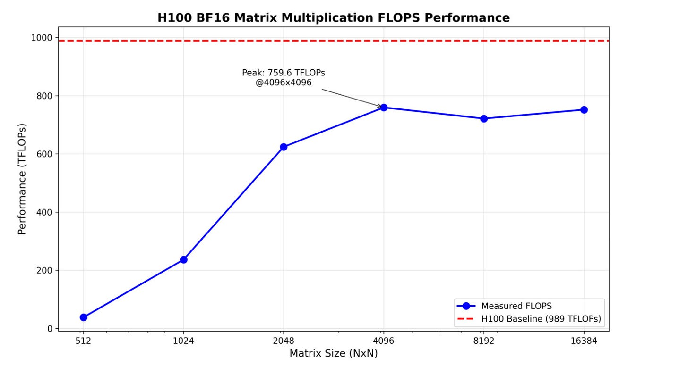

计算嵌入向量需要：

- 从全局内存中一次性加载模型权重
- 完成一次前向传播，涉及约 16.4 TFLOPs 的矩阵乘法及其他计算

模型大小可以根据参数量轻松估算：

$$

\text{7.57B parameters} \times \text{2 bytes per parameter} = \text{15.14GB}


$$

这意味着单次模型加载大约需要：

$$

\text{Forward pass time}\_{memory} = \frac{\text{Total size of a model}}{\text{Memory bandwidth of an H100}} = \frac{15.14}{3.3TB/s} = \text{0.0046s}


$$

完成上述估算的 16.4 TFLOPs 计算量时，将等待大约:

$$

\text{Forward pass time}\_{compute} = \frac{\text{Total FLOPs of forward pass}}{\text{Measured FLOPS of H100}} = \frac{16.4 \text{ TFLOPs}}{750 \text{TFLOPS}}= 0,021s


$$

实际上，GPU 上的内存加载和计算在一定程度上是重叠的，这意味着限制性能的因素将是这两个时间中的较大者——在这种情况下是计算时间，换句话说，计算将更偏向于计算密集型而非内存密集型。

假设单次前向传播需要 0.021 秒，可以估算嵌入吞吐量的上限为：

$$

\text{Embeddings per second} = \frac{1s}{\text{Forward pass time}\_{compute}} = \frac{1s}{0.021s} = \approx 47


$$

实际上，我们无法达到上述这些精确的数字。内存和计算量的数据仅代表理论上限。由于内存与计算重叠不完全、内核启动开销以及各种计算效率低下等因素，实际性能会有所下降。

## 基准测试

```shell
CUDA_VISIBLE_DEVICES=15 python3 -m sglang.launch_server \
--model-path /data/vivi/models/Qwen3-Embedding-8B \
--is-embedding \
--host 0.0.0.0 \
--port 8000
```

使用[基准测试脚本](https://github.com/tugot17/tokenomics?tab=readme-ov-file#-embedding-benchmarks)，用于测量推理引擎的响应时间。该基准测试需要两个输入：序列长度（以标记为单位）和批处理大小（模拟并发用户）。我们向 API 发送了具有预定义长度的请求批次，并测量了处理时间。

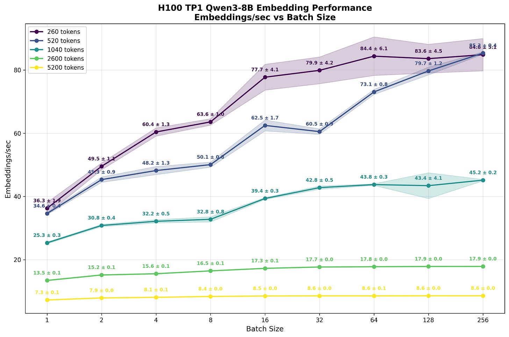

根据上图可以注意到，尽管批处理大小增加，每秒处理的嵌入数量并没有显著提升。对于较短的序列（260 和 520 个标记），将批处理大小从 1 增加到 64，总标记吞吐量仅提升约 2.3 倍。随着序列长度增加，计算资源更加饱和，这种扩展优势进一步减弱。对于最长的序列（5200 个标记），更大的批处理大小几乎不再带来任何好处。

原因很大程度上可以用上面进行的 FLOPS 计算来解释。之前估算当批量大小为 1、序列长度 S=1024 个标记时，上限约为每秒 47 个嵌入，大约是实际观察到数值（25.3）的两倍（47/25.3=1.86）。这种差距是可以预期的，因为模型计算中存在额外开销，包括启动多个内核网格、某些内核的算术强度较低以及其他低效因素。

同样，在 810E 上测试得到的值为（5.4），与计算得到的值 7.5 有差距：

$$
\begin{align}
\text{Forward pass time}\_{compute} = \frac{\text{Total FLOPs of forward pass}}{\text{Measured FLOPS of 810E}} = \frac{16.4 \text{ TFLOPs}}{123 \;\text{TFLOPS}}= 0.133s \\

\text{Embeddings per second} = \frac{1s}{\text{Forward pass time}\_{compute}} = \frac{1s}{0.133s} = \approx 7.5
\end{align}
$$

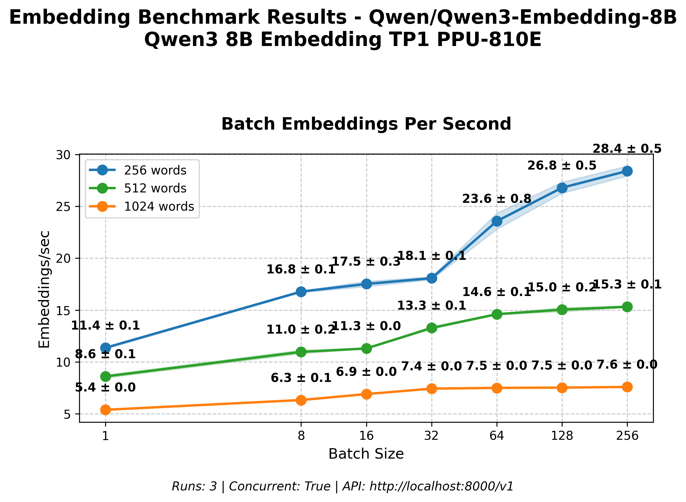

即使在批量大小为 1 的情况下，计算负载也已显著饱和了计算单元。随着序列长度增加，处理的矩阵规模越来越大，且没有多余的计算资源可用——流式多处理器（SMs）已完全占用。<font color="magenta">随着批量增大或序列变长，内核启动开销在总时间中所占比例越来越小，大部分周期都用于实际计算</font>。

由于受限于计算能力，且批量大小增加时处理的嵌入数量仅获得边际提升，这会对每个用户的延迟产生严重影响。随着越来越大规模的矩阵乘法运算，完成所需的时间也越来越长。这体现了 LLM 推理中的一个传统权衡——<font color="magenta">整体吞吐量与每个用户的延迟之间的权衡</font>。

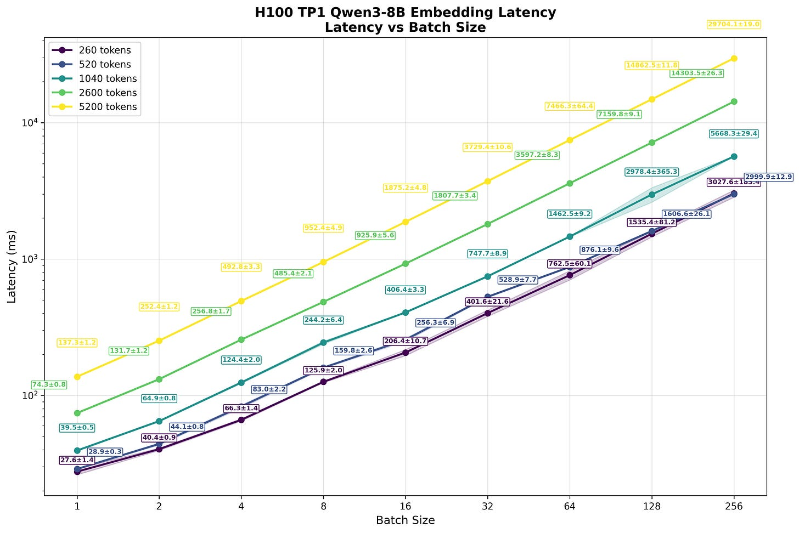

这与自回归标记生成形成鲜明对比。<font color="magenta">生成阶段计算主要是内存受限，增加批量大小能带来显著的吞吐量提升</font>。如图 9 所示，增加批量大小所有请求的整体吞吐量显著提高。对单个用户的延迟惩罚远不如使用嵌入时严重。

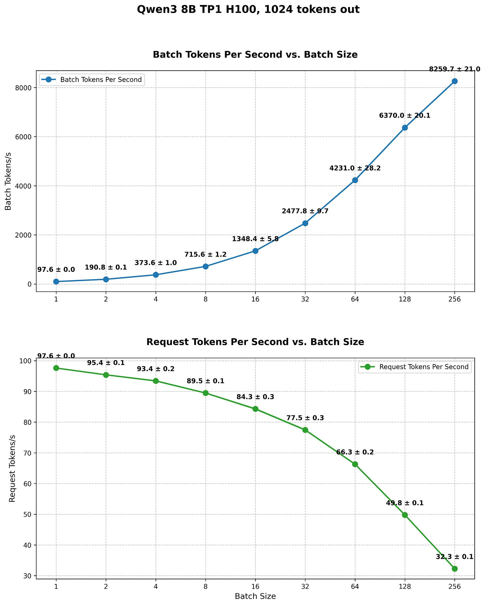

文本生成的内存受限特性带来了有利的扩展性，主要等待模型权重加载以生成每个标记，而计算资源则处于未充分利用状态。只需加载一次模型，并将这一成本分摊给多个用户，对每个用户的体验影响极小。但是随着批次大小的增加，KV 缓存在加载到内存中数据中的占比越来越大。当 KV 缓存开始主导内存负载时，每个用户的体验将越来越受到批次大小的影响。

根本区别在于计算瓶颈。自回归生成受限于内存带宽，且能通过在批次间分摊内存成本而受益；而<font color="magenta">嵌入主要受计算能力限制</font>。嵌入生成只需要一次前向传播，但涉及大规模矩阵运算，会完全占用可用的计算资源。因此，批量处理带来的好处非常有限，而且会显著增加每个用户的延迟。这意味着，与部署 GPT 类模型不同，扩展规模带来的好处非常有限——运行大批次并不会大幅降低“每位用户”的成本。这进一步降低了将嵌入作为业务进行服务的吸引力。

## 性能分析

以下简单代码可以在 SGLang 中触发 `start_profile` 和 `stop_profile` 端点来轻松获取性能剖析轨迹，这两个调用之间的所有计算都将被 torch 性能分析器捕获。

```python
import requests
from openai import OpenAI
from embedding_benchmark import TextGenerator

base_url = "http://localhost:8000"
client = OpenAI(base_url=f"{base_url}/v1", api_key="dummpy")

HOW_MANY_WORDS = 800
BATCH_SIZE = 1

requests.post(f"{base_url}/start_profile")
response = client.embeddings.create(
    input=[
        TextGenerator().generate_text(HOW_MANY_WORDS)
    ]*BATCH_SIZE,
    model="Qwen/Qwen-Embedding-8B",
)
requests.post(f"{base_url}/stop_profile")
print(response.data[0].embedding)
```

Torch Profiler 会以统一的时间线显示 CPU 和 GPU 的活动，但它们是异步运行的：

- CPU 时间线（上半部分）：显示主机代码启动内核、分配内存及其他 CPU 操作的时间点
- GPU 时间线（底部部分）：显示内核在 GPU 硬件上实际执行的时间
- 异步执行：当 launch 一个内核时，CPU 不会等待其完成，而是立即继续执行下一条指令，同时 GPU 独立地执行该内核。

运行上述脚本，在服务端可以得到以下响应：

```shell
[2025-09-29 15:29:55] Profiling starts for True. Traces will be saved to: /tmp (with profile id: 1759130995.3223403)
[2025-09-29 15:29:55] INFO:     127.0.0.1:33334 - "POST /start_profile HTTP/1.1" 200 OK
[2025-09-29 15:29:55] Prefill batch. #new-seq: 1, #new-token: 863, #cached-token: 1, #token: 1, token usage: 0.00, #running-req: 0, #queue-req: 0
[2025-09-29 15:29:56] INFO:     127.0.0.1:33346 - "POST /v1/embeddings HTTP/1.1" 200 OK
[2025-09-29 15:29:56] Stop profiling...
[2025-09-29 15:30:02] Profiling done. Traces are saved to: /tmp
[2025-09-29 15:30:02] INFO:     127.0.0.1:33354 - "POST /stop_profile HTTP/1.1" 200 OK
```

同时查看/tmp 目录可以找到对应的性能分析文件：`/tmp/1759130995.3223403-TP-0.trace.json.gz`，解压后将 json 文件导入[Perfetto Viewer](https://ui.perfetto.dev/#!/query?local_cache_key=00000000-0000-0000-bded-0a81f45c5382)可以查看具体的分析图层。

异步意味着，内核被启动（CPU）和实际运行（GPU）之间通常会有一个明显的间隔。当我们查看前向传播的高层级（图 11）轨迹时，可以清楚地看到多个（36 个）隐藏层被调用。这些内核几乎紧密排列在一起。

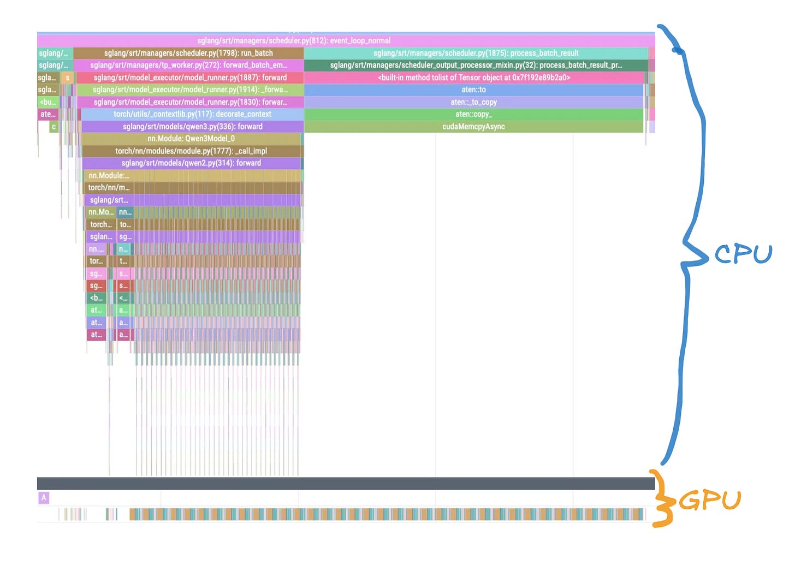

当我们观察单层结构时（见图 12），可以识别出 Transformer 层的各个组成部分。即使对于一个相对较长的 2600 个标记的序列，MLP 计算明显占据主要执行时间。此外，读者应注意，除了 GPU 工作时间（内核）外，还存在一些小但确实存在的间隔，这些间隔出现在准备数据的内核与下一个内核之间（在 Flash Attention 内核之前的小粉红色矩形）。所有这些间隔和小型内核都会为我们的计算增加额外开销。

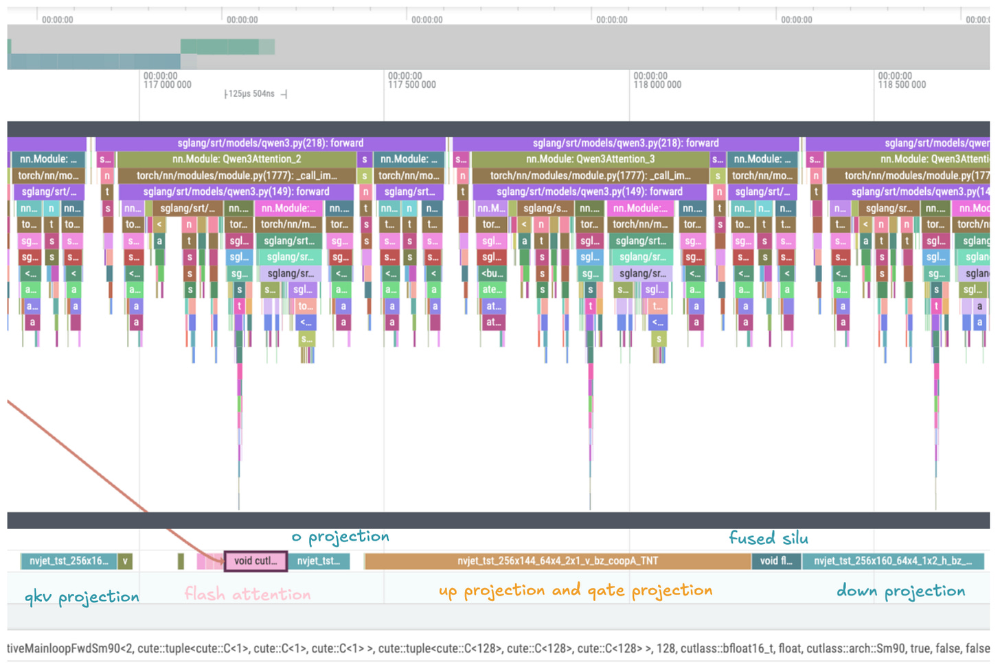

当汇总前向传播过程中调用的所有内核时，会发现一个有趣的规律（见图 13）。前向传播的大部分时间都用于计算 nvjet_tst_256x144_64x4…内核——即 CUDA 高度优化的矩阵乘法内核。这是我们在本文中希望读者能够理解的关键观察之一。在计算嵌入表示时，前向传播的绝大部分时间都消耗在矩阵乘法内核上。这意味着，我们在前一节中计算出的 750 TFLOPs 矩阵乘法性能，将是一个相当不错的估算前向传播耗时及吞吐量的指标。

其他内核，如融合的 SILU 和 RMS 归一化（主要来自 FlashInfer），占用了较少的运行时间，此处不再进一步探讨。

以 810E 为例，序列长度为 800 时：

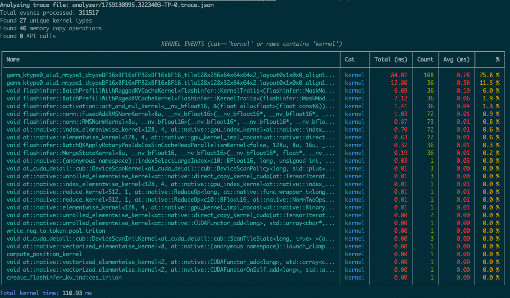

## 成本分析


此外，计算出在不同批次大小下每秒处理的总标记数很容易。例如，对于长度为 1040 个标记、批量大小为 4 的序列：

$$

\text{Embeddings/second} \times \text{Tokens per embedding} = \\
32.2\; \text{embeddings/s} \times 1040\; \text{tokens/embedding} = 33488\; \text{tokens/s}


$$

根据图 H100 中的数据，可以整理表格展示每秒处理的标记数。这些数字大约在每秒 45,000 个标记左右趋于饱和，这再次说明计算已达到计算瓶颈。

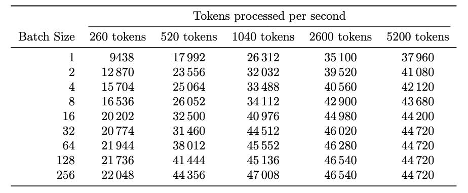

假设以每小时 2 美元的价格租赁 H100 显卡，可以估算出生成一百万 token 的成本。对于一批大小为 4、输入序列长度为 1040 token 的嵌入计算，其成本大约为：

$$

\text{Cost per million tokens} = \frac{\text{GPU cost per hour}}{\text{tokens per second} \times 3600} \times 10^6 \\
= \frac{\$2/\text{hr}}{33{,}488 \text{ tokens/s} \times 3600 \text{ s/hr}} \times 10^6 = \$0.0166


$$

每处理一百万个标记只需 1.66 美分。下表展示了不同设置下的估算价格：

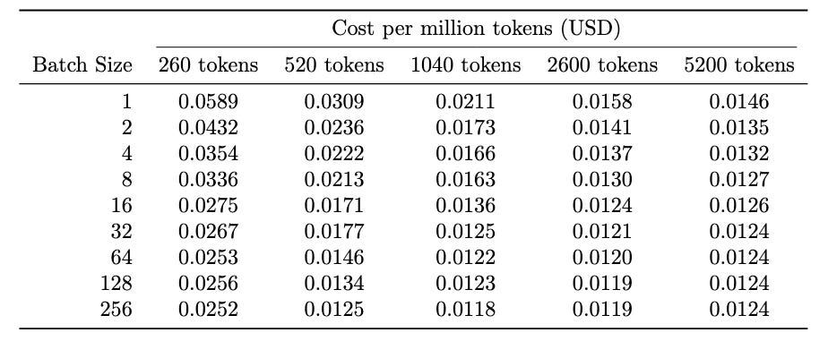

上述估算价格假定了在给定的批次大小下能够实现 100%的利用率，这意味着全天候都能收到请求并进行计算，从而向用户收费。实际上，我们肯定会经历流量高峰时段，此时 API 会收到大量请求；也会有安静时段，例如非工作时间，此时计算资源大部分处于空闲状态。精确计算将取决于计算模式、每个 GPU 的用户数量、用户愿意接受的延迟程度，以及请求的时间集中程度。

假设典型的请求类似于每批大小为 4 的请求，即每次同时到来一个包含 1040 个标记的请求，且这种情况每天大约有 10%的时间发生，那么这将导致约 276,000 次请求（32.2 × 3600 × 24 × 0.1 ≈ 276k）。在这种情况下，处理 100 万输入标记的成本约为$0.0166 × 10 = $0.16，即每百万标记 16 美分，略高于 OpenAI 的 ada-embeddings 定价。

由于受限于 FLOPS，应该优化的指标是**每美元的 FLOPS**。当模型并不需要这些特性时，为什么要为 H100 的 80GB 内存、超快的内存带宽和高速互联支付高价呢？大部分时间都花在计算上，而不是数据传输上。方法是寻找每美元浮点运算性能（FLOPS）更高的 GPU。表 3 使用按需云定价比较了三种流行的选择：H100 SXM、A100 和 RTX 4090。

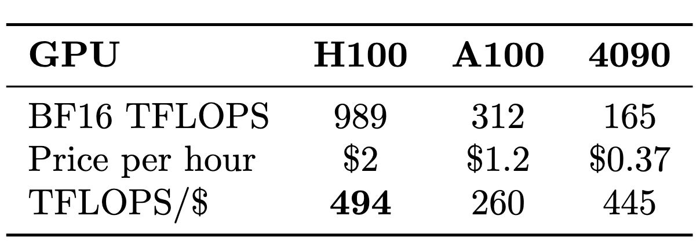

H100 在这项对比中占据优势，其每美元的浮点运算性能（FLOPS）比三款对比的 GPU 中最高。然而， H100 受限于功耗。NVIDIA 承诺的 989 TFLOPS 无法实现。使用更现实的 750 TFLOPS（如图 5 中估算），每美元的 TFLOPS 比率将降至 750/2=375，远低于 RTX 4090 理论上的 445。而通过相同的矩阵乘法基准测试，RTX 4090 非常接近 NVIDIA 的规格说明。价格差异显著：H100 的价格是 RTX 4090 的 5.4 倍（$2/$0.37），而性能差异仅为：

$$

\frac{\text{Real FLOPS of H100}}{\text{Real FLOPS of 4090}}=\frac{750}{165}\approx 4.5


$$

这表明 RTX 4090 在嵌入生成方面能提供更高的单价性能。由于嵌入计算主要由大规模矩阵乘法主导，此基准性能差异应能准确预测实际嵌入吞吐量的差异。显而易见的是，性能差异小于 H100 与 4090 之间的价格差异——这意味着每花费一美元，能够生成更多的文本标记。下表中计算了 4090 每秒处理的标记数量：

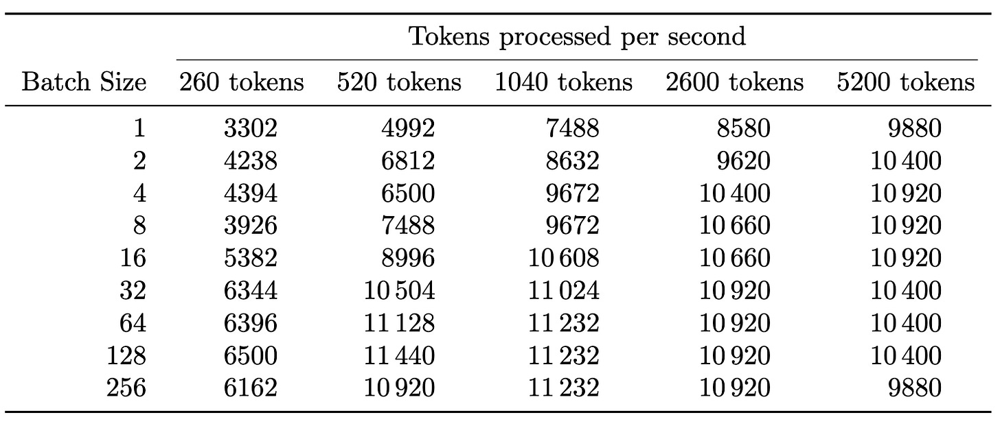

假设每小时支付 0.37 美元来使用 4090 显卡，并且用它持续地以批量大小为 4 对一个包含 1040 个标记的输入序列进行嵌入，这大约相当于

$$

\text{Cost per million tokens} = \frac{\$0.37/\text{hr}}{9672 \text{ tokens/s} \times 3600 \text{ s/hr}} \times 10^6 = \$0,01062


$$

或者每 100 万令牌约 1 美分，比 H100 上实现的数字便宜 36%。

值得注意的是，嵌入（embeddings）并不是唯一可通过<font color="magenta">优先考虑每美元的浮点运算次数（FLOPS）</font>来获益的应用场景。预填充（prefill），尤其是在包含长时间工具调用的代理任务中，也是另一个例子。最近，NVIDIA 正好为此目的发布了 Rubin CPX 芯片——一款计算密集但对内存带宽要求较低的芯片，使用了更便宜的 GDDR7 而非昂贵的 HBM。这正是我们一直在讨论的逻辑：当处于计算瓶颈时，应优化每美元所能获得的浮点运算性能。
