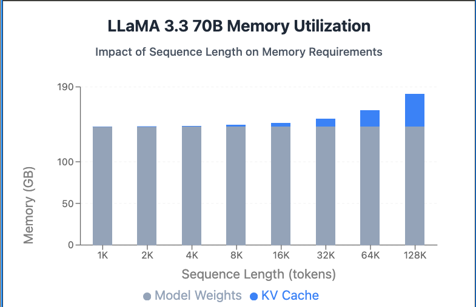

---
---

> [原文链接](https://www.tensoreconomics.com/p/llm-inference-economics-from-first?open=false#%C2%A7total-flops-calculation)
>
> [原文代码](https://github.com/tugot17/llm-inference-economics-from-first-principles)

# LLM 推理经济学

随着 AI 能力的快速进步，推理效率直接塑造了产业经济和可及性。对于 AI 实验室而言，token 生成成本从根本上决定了利润率以及合成训练数据的成本——更高效的推理意味着在固定硬件投资上的更高回报，从而推动进一步的研究与开发周期。对于用户来说，更低的 token 成本将使这些强大工具更加普及，可能把 AI 从一种高端资源转变为可用于日常任务的通用工具。

无论是购买还是租用 GPU，每块 GPU 每小时只能生成有限数量的 token。每小时生成的 token 数除以每小时硬件成本，就能得出单个 token 的单位生成成本。这正是大多数 LLM 提供商定价其 API 服务的方式，也是我们将要探讨的模型。

## 模型结构


本文使用 [LLaMA 3.3 70B](https://www.modelscope.cn/models/LLM-Research/Meta-Llama-3.1-70B-Instruct) 进行分析，与其他仅解码器（decoder-only）Transformer 模型类似，Llama 包含以下组件：

- 输入嵌入层——将 token（或单词）转换为向量表示
- 多个 Transformer 层，每一层包含自注意力部分和 MLP 部分
- 语言建模（LM）头——最后一层

```json
{
  "architectures": ["LlamaForCausalLM"],
  "attention_bias": false,
  "attention_dropout": 0.0,
  "bos_token_id": 128000,
  "eos_token_id": [128001, 128008, 128009],
  "hidden_act": "silu",
  "hidden_size": 8192,
  "initializer_range": 0.02,
  "intermediate_size": 28672,
  "max_position_embeddings": 131072,
  "mlp_bias": false,
  "model_type": "llama",
  "num_attention_heads": 64,
  "num_hidden_layers": 80,
  "num_key_value_heads": 8,
  "pretraining_tp": 1,
  "rms_norm_eps": 1e-5,
  "rope_scaling": {
    "factor": 8.0,
    "low_freq_factor": 1.0,
    "high_freq_factor": 4.0,
    "original_max_position_embeddings": 8192,
    "rope_type": "llama3"
  },
  "rope_theta": 500000.0,
  "tie_word_embeddings": false,
  "torch_dtype": "bfloat16",
  "transformers_version": "4.42.3",
  "use_cache": true,
  "vocab_size": 128256
}
```

> 缩写说明：
>
> hidden_size: H; vocab_size: V; num_attention_heads: n_heads; num_key_value_heads: n_kv_heads;
>
> head_dim: d_head; intermediate_size：d_ffn; num_hidden_layers: L

根据配置，可以分析三部分的大小：

- 嵌入层：$$\text{Input Embedding} = H  \times V$$

- Transformer 层：

  $$
  \begin{align}

  w_q &= H \times n\_heads \times d\_head = H^2 \\
  w_k &= H \times n\_kv\_heads \times d\_head \\
  w_v &= H \times n\_kv\_heads \times d\_head \\
  w_o &= H \times H \\
  w_1 &= H \times d\_ffn \\
  w_2 &= H \times d\_ffn \\
  w_3 &= d\_ffn \times H \\
  2 \times RMSNorm &= 2 \times H
  \end{align}
  $$

根据 Llama 上述结构，`w_v` 和 `w_k` 的大小是 `w_q` 的 1/8，模型 `intermediate_size` 的大小是隐藏层大小的 `3.5x` 。代入后：

$$
\begin{align}
  \text{Total per transformer block} &=  H ^2 + \frac{H^2}{8} + \frac{H^2}{8} \\
  &+ H ^2 \\
  &+ 3.5 \times H ^2 +  3.5 \times H ^2 +  3.5 \times H ^2 \\
  &+ 2 \times H \\
  &= 12.75 \times H ^2 + 2 \times H
\end{align}
$$

- 在将表示输入到 LM 头之前应用一次 RMS Norm，LM 头将向量转换为标记 logits：

  $$
  \text{RMS Norm} =H \\
  \text{LM Head} = H \times V
  $$

将所有这些参数加总，我们得到：

$$
\begin{align}
\text{Total Parameter} &= \text{Input Embedding} + \text{Total per transformer block} \times L + \text{RMS Norm} + \text{LM Head} \\
&= H \times V + L \times (12.75 \times H ^2 + 2 \times H) + H + H \times V \\
\end{align}
$$

将配置中的值代入上述公式：

$$
\begin{align}
\text{Total Parameter} &= 128256 \times 8192 \\
&+ 80 \times (12.75 \times 8192 ^2 + 2 \times 8192) \\
&+ 8192 \\
&+ 8192 \times 128256 \\
&= 70,553,706,496
\end{align}
$$

每个参数以 bfloat16 格式存储，仅为了在 GPU 内存中存储模型权重，我们就需要 141GB。

## 计算或内存受限

FLOPS 和 FLOPs 的含义不同。FLOPs（小写 s）是浮点运算的复数形式，完全不考虑时间因素，而 FLOPS（大写 S）表示每秒发生的浮点运算次数。

算术强度描述了计算操作（如加法或乘法，以 FLOPs 为单位）与内存访问（以字节为单位）之间的比率。较高的算术强度表明程序在从内存获取单位数据上执行更多的计算，通常会更好地利用处理器的计算能力，并减少内存带宽的瓶颈。LLM 推理的计算强度非常低，因为它涉及从内存中反复访问大型模型权重，而每次获取的字节对应的计算量相对较少。


### 矩阵乘法的 FLOPs

当矩阵 A（m\*n)和 B(n\*o)相乘得到矩阵 C(m\*o)时，计算涉及：

- 从 A 中读取每一行，从 B 中读取每一列，计算它们的点积以填充 C 的每个元素

对于长度为 n 的向量的点积：

- 执行 n 次乘法，n-1 次加法，共 2n-1 次操作

由于要为结果矩阵 C 中的每个元素进行该计算：

$$
FLOPs = (2n-1) \times m \times o \approx 2n \times m \times o
$$

为了简化计算，在本文中我们将使用 2mno 作为矩阵乘法的 FLOP 计数。

### 预填充阶段

使用 LLMs 生成文本的第一阶段是提示处理。在此阶段，LLM 会接收一系列输入（提示）令牌，并尝试预测第一个新令牌。此阶段的持续时间被 称为“延迟”或“首个令牌生成时间”（TTFT）。

该阶段严重受计算能力限制，后面手动计算模型在处理 S 个 token 期间的 FLOPs。

## 模型 FLOPs

嵌入层：查找操作，嵌入查找涉及从嵌入矩阵中检索向量，由于它们涉及内存访问而不是算术计算，因此被认为具有可忽略的 FLOPs。

### 自注意力

<font color=magenta>**RMSNorm**</font> 是逐 token（per-token）的归一化操作，不涉及任何矩阵乘法（matmul），它只对 每个 token 的 hidden 向量内部做统计和缩放。RMSNorm **独立处理每一行**，不跨 token 交互

```python
# 伪代码
for i in range(S):               # 遍历每个 token
    for j in range(hidden_size): # 遍历每个 hidden 维度
        x_sq[i, j] = x[i, j] * x[i, j]   # 1 次乘法
```

$$
\begin{align}
FLOPS_{RMSNorm} &= S \times H (square)\\
&+ S \times H (mean) \\
&+ S(add\; epsilon) \\
&+ S(sqrt) \\
&+ S \times H (divide)\\
&+ S \times H (multiply)

\end{align}
$$


简化表达式：

$$
\begin{align}
 \text{FLOPS}_{\text{RMSNorm}} = S \times H \times 4 + S \times 2 \ \approx 4 \times S \times H
 \end{align}
$$

<font color=magenta>**Query Projection**</font>：

- 输入：$\mathbf{x} \in \mathbb{R}^{S \times H}$
- 权重：$\mathbf{w_Q} \in \mathbb{R}^{H \times H}$
- FLOPs：$ FLOPS\_{Query} = 2 \times S \times H^2$

<font color=magenta>**KV Projection**</font>：

- 输入：$\mathbf{x} \in \mathbb{R}^{S \times H}$
- K 权重：$\mathbf{w_K} \in \mathbb{R}^{H \times H/8}$
- V 权重：$\mathbf{w_V} \in \mathbb{R}^{H \times H/8}$
- FLOPs：$ FLOPS\_{KV} = 2 \times 2 \times S \times H^2/8 = \frac{1}{2} \times S \times H^2$

<font color=magenta>**ROPE**</font>：

- Query: $\mathbf{q} \in \mathbb{R}^{S \times d\_head \times n\_heads}$
- Key: $\mathbf{k} \in \mathbb{R}^{S \times d\_head \times n\_heads}$
- Cosine: $\mathbf{cos} \in \mathbb{R}^{S \times d\_head}$
- Sine: $\mathbf{sin} \in \mathbb{R}^{S \times d\_head}$


对于 q 和 k 中的每个元素，执行以下操作（3 个 FLOPs)：

- 乘法运算：每个张量 2 次；q 乘以 cos；旋转后的 q (rotate_half(q)) 与 sin 相乘
- 加法：每个张量 1 次，将上述结果相加

由于这些操作是在 q 和 k 上进行的，因此每个元素的总运算量：3 FLOPs 每张量 x 2 张量 = 6 FLOPs

因此：
$ FLOPS\_{RoPE} = S \times d\_{head} \times n\_{heads} \times 6 = S \times H \times 6 $

<font color=magenta>$Q \times K ^T$</font>： 假设使用的是简单的注意力实现

- Query: $\mathbf{Q} \in \mathbb{R}^{S \times n\_heads \times d\_head}$
- Key: $\mathbf{K} \in \mathbb{R}^{S \times n\_heads \times d\_head}$
- $\mathbf{QK^T} \in \mathbb{R}^{n\_heads \times S \times S}$

> 注意：QK^T 计算时会进行重排，每个头都单独计算

- $ \text{FLOPS per head} = 2 \times S \times d\_{head} \times S = 2 \times S^2 \times d\_{head}$

对于所有注意力头：

- $ \text{FLOPS all heads} = 2 \times S^2 \times d\_{head} \times n\_{heads} = 2 \times S^2 \times H$

> _注意：这种对序列长度（S^2）的二次依赖性是注意力机制在长序列中变得昂贵的原因。_

<font color=magenta>**Softmax**</font>：_估计 Softmax 的 FLOPs 有点困难，近似认为 softmax 每个元素需要 5 个 FLOPs：_

- Input: $$\mathbf{A} \in \mathbb{R}^{S \times S \times n\_heads}$$
- Output: $$\mathbf{A\_softmax} \in \mathbb{R}^{S \times S \times n\_heads}$$
- $ \text{FLOPS\_{Softmax}} = 5 \times S^2 \times n\_{heads}$

> _这是 softmax 中实际运算（指数运算、求和、除法）的简化近似。_

<font color=magenta>**注意力输出 (Q @ K^T) @ V**</font>：

- Attention Scores：$$\mathbf{A\_softmax} \in \mathbb{R}^{S \times S \times n\_heads}$$
- Value 矩阵：$\mathbf{V} \in \mathbb{R}^{S \times d\_head  \times n\_heads}$
- Output: $\mathbf{O} \in \mathbb{R}^{S \times H}$

单个头进行计算时，注意力得分矩阵 `[S, S]`，单个头的 V 是 `[S, d_head]`，再乘以 V（单个头的 V 是 `[S, d_head]`）→ 得到单个头的输出 `[S, d_head]`。最终所有头的输出会拼接在一起，拼接后变成 `[S, d_head * n_heads]`。因此：

- $ \text{FLOPS per head} = 2 \times S \times S \times d\_{head} = 2 \times S^2 \times d\_{head}$
- $ \text{FLOPS all heads} = 2 \times S^2 \times d\_{head} \times n\_{heads} = 2 \times S^2 \times H$

<font color=magenta>**O Projection**</font>：

- Input: $\mathbf{O} \in \mathbb{R}^{S \times H}$
- 权重矩阵：$\mathbf{w_O} \in \mathbb{R}^{H \times H}$
- FLOPs：$ FLOPS\_{O} = 2 \times S \times H^2$
  现在，可以计算自注意力机制的总 FLOPs：
  $$
  \begin{align}
  FLOPS\_{自注意力} &= FLOPS\_{RMSNorm} + FLOPS\_{Query} + FLOPS\_{KV} + FLOPS\_{RoPE} \\
  &+ FLOPS\_{Softmax} + FLOPS\_{Q @ K^T } + FLOPS\_{注意力输出} + FLOPS\_{O} \\
  &= 4 S \times H + 2  S \times H^2  + 0.5  S \times H^2 + 6 S \times H  \\
  &+ 5  S^2 \times n_{heads} + 2  S^2 \times H + 2  S^2 \times H + 2 S \times H^2 \\
  &= 10S \times H + 5 S^2 \times n_{heads} + 4.5S \times H^2 + 4 S^2 \times H
  \end{align}
  $$

### MLP


<font color=magenta>**Gate W1**</font>：

- Input: $\mathbf{X} \in \mathbb{R}^{S \times H}$
- 权重：$\mathbf{w_1} \in \mathbb{R}^{H \times d\_ffn}$
- FLOPs：$ FLOPS\_\text{Gate W1} = 2 \times S \times H \times d_ffn = 7S \times H^2$
  在 Llama 中，根据配置可知 intermediate_size 是 hidden_size 的 3.5 倍

<font color=magenta>**UP W2**</font>：

- Input: $\mathbf{X} \in \mathbb{R}^{S \times H}$
- 权重：$\mathbf{w_2} \in \mathbb{R}^{H \times d\_ffn}$
- FLOPs：$ FLOPS\_\text{UP W2} = 2 \times S \times d_ffn \times H = 7S \times H^2$

<font color=magenta>**激活函数**</font>：

- Input: $\mathbf{X_\text{gate}} \in \mathbb{R}^{S \times d\_ffn}$

> _近似认为每个元素的激活函数需要 5 次浮点运算 (FLOPs)_：

$$ FLOPS\_\text{激活函数} = 5 \times S \times d_ffn = 5S \times 3.5H = 17.5S \times H$$

<font color=magenta>**逐元素乘法**</font>：

- First Input： $SiLU(\mathbf{X_\text{gate}}) \in \mathbb{R}^{S \times d\_ffn}$
- Second Input： $\mathbf{X_\text{up}} \in \mathbb{R}^{S \times d\_ffn}$
  因此，逐元素乘法的 FLOPs:
  $$ FLOPS\_\text{逐元素乘法} = S \times d\_{ffn} = S \times 3.5H$$

<font color=magenta>**DOWN W3**</font>：

- Input: $\mathbf{X} \in \mathbb{R}^{S \times d\_ffn}$
- 权重：$\mathbf{w_3} \in \mathbb{R}^{d\_ffn \times H}$
- FLOPs：$ FLOPS\_\text{DOWN W3} = 2 \times S \times d\_{ffn} \times H = 7S \times H^2$

<font color=magenta>**MLP 总 FLOPs**</font>：

$$
\begin{align}
FLOPS\_{MLP} &= FLOPS\_\text{Gate W1} + FLOPS\_\text{UP W2} + FLOPS\_\text{激活函数} + FLOPS\_\text{逐元素乘法} + FLOPS\_\text{DOWN W3} \\
&= 7S \times H^2 + 7S \times H^2 + 17.5S \times H + S \times 3.5H + 7S \times H^2 \\
&= 21S \times H^2 + 21S \times H \approx 21S \times H^2
\end{align}
$$

### LM Head

推理只关心序列中最后一个标记的下一个标记预测，其他的“下一个标记”已知。

- Input: $\mathbf{X} \in \mathbb{R}^{1 \times H}$
- 权重：$\mathbf{W\_{lm}} \in \mathbb{R}^{H \times V}$
- FLOPs：$ FLOPS\_\text{LM Head} = 2 \times 1 \times H \times V = 2H \times V$

### LLaMa 总 FLOPs

Llama 模型的总 FLOPs 是每个 transformer 块的 FLOPs 与块数量的乘积，再加上 LM 头的 FLOPs。

transformer 块：

- Attention：$$10S \times H + 5 S^2 \times n_{heads} + 4.5S \times H^2 + 4 S^2 \times H$$
- MLP：$$21S \times H^2$$
- 每块总计：$$10S \times H  + 25.5S \times H^2 + 4 S^2 \times H+ 5 S^2 \times n_{heads}$$

总 FLOPs：

$$\text{Total FLOPs} = L\times(10S \times H  + 25.5S \times H^2 + 4 S^2 \times H+ 5 S^2 \times n_{heads}) + 2H\times V$$

对于 Llama 3.3 70B，假定序列长度 S=2048，将参数代入公式：

$$
\begin{align}
\text{Total FLOPs} &= L\times(10S \times H  + 25.5S \times H^2 + 4 S^2 \times H+ 5 S^2 \times n_{heads}) + 2H\times V \\
&= 80\times(10 \times 2048 \times 8192  + 25.5 \times 2048 \times 8192^2 + 4 \times 2048^2 \times 8192+ 5 \times 2048^2 \times 64) + 2\times 8192 \times 128256 \\
\approx  291.48 TFLOPs
\end{align}
$$

291 TFLOPs 大约是现代 GPU 中可用 FLOPs 的数量级，使用 H100 显卡时，理论上处理一个 2048 个令牌的提示需要大约 需要 291/989=0.29s。

要从全局内存加载模型，需要加载 141GB 的参数。现代 GPU 的内存带宽约为 3350GB/s，理论上从全局内存加载整个模型将需要 141/3350=0.04s 的时间，大约比所有计算所需的时间快 7 倍。

## 解码阶段

上述计算中可以发现，用于预填充的首次前向传递计算成本非常高。可以通过引入 KV 缓存来避免重复进行大部分计算，这种优化在矩阵运算中非常优雅：

在预填充阶段，S 个令牌：

$$ \mathbf{Q} \in \mathbb{R}^{S \times H}; \mathbf{K^T} \in \mathbb{R}^{H \times S}; \mathbf{V} \in \mathbb{R}^{S \times H}$$

注意力得分和输出的计算方式：

$$
\text{Score Matrix} = \mathbf{Q} . \mathbf{K^T} \in \mathbb{R}^{S \times S} \\
\text{Attention Output per head} =  softmax(\text{Score Matrix}). \mathbf{V} \in \mathbb{R}^{S \times d_head}
$$

在逐个生成令牌的过程中（令牌 S+1），为了生成下一个标记，只需要计算：

$$
\begin{align}
\mathbf{Q}_{new} &\in \mathbb{R}^{1 \times H} \text{ [Only for the new token]} \\
\mathbf{K}^T_{cache} &\in \mathbb{R}^{H \times S} \text{ [From cache]} \\
\mathbf{K}^T_{new} &\in \mathbb{R}^{H \times 1} \text{ [For the new token]} \\
\mathbf{K}^T_{full} &= [\mathbf{K}^T_{cache} \; | \; \mathbf{K}^T_{new}] \in \mathbb{R}^{H \times (S+1)} \\
\mathbf{V}_{cache} &\in \mathbb{R}^{S \times H} \text{ [From cache]} \\
\mathbf{V}_{new} &\in \mathbb{R}^{1 \times H} \text{ [For the new token]} \\
\mathbf{V}_{full} &= [\mathbf{V}_{cache} \; | \; \mathbf{V}_{new}] \in \mathbb{R}^{(S+1) \times H}
\end{align}
$$

新的注意力计算变为：

$$
\begin{align}
\text{Score Vector} &= \mathbf{Q}_{new} \cdot \mathbf{K}^T_{full} \in \mathbb{R}^{1 \times (S+1)} \\
\text{Attention Output} &= \text{softmax}(\text{Score Vector}) \cdot \mathbf{V}_{full} \in \mathbb{R}^{1 \times H}
\end{align}
$$

将每次新生成 token 的注意力计算从 $O(S^2)$ 降低到 $O(S)$


KV 缓存将前向传播的总 FLOPs 减少了大约 S 倍：

- 自注意力机制中，只计算新标记与所有先前标记之间的注意力

- 在 MLP 和 LM 头中，只处理新令牌
- LM 头保持不变，但它在整体计算中所占的比例非常小，因此可以忽略

例如，使用 2048 个 token 的上下文：

- 在预填充期间：总计约 291 TFLOPs
- 对于生成第 2049 个 token：~291/2048 ≈ 0.14 TFLOPs

在 H100 GPU（989 TFLOP/s）上，这将仅需：

$$\frac{0.14 \text{ TFLOP}}{989 \text{ TFLOP/s}} \approx 0.00014 \text{ seconds}$$

虽然在纯计算方面大约比预填充阶段快 `2048` 倍，<font color=red>但仍然需要从全局内存加载整个模型参数（ `141 GB)` ），并且还需加载 KV 缓存</font>。KV 缓存很容易计算，为：

$$kv \ cache = 2 \times \text{bytes\_per\_param} \times \text{num\_hidden\_layers} \times \text{head\_size} \times \text{num\_key\_value\_heads} \times \text{sequence\_length}$$

对于使用 BF16 精度的 Llama 3.3 70B 以及 2048 个 token，这相当于：

$$kv \ cache = 2 \times 2 \times 80 \times 128 \times 8 \times 2048 = 671MB$$


Llama 3.3 70B 的 KV 缓存内存占用如何随着序列长度增加而增长。上图 x 轴使用对数刻度（2 的幂），在视觉上压缩了指数增长。实际上，<font color=red>内存使用量随序列长度呈**超线性增长**</font>，而不是像从图表外观可能错误推断的线性增长。

虽然 671 MB 听起来不多，但该数字会随着批处理大小和序列长度线性增长（见图 9）。<font color=red>序列长度较长时，逐个生成 token 的速度比在较短序列长度下更慢</font>，因为除了需要从全局内存中加载模型权重外，还需要加载 KV 缓存，从而增加了每个生成 token 的处理时间。

模型权重加上 KV 缓存大约是 `141 + 0.6 ≈ 142GB` ，因此从全局内存加载需要 `142/3350 = 0.04s` 。上面计算过，在 H100 GPU 上完成所有计算（假设 100% 计算利用率）只需要 `0.00014s` ，因此加载模型权重的时间比实际计算要多两个数量级。因此，使用 LLMs 的逐 token 阶段是内存受限的，主要限制在于内存传输所需的时间，而不是计算速度。

### 输入长度的扩展性

LLM 服务的主要挑战之一是理解输入提示长度如何影响端到端性能。提示处理阶段表现出 $O(N^2)$ 的计算复杂度，随着序列长度的增长，处理时间将呈二次方增长。根据之前推导出的 FLOPs ：

- $Q \times  K ^T$ 得分矩阵为$2S^2H$， $ (Q \times K^T) \otimes V$ 注意力输出为$2S^2H$

这对于较长的序列尤其重要，因为生成第一个标记的时间会随着输入序列的长度呈二次方增长。因此，随着输入长度不断增加，处理请求的总时间中，会有越来越大比例花在提示处理上——即计算密集型部分。


> 随着提示长度增加，所需的计算量以及时间呈二次方增长，占请求总处理时间的比例越来越大。请注意：这仅是一个用于提供直观理解的可视化图表，并非基于实际观测数据。

在逐 token 的生成阶段，生成速度与序列长度之间的关系并不简单直接。FLOP 的计算量呈线性增长；新 token 需要关注过去所有的 token，或者 `2 S H` 对应 `Q @ Kᵗ` ， `2 S H` 对应 `(Q @ Kᵗ) @ V` ，但对于逐 token 处理的情况，FLOP 并不是那么相关，因为主要受内存限制。<font color=magenta>更相关的是需要从全局内存加载的数据大小</font>。每次前向传播都需要从全局内存中加载整个模型权重；除此之外，还需要从全局内存中加载 KV 缓存。正如在上一节中展示的，随着 KV 缓存序列长度的增加，占用的内存呈线性增长，即在 `2 x bytes_per_param x num_hidden_layers x head_size x num_key_value_heads x S.` 中按因子 `S` 增长。

一开始，KV 缓存的大小与需要加载的模型大小相比可以忽略，但随着处理的提示规模增大，它将占据越来越多的内存（见图 11）。需要注意的是，如果决定处理更大的批次，<font color=magenta>KV 缓存的大小会随着批次大小线性增长，因为还需要为批次中的所有样本**独立缓存键和值**</font>。然后在某个时刻，KV 缓存的大小将超过模型本身的大小。

对于小批次和短序列，序列长度对吞吐量的影响很小，因为加载模型权重主导了内存带宽的使用。然而，随着批次大小或序列长度的增加，为每个 token 加载 KV 缓存所需的时间逐渐增多，最终超过加载模型权重本身所消耗的时间。

这种转变产生了两种不同的性能模式：<font color=magenta>**模型主导模式**（短序列/小批量）</font>，尽管序列长度增加，吞吐量仍保持相对稳定。一旦进入<font color=magenta> **KV 缓存主导模式**</font>，生成速度开始随着序列长度成比例下降。这在短序列长度时无关紧要，但对于非常长的序列（数万 token 级别）是一个显著的问题，加载 KV 缓存所花费的额外时间相对于序列长度呈线性增长。



> 随着序列长度增加，KV 缓存的扩展情况。对于 Llama 3.3 70B，在 128k 个 token 时，单个句子的 KV 缓存将达 40GB。

在注意力机制的简单实现中，当实现 `SxS` 分数矩阵时，内存也会以平方级别增长，但 Flash Attention 机制取代了简单实现。Flash Attention 通过迭代方式计算 `(Q @ Kᵗ) @ V` ，其所需的内存保持在 `O(N)` 。

- **Naive（朴素）注意力实现**，中间矩阵 `S`（即 `QKᵀ`）的大小是 `S×S`，所以 **内存占用为 O(S²)**。当序列很长时，仅一个注意力头就可能耗尽 GPU 显存。

  1. 计算 **注意力分数矩阵**：`S = Q @ Kᵀ`，形状为 `(seq_len, seq_len)`，记作 `S×S`（S = sequence length）。
  2. 对 `S` 做 softmax。
  3. 计算输出：`O = softmax(S) @ V`。

- FlashAttention 是一种 **IO-aware（内存感知）的注意力算法**，由 Dao et al. (2022) 提出。它**不显式存储完整的 `S×S` 矩阵**，从而避免 O(S²) 内存:
  1. 将 Q, K, V **分块（tiling/blocking）** 到 GPU 的高速缓存（如 SRAM）中。
  2. 在片上（on-chip）计算局部 `q_i @ k_jᵀ` 和 softmax 归约，**只保留最终输出 O，不保存中间 S 矩阵**。
  3. 通过 **重计算（recomputation）** 技术，在反向传播时重新计算前向的局部块，避免存储中间结果。

## 多 GPU 推理

H100 显卡配备了 80GB 的 HBM 内存，仅使用两张 GPU 来运行 Llama 3.3 70B 将导致 KV 缓存可用的内存非常有限，模型权重已经占用了 88% ( `141/160=88%` ) 的内存，只剩下 19GB 的内存 ( `160-141=19GB` ) 可供 KV 缓存使用（实际上比这还要少，因为无法使用 100% 的 GPU 内存，而只能使用大约 95%）。将无法运行大批量或长序列长度的任务。

### TP

对于一个<font color=magenta>**按列**</font>分布在 2 个 GPU 上的权重矩阵 $\mathbf{W_1} \in \mathbb{R}^{d_{in}\times d_{hid}}$ ：

$$\mathbf{W}_1 = [\mathbf{W}_{1,1} \quad \mathbf{W}_{1,2}], \quad \mathbf{W}_{1,i} \in \mathbb{R}^{d_{\text{in}} \times \frac{d_{\text{hid}}}{2}}$$

每个 GPU 独立计算其部分输出（无通信）：

$\mathbf{h}_1 = x\mathbf{W}_{1,1},\quad \mathbf{h}_2 = x\mathbf{W}_{1,2}$

隐藏层激活变为： $\mathbf{h}=[\mathbf{h}_1 \quad \mathbf{h}_2]$

这里不需要通信，因为每个 GPU 都有所有必要的数据。对于$\mathbf{W_2} \in \mathbb{R}^{d_{hid}\times d_{out}}$中的后续<font color=magenta>**按行拆分**</font>：

$\mathbf{W}_2 = \left[\begin{array}{1} \mathbf{W}_{2,1} \\ \mathbf{W}_{2,2}  \end{array} \right] \quad \mathbf{W}_{2,i} \in \mathbb{R}^{\frac{d_{\text{hid}}}{2} \times d_{\text{out}}}$

每个 GPU 计算：

$\mathbf{y}_1 = \mathbf{h}_1 \mathbf{W}_{2,1}, \quad \mathbf{y}_2 = \mathbf{h}_2 \mathbf{W}_{2,2}$

最终输出需要一个全归约求和，即需要在设备之间进行同步：$\mathbf{y}=\mathbf{y_1} + \mathbf{y_2}$

这种布局可以应用于 Transformer 块，每个 Transformer 仅需两次同步：

- 自注意力：各个头独立处理，仅在输出投影时同步（ `o_proj` ）。
- MLP：上投影（ `w1,` `w3)` ）按列分割，下投影（ `w2)` ）按行分割，同步操作仅在下投影之后执行。

pytorch 文档中的[tp_plan](https://docs.pytorch.org/tutorials/intermediate/TP_tutorial.html)：

```python
layer_tp_plan = {
    # by default ColwiseParallel input layouts is replicated
    # and RowwiseParallel output layouts is replicated
    "attention.wq": ColwiseParallel(use_local_output=False),
    "attention.wk": ColwiseParallel(use_local_output=False),
    "attention.wv": ColwiseParallel(use_local_output=False),
    "attention.wo": RowwiseParallel(),
    "feed_forward.w1": ColwiseParallel(),
    "feed_forward.w2": RowwiseParallel(),
    "feed_forward.w3": ColwiseParallel(),
}
```


正确估算通信带来的额外开销相当复杂。理论上需要考虑以下两个因素：

1. 消息传递延迟：通常为 3-5 微秒，具体取决于硬件
2. 数据传输时间：基于互连带宽

在理想情况下，使用现代 NVLink 连接，可以估计 4 张 H100 的情况下：

$$
\begin{aligned}
\text{Overhead} &\approx \frac{\text{params} \times \text{comms/layer} \times \text{hidden size} \times \text{number of layers} \times (N-1)/N}{\text{bandwidth}} \\
&= \frac{2 \times 2 \times 8192 \times 80 \times 3/4}{450 \times 10^9} \\
&\approx 4\ \mu\text{s}
\end{aligned}
$$

总计 8 或 9 微秒的开销非常理想。然而，在实践中情况要复杂得多。在<font color=red>同步屏障期间，计算图会停滞。 GPU 在等待同步完成时处于空闲状态，会产生几毫秒的恒定开销</font>。这个额外的“税”是阻止充分利用所有 GPU 可用内存带宽的主要原因之一。准确地<font color=magenta>对开销进行建模</font>颇具挑战性，理论性能与实际性能之间的差距可能相当大，因此需要通过实证测量来进行精确的系统建模。

### 批处理

批次是一种自然的改进，因为可以使用加载的权重同时对批次中的多个项目进行推理（从而同时为不同的客户服务）。<font color=red>增加批次大小会线性增加计算量</font>——需要进行 `k` 倍的乘法运算，但这只会略微改变所使用的内存带宽（<font color=magenta>仅用于加载 KV 缓存</font>），因此这是提高计算强度的一个简单方法。由于 KV 缓存所需的额外内存明显小于模型所需的内存，它只会增加很小的开销，但却能<font color=magenta>线性增加生成的 token 数量</font>。

随着批次大小的增加，可以有效地分摊从高带宽内存（HBM）加载模型的时间，即加载模型的成本可以分摊到越来越多的客户端上，享受规模经济效应并降低每次请求的成本。拥有足够的需求并持续处理大批量任务，是经营盈利性 LLM 推理业务的关键；如果无法支持大批量，每 token 成本将急剧上升，使操作无利可图。

需要注意的是，当处理非常长的序列或非常大的批次时，KV 缓存的内存占用开始逐渐超过模型本身的内存占用（见图 15）。这种情况发生时，加载模型的成本与从全局内存加载数据的总时间越来越无关。


> KV 缓存随批次大小线性扩展

## 吞吐量

估计 LLM 的吞吐量：

1. 根据 GPU 规格说明书开发一个理论性能模型。
2. 将其与 Llama 3.3 70B 在 4 张 H100 显卡上的实际吞吐量进行比较
3. 解释理论性能和实际性能之间的差异。

由于预填充（prefill）对计算能力要求极高，可以通过将预填充期间的浮点运算次数除以所有 GPU 的总有效 FLOPS，再加上跨 GPU 通信时间带来的额外延迟来估算时间。解码主要受内存限制，但随着批处理大小的增加，计算将变得越来越重要。


首先，让我们看一下不同批量大小下的估计模型性能。批量大小是关于代币经济学最相关的单一统计量。吞吐量随着批量大小几乎线性增长（见图 16)。<font color=magenta>当 KV 缓存大小接近模型大小时，总吞吐量的增长正在减少</font>。

虽然总吞吐量随着批量大小增加而增加，但每个请求的速度在下降，并且由于 KV 缓存的内存占用增加，<font color=red>随着批量大小的增加，减速还在加剧</font>。在某个点上，当使用超大批次时，每个请求的体验将大幅下降。这意味着即使可以支持更大的批次，因为每个用户将体验到较差的令牌生成速度，需要做好权衡。总体而言，在 OpenRouter 上体验到的速度差异很大程度上可以归因于当前的批量大小。

这也是批量 API 便宜的部分原因。在速度不是最重要的情况下，LLM 提供商可以运行大规模的批次，享受规模经济带来的好处，单个请求的处理速度可能较慢，但利润更高。

但仔细观察上图，虽然理论和实际测得的总体的 S 型曲线形状非常相似，但数值有很大不同。在小批量情况下，从大约 60%的理论估算性能下降到约 40%。这种差异从何而来？这就是 GPU 优化问题的核心，实际上，要准确估算 GPU 应用的实际运行时间非常困难。有许多复杂因素，使得情况更加模糊。以下是一些可能导致观察结果与现实之间存在差异的因素：

- 理论模型假设了 100%的内存和计算利用率。但 TFLOPS 和内存带宽这样的理论峰值性能指标在实践中从未完全实现。由于各种原因，GPU 通常只能达到其理论计算能力的 50-70%。
  - 内核启动开销和同步成本
  - 内存访问模式未能完全与缓存架构对齐
  - warp 发散及其他 GPU 特定的低效问题
  - 指令组合未能充分利用所有 GPU 单元
- 理论模型假设跨设备通信的开销很小；实际情况并非一定如此。在实践中，有许多其他因素可能导致额外的延迟，例如
  - 必须在设备间同步 CUDA 图以实现跨 GPU 通信
  - 强制所有 GPU 等待最慢的那个的同步屏障
  - 内部缓冲区和管理开销
  - 潜在的次优（非合并）内存访问模式，尤其是在较大尺寸下，KV 缓存存储在 VRAM 内存的随机页面中
- 为了简化计算 FLOPs，理论模型通常会假设一个非常简单的注意力机制实现。在实际应用中，普遍使用类似 Flash Attention 的方法。准确估算涉及的时间和 FLOPs 是相当复杂且具有挑战性的。
- 来自 LLM 服务引擎实际实现的开销，例如分页注意力机制
- 使用 Python、PyTorch 以及 vLLM 框架本身带来的额外开销

[代码](https://github.com/tugot17/llm-inference-economics-from-first-principles/tree/main)尝试考虑了上述的一些因素，并将它们包含在扩展的仿真模型中。简而言之，假设了较低的计算和内存利用率值、通信带来的额外延迟，以及一些其他因素，比如随着批处理大小呈指数增长的额外内存开销。


虽然远非完美，但它确实可以工作。它对其他规模的模型也有很好的泛化能力；例如，在 TP1 上运行的 Llama 3.1 8B 模型同样适用。然而，当尝试不同长度的不同批次时，差异更加显著，这表明模型远非完美。例如，尝试估计长上下文模型性能的吞吐量时，输入 16k 个 token，输出 1000 个 token。由于内存消耗过多，设置保持为 8 的批处理大小。在这种情况下，模型未能正确预测最终的吞吐量，这表明我们的模型远非完美。


> 对于不同的输入/输出配置（在本例中为 16k tokens 输入，1k tokens 输出），模型对吞吐量的估计准确性较低，尤其是对于 Llama 3.3 70B，而对 Llama 3.1 8B 的影响较小。

正确预测模型吞吐量非常困难，准确估计需要一系列非常详细的性能分析步骤，例如分析跨多种模型大小、批量大小和提示长度组合的内存访问模式；深入研究（分页）注意力机制实现的具体细节；批量调度的实现细节；评估不同形状对计算和内存利用率的影响；以及进行数十种不同的实验。我们认为，<font color=red>在不同设置下进行准确估计的难度极高，以至于在实践中可能并不可行</font>。如果您想要准确的结果，直接测量真实世界的结果可能是更好的选择。

## 总结

- 预填充时间与序列长度呈二次依赖关系。随着输入规模的增长，它将占据请求处理时间中越来越大的比例。
- 生成单个 token 所需的时间随着上下文长度的增长而线性增加。KV 缓存将逐渐成为从全局内存加载的总数据中越来越大的比例（与模型参数相比）。
- 由于生成单个 token 的时间可以通过从全局内存中加载模型权重一次的成本很好地近似，因此这个时间随着生成的 token 数量线性增长。

在评估用于 LLM 推理的硬件时，<font color=magenta>**内存大小**并非唯一重要因素，**内存带宽**同样重要，甚至更为关键</font>。由于逐个生成 token 的过程主要受内存限制，因此应该始终问一句：“内存速度是多少？”因为这决定了模型运行的速度。例如，NVIDIA L40S GPU 提供 48GB 内存，但带宽仅为 864 GB/s（相比 H100 卡的 3350），导致推理速度非常慢。同样，配备 M3 Ultra 芯片的 Apple Mac Studio 拥有 512GB 统一内存，但内存带宽仅为 819GB/s（见图 25），尽管内存池很大，其 LLM 推理能力仍然受到限制。


此外，在边缘设备上运行模型时，每个令牌的价格会相对昂贵。因为在消费者终端设备上运行时，批处理大小始终为 1，无法享受在多个用户之间分摊模型加载成本的规模经济效应。用户总是自己承担整个设备和能源成本，再加上边缘硬件的特性不佳和内存速度较慢，这将导致诸如电力和硬件折旧等高成本。
